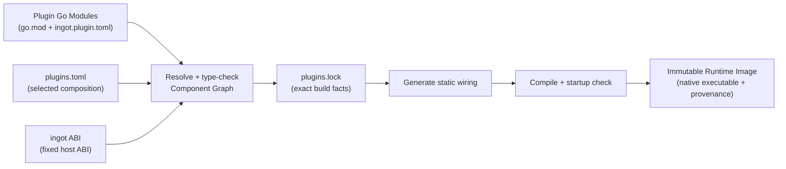

<p align="center">
  
</p>

# ingot

> Compose the agent you need from plugins. Ship it as one immutable binary.

[**English**](./README.md) · [**中文文档**](./docs/README.zh.md) · [Usage Guide](./docs/USAGE.md) · [使用说明](./docs/USAGE.zh.md)

ingot is a build-time composition system for agents. It treats an agent as a
graph of replaceable capabilities, not a fixed application with a handful of
extension points. The HTTP client, model providers and routing, tools, policy
interceptors, storage, prompt and context handling, agent loop, and the
user-facing application can all be supplied by plugins.

At build time, ingot resolves the selected plugins into a static Component
Graph, type-checks every connection, generates the wiring code, and compiles
the complete graph into a native Runtime Image. At runtime there is no plugin
discovery, graph resolution, dynamic loading, or reflection-based wiring: the
chosen code is already connected inside the executable.

This gives ingot its defining balance: **maximum flexibility while composing an
agent, minimum uncertainty while running it**.

## Why ingot

### Every layer is replaceable

Official plugins are useful defaults, not privileged implementations. A plugin
is an ordinary Go module with an `ingot.plugin.toml` manifest, and components
communicate through typed capability contracts. Any layer can be replaced as
long as the new component satisfies the capabilities required by the rest of
the graph.

| Layer | Official plugin examples | Possible replacement |
|---|---|---|
| Application / UI | `app.backend` (browser workspace) | HTTP or WebSocket gateway, customer-service connector, chat platform adapter |
| Agent loop | `agent.default` | Triage workflow, domain-specific loop, deterministic orchestration |
| Model access | `http.default`, `model.openai-compatible`, `model.runtime` | Enterprise transport, another provider, custom routing or failover |
| Binary assets | `asset.local` | Object storage, shared media service, encrypted or remote immutable blobs |
| Tools | `tool.shell`, `tool.ask`, `tool.runtime` | CRM, order system, search, database, or internal APIs |
| Policy | `interceptor.approval`, `interceptor.script` | Audit, authorization, rate limits, organization-specific guardrails |
| State and context | `session.sqlite`, `context.compact`, `prompt.default` | Alternate session backends, retrieval, custom memory and prompting |

The boundary is deliberately broad: customization does not stop at tools or
model providers. It extends down to the HTTP client and up through the agent
loop to the application that exposes the agent.

### Flexible does not mean dynamic

ingot moves variability to build time and keeps the production runtime fixed:

- **Generated wiring, no reflection** — components are plain Go objects joined
  by generated `main.go` and `wiring_gen.go`.
- **Compile-time graph validation** — capability types, cardinality, missing or
  ambiguous providers, self-loops, cycles, and creation order are checked
  before an image is committed.
- **Self-contained delivery** — selected plugin implementations are compiled
  into the runtime executable. The target machine does not need Go, the ingot
  Builder, an SDK installation, or a separate plugin tree.
- **Immutable, traceable images** — exact module inputs and local sources are
  locked and hashed; the binary has its own artifact digest.
- **Safe image lifecycle** — startup validation, atomic activation, rollback,
  crash recovery, and garbage collection are built into the image workflow.
- **A small runtime surface** — startup instantiates a predetermined graph of
  ordinary Go values, and shutdown cleans them up in reverse creation order.

Runtime configuration, secrets, persistent state, and intentionally external
services remain external; what disappears is the deployment-time dependency on
the build system and plugin packages.

## More than a coding agent

The bundled profile produces a capable terminal-based coding agent, but that is
one composition of ingot, not its architectural limit.

For a customer-service agent, for example, replace `app.backend` with a network
plugin that receives conversations from the support system and streams replies
back. Replace shell and question tools with plugins for tickets, CRM, orders,
and the knowledge base. Keep the default model runtime and agent loop, or swap
those too. The Builder verifies the new graph and emits the same kind of
self-contained Runtime Image, ready to distribute without shipping a plugin
framework alongside it.

The same pattern applies to internal assistants, data agents, workflow agents,
embedded agents, and other domains where the surrounding capabilities matter
as much as the model call.

## Quick start

Requires Go 1.24 or newer. One command installs the CLI, initializes the
home with the default profile (browser workspace: sessions, tools, streaming;
no filesystem tools, no approval interceptors), collects your model provider
settings, builds the runtime image, and offers to start the web UI:

```sh
./scripts/install.sh
# non-interactive alternative: set the provider first
INGOT_BASE_URL=https://api.deepseek.com INGOT_API_KEY=sk-... \
  INGOT_MODEL=deepseek-v4-flash ./scripts/install.sh
```

Manual steps, equivalent to what the installer does:

```sh
# 1. Build the CLI (or install with ./scripts/install.sh)
go build -o ingot ./cmd/ingot

# 2. Initialize a home with the official plugin set
./ingot init

# 3. Build and name the managed default profile
./ingot build --use ~/.ingot/profiles/default.toml \
  --lock ~/.ingot/profiles/default.lock --tag local/ingot:default

# 4. Create and start an isolated Runtime
./ingot runtime create default --image local/ingot:default -- web
./ingot runtime start default   # then open http://127.0.0.1:7316/
```

Plugins start Unconfigured and own their configuration. Set the model provider
through the `app.backend.config` operation (or by editing the plugin's own
`state/` file) once the runtime is running.

`ingot init` materializes the official plugins under `bundled-plugins/`, writes
`builder.toml`, and maintains the selected recipe under `profiles/` in the
managed Home. It never writes to the current directory. Use
`ingot project init .` when you explicitly want a project-owned `plugins.toml`. Pass
`--profile minimal` for the smallest runnable graph (terminal CLI, no tools).
See the [Usage Guide](./docs/USAGE.md) for installation options and the full
workflow.

For the browser workspace, replace the CLI with [app.backend](./plugins/app-webui/README.md).
Its Vue + Tailwind frontend is embedded in the native Runtime Image and includes
conversations, streaming, approvals, attachments, execution details, and operations.
It is intended for trusted local, single-user use.

## How build-time composition works



The composition passes through three distinct states:

1. `plugins.toml` states what you want.
2. `plugins.lock` records exactly what was resolved, including the full Go
   module graph, source digests, the pinned Runtime ABI, and build flags.
3. `images/<ImageID>/` contains the immutable native executable and its
   provenance manifest.

Changing a runtime value only changes that Plugin's own state, never the image.
Changing an implementation means changing the plugin set and building a new
image; the old image remains available for rollback.

## Two dependency dimensions

ingot composes capabilities along two independent dimensions:

```text
Static Component Graph
    describes what a Component depends on
    → typed capability dependencies resolved at build time

Dynamic Execution Scope
    describes which execution domain one invocation belongs to
    → explicit execution.Scope carried by runtime invocation envelopes
```

The static graph answers "what capability does this component need"; the
dynamic execution scope answers "whose request is this call". Correctness-
critical execution identity is expressed by public SDK request and invocation
contracts (for example `tool.Invocation`), never by hidden `context.Value`
conventions or ambient process state.

Execution-scoped host effects follow the same rule: a plugin combines its
statically wired `interaction.ExecutionBinder` with the explicit invocation
scope to derive a bound Channel. Observation correlation may enrich tracing or
presentation, but it never supplies or overrides Session routing.

The bundled coding agent is the reference consumer of this model: a Workspace
Binding maps each Session to one immutable local working root, `tool.shell`
obtains its working directory only from the session-scoped `workspace.Resolver`,
and `session.sqlite` persists both Session and Workspace capabilities. The
Builder continues to understand only the static Component Graph; it has no
special knowledge of Session or Workspace semantics.

## The plugin model

| Concept | Meaning |
|---|---|
| **Plugin** | A Go module declaring `ingot.plugin.toml`; the unit of distribution, versioning, configuration, and user operations. |
| **Component** | A node in the static graph; it declares typed dependencies and exports and constructs plain Go values with `New`. |
| **Capability** | A stable Go contract exchanged by components and checked at build time with `go/packages` and `go/types`. |
| **Runtime Image** | One resolved, generated, compiled, checked, and immutable agent composition. |

Components do not register themselves in a global container. They expose
ordinary named structs and a constructor:

```go
type Dependencies struct {
    // Capabilities consumed by this component.
}

type Exports struct {
    // Capabilities provided by this component.
}

func New(
    ctx context.Context,
    cfg Config,
    deps Dependencies,
) (Exports, ingotabi.Cleanup, error)
```

The Builder reads these contracts, resolves `ONE`, `OPTIONAL`, and `MANY`
dependencies, establishes a deterministic creation order, and writes the calls
that ordinary Go code would make by hand. The Component ABI primitives
(`Cleanup`, `Optional`, `Named`) and every runtime-owned host contract
(invocation metadata, lifecycle shutdown, plugin state scope) live in the
fixed [ingot ABI](https://github.com/ingot-agent/ingot-abi). The
replaceable agent capability contracts live in the separate
[ingot SDK](https://github.com/ingot-agent/sdk) or any other domain contract
module; no contract module needs Builder configuration.

To add or replace a plugin:

```sh
ingot plugin add github.com/example/my-plugin@v1.2.3
ingot plugin add --path ../my-local-plugin
ingot plugin remove tool.ask
ingot build --tag acme/agent:dev
```

If the new composition has a missing, duplicate, or cyclic capability, the
build fails before an Image is committed.

## Build guarantees

- **Strict canonical inputs** — `builder.toml`, `plugins.toml`, `plugins.lock`,
  and `ingot.plugin.toml` are parsed strictly and represented by canonical
  digests.
- **Fixed Runtime ABI** — the Builder pins the exact ingot ABI module path,
  version, and source identity; production builds refuse an unpinned or
  MVS-upgraded ingot ABI.
- **Ordinary contract modules** — agent and domain SDKs need no Builder
  configuration; they participate in the Component Graph through plain Go
  type identity and are locked as ordinary modules.
- **Content-addressed identity** — `ImageID` identifies the complete build
  inputs; `ArtifactDigest` identifies the final executable bytes.
- **Reproducibility checks** — rebuilding an existing `ImageID` must reproduce
  its artifact digest instead of silently replacing different bytes.
- **Explicit deployment** — mutable tags name immutable target variants;
  Runtimes resolve them to concrete digests and switch desired Images atomically
  without changing a live Process.

## The ingot home

Managed machine state lives in `~/.ingot` by default; project recipes remain in
the project directory. Use `--home PATH` to select another managed Home.

| Path | Role |
|---|---|
| `builder.toml` | Builder configuration (no SDK list; the ingot ABI is fixed). |
| `profiles/<name>.toml` | Ingot-managed recipe for an official profile. |
| `profiles/<name>.lock` | Resolution lock generated when that managed profile is built. |
| `<project>/plugins.toml` | The desired plugin composition. |
| `<project>/plugins.lock` | Target-neutral resolution, source hashes, and module graph. |
| `bundled-plugins/` | Materialized sources for the official plugin set. |
| `images/catalog.json` | Mutable tags and pins. |
| `images/<ImageID>/` | Immutable runtime executable and manifest v3. |
| `runtimes/<name>/state/<plugin>/` | Runtime-isolated Plugin state. |

## Commands at a glance

```text
ingot [--home PATH] <command>

init        Initialize a home with an official plugin profile
project     Explicitly initialize a project recipe with `project init <dir>`
bundle      Check or update the official plugin bundle
resolve     Resolve plugins.toml and refresh plugins.lock
build       Resolve/build a content-addressed Image, optionally with --tag
image       list | inspect | verify | tag | import | export | pin | remove
runtime     create | inspect | switch | rollback | run | start | stop | logs
run         Create and start a named Runtime
ps / stop   Observe or gracefully stop managed Processes
status      Show project desired, locked, and built state as JSON
inspect     Inspect the environment or one plugin as JSON
gc          Sweep Images using tag, pin, Runtime, and Process roots
plugin      add | remove | update | reorder | list | inspect
```

See the [Usage Guide](./docs/USAGE.md) or
[使用说明](./docs/USAGE.zh.md) for the complete command reference.

## Documentation

- [中文 README](./docs/README.zh.md)
- [Contributing guide](./CONTRIBUTING.md) · [贡献指南](./docs/CONTRIBUTING.zh.md)
- [Usage Guide](./docs/USAGE.md) · [使用说明](./docs/USAGE.zh.md)
- [Architecture design v0.3](./docs/ingot_架构设计_v0.3.md) (Chinese)
- [M2 Image / Runtime / Process design](./docs/ingot_M2_image_runtime_process_设计方案.md) (Chinese)
- [M0 architecture freeze ADRs: Image identity, Runtime Home, Plugin Configuration, Operation identity, Collection, Runtime environment](./docs/adr/) (Chinese)
- [Plugin manifest design](./docs/ingot.plugin.toml_设计方案_v0.1.md) (Chinese)
- [`plugins.toml` design](./docs/ingot_plugins.toml_v0.1_设计方案.md) (Chinese)
- [`builder.toml` design](./docs/ingot_builder.toml_v0.1_设计方案.md) (Chinese)
- [`plugins.lock` design](./docs/ingot_plugins.lock_v0.1_设计方案.md) (Chinese)
- [SDK design v0.1](./docs/ingot_SDK_v0.1_设计方案.md) (Chinese)
- [ingot ABI design v0.1](./docs/ingot_ABI_v0.1_设计提案.md) (Chinese)

## Repository layout

- `cmd/ingot` — CLI entry point.
- `internal/cli` — command parsing and user-facing output.
- `internal/home` — schema v2 Home facade, project mutations, Image GC, and
  Runtime/Process coordination.
- `internal/image` — manifest v3, catalog, references, verification, and bundles.
- `internal/managedruntime` — persistent Runtime registry and bindings.
- `internal/process` — per-Process supervision, control, reconciliation, and logs.
- `internal/bundle` — official plugin profiles and source materialization.
- `internal/builder` — resolution, type analysis, component graph, code
  generation, reproducible build, and image validation.
- `plugins/` — official plugins; every directory is an independent Go module.
- `scripts/` — Unix and PowerShell installation scripts.

For local development, place the ingot ABI repository beside this
repository; the included `go.work` selects it with a workspace replacement.

## Development

Run the Builder, integration, SDK, and plugin tests from this directory:

```sh
go test -race ./...
for plugin_dir in plugins/*; do
  (cd "$plugin_dir" && go test -race ./...)
done
(cd ../sdk && go test -race ./...)
```

The repository `go.work` compiles the official plugins against the local SDK
and ingot ABI checkouts so a coordinated cross-repository refactor can be
developed and tested before either module is released.

## Roadmap

- [x] `ingot init` — create a runnable plugin profile and configuration.
- [ ] `ingot doctor` — validate plugin completeness, configuration, and the
  active image.

## License

[MIT](./LICENSE)
