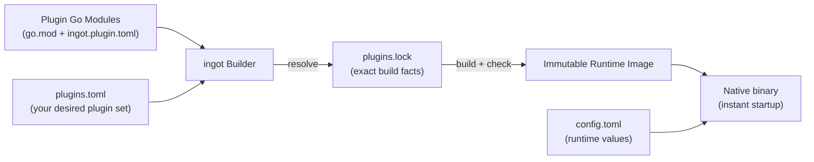

# ingot

> Build-time composed, immutable agent runtime.

[**English**](./README.md) · [**中文文档**](./docs/README.zh.md) · [Usage Guide](./docs/USAGE.md) · [使用说明](./docs/USAGE.zh.md)

ingot is a plugin-based agent runtime. Instead of loading plugins at runtime,
it composes plugins into a **static Component Graph** at build time, type-checks
every dependency, generates the wiring code, and compiles everything into a
single **immutable native Runtime Image** — then just runs it.

The result: fast startup, low memory, verifiable builds, and safe rollbacks.

## How it works



Three concepts to know:

| Concept | Meaning |
|---|---|
| **Plugin** | A Go module that declares `ingot.plugin.toml`; the unit of distribution, versioning and configuration. |
| **Component** | A node in the component graph; declares its dependencies, exports and constructor (`New`) in plain Go. |
| **Capability** | What components exchange — stable Go contract types, checked at build time with `go/packages` + `go/types`. |

## Highlights

- **Strict, canonical file formats** — `plugins.toml`, `plugins.lock`, and `ingot.plugin.toml` are parsed strictly, with canonical digests.
- **Exact, reproducible builds** — the full Go module graph and local dev sources are hashed and verified; every image carries a SHA-256 `ImageID` (build inputs) and `ArtifactDigest` (binary bytes). Rebuilding the same inputs yields the same artifact.
- **Compile-time correctness** — component contracts, ONE/OPTIONAL/MANY resolution, self-loops, cycles and stable topological ordering are all validated before anything runs.
- **Generated wiring, no reflection** — `main.go` and `wiring_gen.go` are generated, compiled natively, and startup-validated with `--ingot-check` before the image is committed.
- **Immutable images with safe lifecycle** — atomic `current` switching, single-writer locking, transactions with crash recovery, rollback, and image GC.
- **Plain Go objects at runtime** — the running process is ordinary Go: fast, debuggable, with reverse-order Cleanup.

## Quick start

```sh
# 1. Build the CLI (or install with ./scripts/install.sh)
go build ./cmd/ingot

# 2. Initialize a working home: official plugin set + config template
./ingot init

# 3. Edit ~/.ingot/config.toml — set your model provider, then apply
./ingot apply

# 4. Run it — any unknown command is dispatched to the current image
./ingot chat
```

`ingot init` writes the official default plugin set (as local dev sources under
`bundled-plugins/`), a `plugins.toml`, and a `config.toml` template; `--apply`
also resolves, builds and switches the first image immediately. See the
[Usage Guide](./docs/USAGE.md) for details.

Everything lives in the ingot home (`~/.ingot` by default; choose another with
`--home PATH`). From there:

| File | Role |
|---|---|
| `plugins.toml` | Your desired plugin set (you or the CLI maintain this). |
| `plugins.lock` | The exact resolution: full module graph, digests, build flags. |
| `config.toml` | Runtime configuration values. |
| `bundled-plugins/` | Materialized official plugin sources (written by `ingot init`). |
| `current` | Atomic pointer to the active image. |
| `images/<ImageID>/` | Immutable built images (binary + `manifest.json`). |

## Commands at a glance

```text
ingot [--home PATH] <command>

init        Initialize a home: official plugin set + config template
resolve     Resolve plugins.toml and refresh plugins.lock
build       Build the locked resolution into a new image
apply       Resolve + build + switch current atomically
status      Show desired/locked/current state as JSON
inspect     Inspect the whole environment or one plugin (JSON)
rollback    Point current back to a previous image
gc          Remove old images (keep the current, previous, and N recent)
plugin      add | remove | update | reorder | list | inspect
<other>     Dispatch to the current runtime image, e.g. ingot chat
```

See the [Usage Guide](./docs/USAGE.md) for the full command reference with
examples, and [使用说明](./docs/USAGE.zh.md) for the Chinese version.

## Documentation

- [中文文档](./docs/README.zh.md) — this README in Chinese.
- [使用说明](./docs/USAGE.zh.md) — usage guide in Chinese.
- Design documents (Chinese) in [`docs/`](./docs/):
  - [ingot 架构设计 v0.3](./docs/ingot_架构设计_v0.3.md)
  - [`plugins.toml` v0.1](./docs/ingot_plugins.toml_v0.1_设计方案.md)
  - [`plugins.lock` v0.1](./docs/ingot_plugins.lock_v0.1_设计方案.md)
  - [`ingot.plugin.toml` v0.1](./docs/ingot.plugin.toml_设计方案_v0.1.md)
  - [SDK v0.1](./docs/ingot_SDK_v0.1_设计方案.md)
  - [`ingot init` 设计 v0.1](./docs/ingot_init_设计方案_v0.1.md)

## Repository layout

- `cmd/ingot`: CLI entry point.
- `internal/cli`: command-line parsing and user-facing output.
- `internal/home`: ingot home state, plugin mutation, image switching, rollback, GC, transactions, runtime dispatch, and `init`.
- `internal/bundle`: the official plugin bundle — profiles, lookup and `bundled-plugins/` materialization.
- `internal/builder`: resolution, component graph, code generation, and immutable image build.
- `plugins/`: the official plugin set (each directory is an independent Plugin Go module).
- `scripts/`: `install.sh` / `install.ps1` build the CLI and install binary + plugin tree.

The plugin SDK lives in a separate repository: <https://github.com/ingot-agent/sdk>.
For local development, place it as a sibling checkout and select it with
`go.work` or a temporary `replace` directive.

## Roadmap

- [x] `ingot init` — write a default `plugins.toml` and `config.toml` so users go from installation to a working agent in one step (design: [`docs/ingot_init_设计方案_v0.1.md`](./docs/ingot_init_设计方案_v0.1.md)).
- [ ] `ingot doctor` — check that the default plugins are complete, config is valid, and the current image runs.

## Development

Run all conformance and integration tests:

```sh
go test -race ./...
(cd sdk && go test -race ./...)
```

## License

[MIT](./LICENSE)
