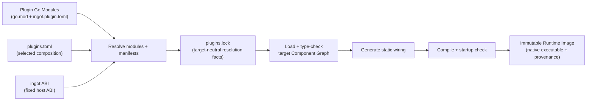

<p align="center">
  
</p>

# ingot

> Compose the agent you need from plugins. Ship it as one immutable binary.

[**English**](./README.md) · [**中文文档**](./docs/README.zh.md) · [Usage Guide](./docs/USAGE.md) · [使用说明](./docs/USAGE.zh.md)

ingot is a build-time composition system for agents. It treats an agent as a
graph of replaceable capabilities, not a fixed application with a handful of
extension points. The HTTP client, model providers and routing, tools, policy
interceptors, storage, prompt and context handling, agent loop, and the
user-facing application can all be supplied by plugins.

At build time, ingot resolves the selected plugins into a static Component
Graph, type-checks every connection, generates the wiring code, and compiles
the complete graph into a native Runtime Image. At runtime there is no plugin
discovery, graph resolution, dynamic loading, or reflection-based wiring: the
chosen code is already connected inside the executable.

This gives ingot its defining balance: **maximum flexibility while composing an
agent, minimum uncertainty while running it**.

## Why ingot

### Every layer is replaceable

Official plugins are useful defaults, not privileged implementations. A plugin
is an ordinary Go module with an `ingot.plugin.toml` manifest, and components
communicate through typed capability contracts. Any layer can be replaced as
long as the new component satisfies the capabilities required by the rest of
the graph.

| Layer | Official plugin examples | Possible replacement |
|---|---|---|
| Application / UI | `app.backend` (browser workspace) | HTTP or WebSocket gateway, customer-service connector, chat platform adapter |
| Agent loop | `agent.default` | Triage workflow, domain-specific loop, deterministic orchestration |
| Model access | `http.default`, `model.openai-compatible`, `model.runtime` | Enterprise transport, another provider, custom routing or failover |
| Binary assets | `asset.local` | Object storage, shared media service, encrypted or remote immutable blobs |
| Tools | `tool.shell`, `tool.ask`, `tool.runtime` | CRM, order system, search, database, or internal APIs |
| Policy | `interceptor.approval`, `interceptor.script` | Audit, authorization, rate limits, organization-specific guardrails |
| State and context | `session.sqlite`, `context.compact`, `prompt.default` | Alternate session backends, retrieval, custom memory and prompting |

The boundary is deliberately broad: customization does not stop at tools or
model providers. It extends down to the HTTP client and up through the agent
loop to the application that exposes the agent.

### Flexible does not mean dynamic

ingot moves variability to build time and keeps the production runtime fixed:

- **Generated static wiring** — components are plain Go objects joined by
  generated `main.go` and `wiring_gen.go`. Runtime value checks use reflection
  to validate capabilities; dependency selection and constructor calls are static.
- **Compile-time graph validation** — capability types, cardinality, missing or
  ambiguous providers, self-loops, cycles, and creation order are checked
  before an image is committed.
- **Self-contained delivery** — selected plugin implementations are compiled
  into the runtime executable. The target machine does not need Go, the ingot
  Builder, an SDK installation, or a separate plugin tree.
- **Immutable, traceable images** — exact module inputs and local sources are
  locked and hashed; the binary has its own artifact digest.
- **Safe image lifecycle** — startup validation, atomic activation, rollback,
  crash recovery, and garbage collection are built into the image workflow.
- **A small runtime surface** — startup instantiates a predetermined graph of
  ordinary Go values, and shutdown cleans them up in reverse creation order.

Runtime configuration, secrets, persistent state, and intentionally external
services remain external; what disappears is the deployment-time dependency on
the build system and plugin packages.

## More than a coding agent

The default profile produces a browser-based coding agent with shell and
question tools. It is one composition of ingot; the application, tools, and
agent loop can all be replaced.

For a customer-service agent, for example, replace `app.backend` with a network
plugin that receives conversations from the support system and streams replies
back. Replace shell and question tools with plugins for tickets, CRM, orders,
and the knowledge base. Keep the default model runtime and agent loop, or swap
those too. The Builder verifies the new graph and emits the same kind of
self-contained Runtime Image, ready to distribute without shipping a plugin
framework alongside it.

The same pattern applies to internal assistants, data agents, workflow agents,
embedded agents, and other domains where the surrounding capabilities matter
as much as the model call.

## Quick start

Install the official core binary from GitHub Releases. The installer does not
require Go and only installs `ingot`; it does not initialize or modify
`INGOT_HOME`, plugins, Images, or Runtimes.

```sh
# Linux and macOS; installs to ~/.local/bin by default
curl -fsSL https://github.com/ingot-agent/ingot/releases/latest/download/install.sh | sh
```

On Windows PowerShell:

```powershell
$installer = Join-Path $env:TEMP 'install-ingot.ps1'
Invoke-WebRequest https://github.com/ingot-agent/ingot/releases/latest/download/install.ps1 -OutFile $installer
& $installer
Remove-Item $installer
```

Then initialize and build the agent composition. Building Runtime Images
requires Go on `PATH` (the Core source requires Go 1.24.2 or newer), even when
the Core was installed from a Release. See the [Usage Guide](./docs/USAGE.md)
for build requirements and platform support.

```sh
# 1. Initialize managed Home
ingot setup

# 2. Initialize a project recipe in the current directory
ingot init .

# 3. Build and start the default Runtime in the background
ingot up -d -- web   # then open http://127.0.0.1:7316/
```

Open [http://127.0.0.1:7316/](http://127.0.0.1:7316/). For the shipped plugin
`v0.1.0` profile, select the browser Operation `model.openai-compatible.config`
in group `configuration` and add one initial provider with its endpoint, API
key, and model IDs. Run `ingot restart default`, refresh the browser, then use
`model.runtime.config` in the same group to set the default provider and model.
Restart once more after saving changed defaults. These are browser Operations;
the restarts are Core CLI commands. Follow each Operation's `restart_required`
result; configuration changes need no Image rebuild. See the
[version-specific setup notes](./docs/USAGE.md#configure-the-browser-agent)
before configuring multiple providers.

The plugins repository's `main` docs describe newer source behavior and command
names (`/model-openai-compatible config`, `/model-runtime config`), which can
differ from the exact modules selected by this Core's profiles.

The browser workspace starts before a provider is configured. Its frontend is
embedded in the Image, so running it needs neither Node nor a separate web
server. It currently targets trusted local, single-user use. See the
[app.backend guide](https://github.com/ingot-agent/plugins/tree/main/app-webui)
for workspace selection, configuration, and application behavior.

`ingot setup` writes the selected official profile with exact released plugin
module versions under `profiles/` in managed Home, then writes `builder.toml`.
`ingot init [DIR]` creates a project-owned `plugins.toml` and also ensures Home
exists. Both `default` and `minimal` use `app.backend`; `minimal` omits
`tool.shell` and `tool.ask` while retaining the tool runtime.
`ingot up [NAME]` builds, binds, and restarts one Runtime; omitting
the name selects `default`. See the [Usage Guide](./docs/USAGE.md) for
installation options and the full workflow.

For a local plugin checkout with one plugin per first-level directory,
`ingot project scan /path/to/plugins` generates `plugins.toml` with absolute
local source paths.

For the browser workspace, replace the CLI with
[app.backend](https://github.com/ingot-agent/plugins/tree/main/app-webui).
Its Vue + Tailwind frontend is embedded in the native Runtime Image and includes
conversations, streaming, approvals, attachments, execution details, and operations.
It is intended for trusted local, single-user use.

## How build-time composition works



The composition passes through three distinct states:

1. `plugins.toml` states what you want.
2. `plugins.lock` records exactly what was resolved, including the full Go
   module graph, source digests, and the pinned Runtime ABI. Target, toolchain,
   and build flags are recorded in each Image's BuildManifest.
3. `images/<ImageID>/` contains the immutable native executable and its
   provenance manifest.

Changing a runtime value only changes that Plugin's own state, never the image.
Changing an implementation means changing the plugin set and building a new
image; the old image remains available for rollback.

## Two dependency dimensions

ingot composes capabilities along two independent dimensions:

```text
Static Component Graph
    describes what a Component depends on
    → typed capability dependencies resolved at build time

Dynamic Execution Scope
    describes which execution domain one invocation belongs to
    → explicit execution.Scope carried by runtime invocation envelopes
```

The static graph answers "what capability does this component need"; the
dynamic execution scope answers "whose request is this call". Correctness-
critical execution identity is expressed by public SDK request and invocation
contracts (for example `tool.Invocation`), never by hidden `context.Value`
conventions or ambient process state.

Execution-scoped host effects follow the same rule: a plugin combines its
statically wired `interaction.ExecutionBinder` with the explicit invocation
scope to derive a bound Channel. Observation correlation may enrich tracing or
presentation, but it never supplies or overrides Session routing.

The default coding-agent profile is the reference consumer of this model: a Workspace
Binding maps each Session to one immutable local working root, `tool.shell`
obtains its working directory only from the session-scoped `workspace.Resolver`,
and `session.sqlite` persists both Session and Workspace capabilities. The
Builder continues to understand only the static Component Graph; it has no
special knowledge of Session or Workspace semantics.

## The plugin model

| Concept | Meaning |
|---|---|
| **Plugin** | A Go module declaring `ingot.plugin.toml`; the unit of distribution, versioning, configuration, and user operations. |
| **Component** | A node in the static graph; it declares typed dependencies and exports and constructs plain Go values with `New`. |
| **Capability** | A stable Go contract exchanged by components and checked at build time with `go/packages` and `go/types`. |
| **Runtime Image** | One resolved, generated, compiled, checked, and immutable agent composition. |

Components do not register themselves in a global container. They expose
ordinary named structs and a constructor:

```go
type Dependencies struct {
    // Capabilities consumed by this component.
}

type Exports struct {
    // Capabilities provided by this component.
}

func New(
    ctx context.Context,
    deps Dependencies,
) (Exports, ingotabi.Cleanup, error)
```

The Builder reads these contracts, resolves `ONE`, `OPTIONAL`, and `MANY`
dependencies, establishes a deterministic creation order, and writes the calls
that ordinary Go code would make by hand. The Component ABI primitives
(`Cleanup`, `Optional`, `Named`) and every runtime-owned host contract
(invocation metadata, lifecycle shutdown, plugin state scope) live in the
fixed [ingot ABI](https://github.com/ingot-agent/ingot-abi). The
replaceable agent capability contracts live in the separate
[ingot SDK](https://github.com/ingot-agent/sdk) or any other domain contract
module; no contract module needs Builder configuration.

To add or replace a plugin:

```sh
ingot plugin add github.com/example/my-plugin@v1.2.3
ingot plugin add ../my-local-plugin
ingot plugin rm tool.ask
ingot up
```

If the new composition has a missing, duplicate, or cyclic capability, the
build fails before an Image is committed.

## Build guarantees

- **Strict canonical inputs** — `builder.toml`, `plugins.toml`, `plugins.lock`,
  and `ingot.plugin.toml` are parsed strictly and represented by canonical
  digests.
- **Fixed Runtime ABI** — the Builder pins the exact ingot ABI module path,
  version, and source identity; production builds refuse an unpinned or
  MVS-upgraded ingot ABI.
- **Ordinary contract modules** — agent and domain SDKs need no Builder
  configuration; they participate in the Component Graph through plain Go
  type identity and are locked as ordinary modules.
- **Content-addressed identity** — `ImageID` identifies the complete build
  inputs; `ArtifactDigest` identifies the final executable bytes.
- **Reproducibility checks** — rebuilding an existing `ImageID` must reproduce
  its artifact digest instead of silently replacing different bytes.
- **Concrete Runtime binding** — builds bind exactly one Runtime to immutable
  Image and Artifact digests. Mutable tags never make an existing Runtime
  follow a later Image, and changing a binding does not silently restart a live
  Process.

## The ingot home

Managed machine state uses `INGOT_HOME` when set and otherwise lives in
`~/.ingot`; project recipes remain in the project directory. Use `--home PATH`
to override this Home selection. It does not move or select the project recipe.

| Path | Role |
|---|---|
| `builder.toml` | Builder configuration (no SDK list; the ingot ABI is fixed). |
| `profiles/<name>.toml` | Ingot-managed recipe for an official profile. |
| `profiles/<name>.lock` | Resolution lock generated when that managed profile is built. |
| `<project>/plugins.toml` | The desired plugin composition. |
| `<project>/plugins.lock` | Target-neutral resolution, source hashes, and module graph. |
| `images/catalog.json` | Mutable tags and pins. |
| `images/<ImageID>/` | Immutable runtime executable and manifest v3. |
| `runtimes/<name>/state/<plugin>/` | Runtime-isolated Plugin state. |

## Commands at a glance

```text
ingot [--home PATH] [--json] <command>

setup       Initialize or refresh managed Home
init        Initialize a project recipe in [DIR]
build       Build and bind one Runtime (default: `default`)
up          Build, bind, and restart one Runtime
start       Start an existing Runtime
stop        Gracefully stop a Runtime Process
restart     Restart a Runtime in the background
logs / ps   Inspect detached logs and Processes
run         Create and run a named Runtime from an existing Image
project     status | show | resolve | generate
plugin      add | rm | update | move | ls | show
collection  inspect | plan | apply
image       ls | show | verify | tag | untag | import | export | pin | unpin | rm
runtime     create | ls | show | switch | rollback | command | rm
completion  Generate Bash, Zsh, Fish, or PowerShell completion
version     Report core, Builder, and protocol identities
update / gc Maintain the core binary and immutable Images
```

See the [Usage Guide](./docs/USAGE.md) or
[使用说明](./docs/USAGE.zh.md) for the complete command reference.

## Documentation

- [Documentation index and ownership](./docs/README.md)
- [中文 README](./docs/README.zh.md)
- [Contributing guide](./CONTRIBUTING.md) · [贡献指南](./docs/CONTRIBUTING.zh.md)
- [Usage Guide](./docs/USAGE.md) · [使用说明](./docs/USAGE.zh.md)
- [Current file formats](./docs/FILE_FORMATS.md)
- [Upgrading, backup, and recovery](./docs/UPGRADING.md)
- [Current architecture and source navigation](./docs/ARCHITECTURE.md)
- [Core release procedure](./RELEASE.md) · [Security reporting](./SECURITY.md)
- [Official plugin guides](https://github.com/ingot-agent/plugins/tree/main/docs)
- [SDK contracts](https://github.com/ingot-agent/sdk) · [Runtime ABI](https://github.com/ingot-agent/ingot-abi)

Core design records and ADRs are indexed separately in the documentation index.
Historical proposals are retained for rationale; current code, tests, and usage
references determine supported behavior. Plugin implementation design history
belongs in the [plugins repository](https://github.com/ingot-agent/plugins/tree/main/docs/design-history).

## Repository layout

- `cmd/ingot` — CLI entry point.
- `internal/cli` — command parsing and user-facing output.
- `internal/home` — schema v2 Home facade, project mutations, Image GC, and
  Runtime/Process coordination.
- `internal/image` — manifest v3, catalog, references, verification, and bundles.
- `internal/managedruntime` — persistent Runtime registry and bindings.
- `internal/process` — per-Process supervision, control, reconciliation, and logs.
- `internal/profiles` — exact released Official Plugin profile definitions.
- `internal/collection` — strict Collection loading, semantic identity, conflict
  planning, and deterministic order merging.
- `internal/builder` — resolution, type analysis, component graph, code
  generation, reproducible build, and image validation.
- `scripts/` — Unix and PowerShell installation scripts.

Official plugins are developed and released from the standalone
[`ingot-agent/plugins`](https://github.com/ingot-agent/plugins) repository.

## Development

Run the Core test suite from this directory:

```sh
GOWORK=off go test -race ./...
```

This repository is the Core Go module. `GOWORK=off` prevents a parent or local
workspace from changing its dependency resolution. Official profile builds
resolve exact released plugin modules; local plugin development belongs in the
standalone [plugins repository](https://github.com/ingot-agent/plugins).

## Roadmap

- [x] `ingot setup` and `ingot init` — initialize managed Home and project recipes.
- [x] `ingot collection inspect|plan|apply` — apply reusable exact-version
  Plugin composition recipes with explicit conflict handling.
- [ ] `ingot doctor` — a future diagnostic command; it is not currently available.

## License

[MIT](./LICENSE)
