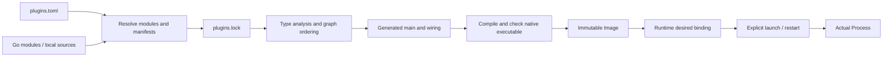

# Current Core architecture and source navigation

This describes the implementation in this checkout. For exact user-facing
commands and formats, use [USAGE.md](USAGE.md) and [FILE_FORMATS.md](FILE_FORMATS.md).
The [ADR index](adr/README.md) records accepted decisions; the other design
documents are historical proposals and may include superseded behavior.

## System boundaries

ingot composes ordinary Go plugin modules into a native runtime executable.
Composition happens before deployment: module resolution, manifest validation,
type analysis, dependency ordering, code generation, compilation, and check-mode
construction all happen before an Image is committed.

| Concept | Owner and responsibility |
| --- | --- |
| Plugin | A Go module with `ingot.plugin.toml`; distribution/version, configuration, user Operations, and plugin state ownership |
| Component | A manifest-declared package with `Dependencies`, `Exports`, and `New(context.Context, Dependencies) (Exports, ingotabi.Cleanup, error)`; construction/lifecycle node |
| Capability | A typed Go contract exchanged between components; type identity and assignability determine graph edges |
| Image | Immutable native executable plus provenance manifest; identifies the build inputs and executable digest separately |
| Runtime | Persistent named definition with desired/rollback Image bindings, default argv, and isolated state |
| Process | One actual launch of an Image for a Runtime, with OS identities, supervision, control, and exit observations |

The [ABI repository](https://github.com/ingot-agent/ingot-abi) owns the fixed
wrappers and host contracts. The [SDK](https://github.com/ingot-agent/sdk) owns
optional, replaceable agent capability contracts. The
[plugins repository](https://github.com/ingot-agent/plugins) owns implementations
such as model routing, session storage, tool execution, approvals, and the
browser application. The Builder has no special knowledge of their plugin
names, sessions, or workspace bindings. Shipped profiles select ordinary
plugins; selection grants no special graph or runtime privileges.

## From recipe to Image

1. **Select inputs.** The CLI selects a project recipe/lock from an explicit
   `--file`/`--lock`, a managed `--profile`, or project lookup. Managed Home
   selection is independent from recipe selection. The current `builder.toml`
   accepts only `builder_config_version = 1`; it has no configurable Go flags,
   environment tables, or SDK list. Plugins own runtime configuration in their
   state.
2. **Resolve.** `builder.Resolve` creates a temporary root module, fixes the
   ABI version, resolves direct plugin modules and the transitive Go graph,
   parses manifests, validates protocol compatibility, and records source
   identities. Direct plugin versions must remain exactly selected. Local
   sources are hashed and represented explicitly, rather than silently treated
   as published releases. Resolution may access the network.
3. **Lock.** The target-neutral lock records exact modules/sums, local source
   identities, manifest/component declarations, recipe identity, and fixed ABI.
   Project mutations resolve first and commit the recipe/lock transaction only
   after successful validation. `--locked` forbids automatic lock refresh.
4. **Analyze the target graph.** `go/packages` and `go/types` load target
   packages, check constructor and struct contracts, resolve `ONE`, `OPTIONAL`,
   and `MANY` dependencies, handle fixed host contracts, and reject missing or
   ambiguous providers, self-loops, cycles, and invalid boundary types. Stable
   dependency order determines creation and ordered capability collections.
5. **Generate.** The Builder emits a restored root module and ordinary Go
   calls. Providers' exports are assigned into typed dependency struct fields;
   constructors run in the resolved order. The generated runtime does not
   discover modules or solve the dependency graph at startup.
6. **Build and check.** The locked build uses an isolated module environment,
   `GOWORK=off`, `GOTOOLCHAIN=local`, `-mod=readonly`, `-trimpath`, and
   `-buildvcs=false`. The current native build uses CGO disabled. It validates
   the selected module graph and compiles from staged inputs, then executes
   `--ingot-check` with a temporary empty Runtime Home.
7. **Commit and bind.** Successful check-mode construction and cleanup allow
   the immutable executable/manifest pair to be committed. The lower-level
   `builder.Build` does not change tags or Runtime bindings; `home` coordinates
   those operations. `build NAME` binds NAME without restarting an existing
   Process; `up NAME` additionally restarts it.

For development, the resolver also scans the CLI working directory and its
ancestors for the first `go.work`, and recognizes versionless local `replace`
entries for the ABI and selected dependency modules. This is a Builder source
locator, independent of the `GOWORK=off` setting passed to Go subprocesses.
Such overrides are recorded as local replacements with source digests. To
validate published modules only, invoke the CLI outside that workspace tree
and confirm no local replacements appear in the lock; an external `--home`
alone does not isolate the current working directory.

The ImageID hashes the canonical BuildManifest, including effective target,
toolchain, build settings and graph inputs. ArtifactDigest hashes the resulting
executable bytes. If the same ImageID already exists but rebuilding produces
different bytes, Core reports a reproducibility error instead of overwriting
it. Different toolchains/targets can legitimately create different ImageIDs.

Static wiring does not mean the runtime contains no reflection at all. The
current generated validation helpers use `reflect` to reject nil capabilities
and invalid/duplicate `Named` collection values before consumer construction.
Dependency selection and constructor dispatch are generated static Go code.

## Runtime execution and state

Generated `main` determines its Runtime Home from `INGOT_RUNTIME_HOME`; for a
standalone executable, the default is `<absolute-executable-path>.home`.
Managed launches set it to `<ManagedHome>/runtimes/<name>`. Runtime Home is not
`INGOT_HOME`, and neither should be used as an implicit application workspace.

Before constructing any component, the runtime acquires `run/writer.lock`.
This protects the same Runtime Home for managed and standalone launches. The
generated host provides invocation argv/mode, lifecycle shutdown control, and
plugin-scoped `state.Scope` directories at `state/<manifest-short-name>/`.
All components from a plugin receive that plugin's state location. Plugins
decide which files to create and how to load/validate/migrate their content.

Construction returns exports and optional cleanup. On failure, previously
registered cleanups, including one returned by the failing constructor, run
in reverse order. Check mode constructs and then cleans up without waiting for
normal application shutdown. In run mode, the graph remains active until its
context is cancelled by a process signal or lifecycle shutdown request.
Cleanup receives an uncancelled base context with a ten-second deadline per
callback; callbacks must cooperate with cancellation because a blocking Go
function cannot be forcibly interrupted by that deadline. Cleanup errors and
shutdown causes contribute to the process result.

The build check validates a trusted plugin graph against empty state. Plugin
code executes during construction, so it is not a sandbox or a production
health check. Model calls, existing database migration, browser readiness,
external service authorization, and application behavior need separate tests.

## Managed lifecycle, concurrency, and recovery

`internal/home` is the coordinating facade used by CLI handlers. It validates
Home schema, acquires management locks, recovers transactions, invokes Builder
and Image APIs, and mediates Runtime/Process operations. Project recipe/lock
mutations have a separate project lock so the project input pair is coherent.

The Runtime registry persists concrete ImageID, ArtifactDigest, target, default
argv, and generation. Changing an Image tag does not change that binding.
`switch` and `rollback` update the desired binding and generation atomically;
`rollback` swaps one desired/previous pair and never restores data. A Process
records its actual Image and launch generation. Inspection reports
`restart_required` when desired and actual facts differ.

A foreground CLI or detached `ingot supervise` process owns one runtime child.
Supervision records process UUID, PID and birth identity, captures detached
logs, and serves a token-authenticated IPv4 loopback control endpoint. Stop
requests graceful termination through this endpoint; it does not force-kill a
PID when authentication or identity cannot be established.

Reconciliation combines process identities, the control endpoint, and writer
locks to report `starting`, `running`, `stopping`, `stopped`, `failed`,
`unresponsive`, `orphaned`, or `external`. An independently launched writer
can hold the Runtime Home without a managed actual-Image record. Mutations
and garbage collection fail closed where that unknown state would make
deletion or rebinding unsafe. A `running` state confirms a spawned child,
not an application readiness probe.

Garbage collection keeps tags, pins, Runtime desired/rollback bindings, live
Process Images, and the requested number of recent unreferenced Images.
Corrupt/missing roots or external writers abort the sweep. State is never
stored inside an Image; see [UPGRADING.md](UPGRADING.md) for backup/recovery and
the limits of Image rollback.

## Source map

| Start here | Responsibility / useful neighboring tests |
| --- | --- |
| [`cmd/ingot/main.go`](../cmd/ingot/main.go) | Process entry point and signal cancellation; `main_test.go` |
| [`internal/cli/cli.go`](../internal/cli/cli.go) | Root command, global flags and command registration; `project.go`, `runtime.go`, `image.go`, `completion.go`, `cli_test.go` |
| [`internal/home/home.go`](../internal/home/home.go) | Managed Home selection, facade and paths; `schema.go`, `init.go`, `home_test.go`, `init_test.go` |
| [`internal/home/project.go`](../internal/home/project.go) | Project selection, mutation, resolve/build/generate orchestration; `plugins_writer.go`, `transactions.go` |
| [`internal/builder/resolve.go`](../internal/builder/resolve.go) | Version authorities, Go module resolution and lock inputs; `desired.go`, `manifest.go`, `lock.go`, `schema_test.go`, `lock_test.go` |
| [`internal/builder/graph.go`](../internal/builder/graph.go) | Type contracts, provider selection, ordering and target graph; `graph_test.go`, `graph_integration_test.go` |
| [`internal/builder/generate.go`](../internal/builder/generate.go) | Generated runtime support, typed constructor calls, value validation and cleanup |
| [`internal/builder/build.go`](../internal/builder/build.go) | Locked build, native check and immutable commit; `prepare.go`, `build_test.go`, `build_integration_test.go` |
| [`internal/builder/export.go`](../internal/builder/export.go) | Export a generated Go project for inspection/building; `export_test.go` |
| [`internal/image/manifest.go`](../internal/image/manifest.go) | Image identity/integrity; `types.go`, `catalog.go`, `bundle.go`, `image_test.go` |
| [`internal/managedruntime/registry.go`](../internal/managedruntime/registry.go) | Runtime definitions, switch/rollback and command defaults; `registry_test.go` |
| [`internal/home/runtimes.go`](../internal/home/runtimes.go) | Binding, start/restart/stop, managed launch environment and logs |
| [`internal/process/supervisor.go`](../internal/process/supervisor.go) | Child supervision and control endpoint; `reconcile.go`, `types.go`, platform identity/signal/lock files, `process_test.go` |
| [`internal/home/images.go`](../internal/home/images.go) | Image management, export/import and GC root coordination |
| [`internal/collection/plan.go`](../internal/collection/plan.go) | Collection conflicts and deterministic order merge; `load.go`, `model.go`, `plan_test.go`; apply in `home/collection.go` |
| [`internal/profiles/profiles.go`](../internal/profiles/profiles.go) | Embedded exact released profile recipes and initialization metadata; `profiles_test.go` |
| [`internal/coreupdate/updater.go`](../internal/coreupdate/updater.go) | Core download, identity verification and executable replacement; `updater_test.go`, platform replacement files |
| [`internal/release/pack.go`](../internal/release/pack.go) | Archive/manifest generation; `manifest.go`, `pack_test.go`; CLI in `internal/releasetool/main.go` |

For a CLI bug, start at its handler and follow the `home` method it invokes.
For a graph bug, distinguish resolution/lock facts from target-specific type
analysis before changing code. For a startup bug, distinguish generated
construction from managed process supervision and plugin readiness. Use
arbitrary plugin identities in Core tests: official plugins must pass through
the same mechanisms as any third-party plugin.

## What this architecture does not promise

Plugins are compiled into a single native process and share its OS privileges.
Graph type checks, state scopes, and writer locks provide composition and
lifecycle guarantees; they do not isolate malicious plugin code. Plugin
configuration and external services remain outside immutable Images. There is
no general automatic plugin-state migration, Image rollback of data, remote
fleet scheduler, or runtime plugin discovery in the implementation described
here. Report security issues according to [SECURITY.md](../SECURITY.md).
