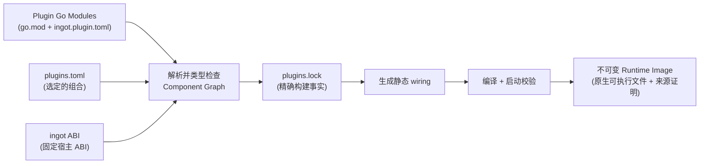

# ingot

> 从插件组合你需要的 Agent，交付为一个不可变二进制。

[**English**](../README.md) · [**中文文档**](./README.zh.md) · [Usage Guide](./USAGE.md) · [使用说明](./USAGE.zh.md)

ingot 是一个面向 Agent 的构建期组合系统。它不把 Agent 看成只有少数扩展点的固定应用，而是看成一张由可替换能力组成的图：HTTP Client、模型 Provider 与路由、工具、策略拦截器、存储、Prompt 与上下文管理、Agent Loop，以及最终面向用户的应用，都可以由插件提供。

在构建期，ingot 将选定的插件解析为静态 **Component Graph**，对每一条连接做类型检查，生成 wiring 代码，再把整张图编译为原生 **Runtime Image**。运行期不再发现插件、解析依赖图、动态加载代码，也不依赖反射完成装配；所有选定的代码都已经连接在可执行文件中。

这形成了 ingot 最重要的平衡：**组合 Agent 时拥有最大灵活性，运行 Agent 时保留最小不确定性。**

## 为什么选择 ingot

### 每一层都可替换

官方插件只是开箱即用的默认实现，并不拥有任何特权。一个插件就是带有 `ingot.plugin.toml` Manifest 的普通 Go Module，Component 之间通过有类型的 Capability Contract 通信。只要新 Component 满足图中其余部分需要的 Capability，任何一层都可以被替换。

| 层次 | 官方插件示例 | 可以替换为 |
|---|---|---|
| 应用 / UI | `app.backend`（浏览器工作区） | HTTP 或 WebSocket 网关、客服系统连接器、聊天平台适配器 |
| Agent Loop | `agent.default` | 分诊工作流、领域专用 Loop、确定性编排流程 |
| 模型访问 | `http.default`、`model.openai-compatible`、`model.runtime` | 企业网络传输、其他 Provider、自定义路由或故障转移 |
| 二进制 Asset | `asset.local` | 对象存储、共享媒体服务、加密或远程不可变 Blob |
| 工具 | `tool.shell`、`tool.ask`、`tool.runtime` | CRM、订单系统、搜索、数据库或内部 API |
| 策略 | `interceptor.approval`、`interceptor.script` | 审计、鉴权、限流、组织专用安全策略 |
| 状态与上下文 | `session.sqlite`、`context.compact`、`prompt.default` | 可替换 Session 后端、检索、自定义记忆与 Prompt |

这个边界刻意设计得很宽：定制能力并不止于工具和模型 Provider，而是向下覆盖 HTTP Client，向上贯穿 Agent Loop，直至承载 Agent 的应用本身。

### 灵活不等于动态

ingot 把变化放在构建期，把生产运行时固定下来：

- **生成 wiring，全程无反射** —— Component 是普通 Go 对象，由自动生成的 `main.go` 和 `wiring_gen.go` 连接。
- **构建期依赖图校验** —— Capability 类型、基数、缺失或歧义的 Provider、self-loop、环和创建顺序，都会在镜像提交前完成检查。
- **自包含交付** —— 选定的插件实现会被编译进运行时可执行文件；目标机器不需要安装 Go、ingot Builder、SDK，也不需要单独部署插件目录。
- **不可变、可追溯的镜像** —— 精确的 Module 输入和本地源码都会被锁定与哈希，二进制本身也有独立的产物摘要。
- **安全的镜像生命周期** —— 启动校验、原子激活、回滚、崩溃恢复和垃圾回收都属于标准工作流。
- **极小的运行时表面积** —— 启动过程只实例化一张预先确定的普通 Go 对象图，关闭时按创建顺序的逆序清理。

运行配置、密钥、持久化状态以及插件主动连接的外部服务仍然位于二进制之外；真正被消除的是部署阶段对构建系统和插件包的依赖。

## 不只是 Coding Agent

内置的默认 Profile 会生成一个功能完整的终端 Coding Agent，但它只是 ingot 的一种组合方式，并不是架构边界。

例如，要构建一个客服 Agent，可以把 `app.backend` 替换为网络插件：从客服系统接收会话，再把流式响应发送回去；把 Shell 和提问工具替换为工单、CRM、订单和知识库插件；默认模型运行时和 Agent Loop 可以保留，也可以一并替换。Builder 会验证新的依赖图，并产出同样自包含的 Runtime Image，分发时不需要再附带一套插件框架。

同一种模式还可以用于企业内部助手、数据 Agent、工作流 Agent、嵌入式 Agent，以及任何“模型调用之外的周边能力同样重要”的领域。

## 快速开始

从 GitHub Releases 安装官方 Core 二进制。安装器本身不依赖 Go，并且只安装
`ingot`，不会初始化或修改 `INGOT_HOME`、插件、Image 或 Runtime。

```sh
# Linux 与 macOS；默认安装到 ~/.local/bin
curl -fsSL https://github.com/ingot-agent/ingot/releases/latest/download/install.sh | sh
```

Windows PowerShell：

```powershell
$installer = Join-Path $env:TEMP 'install-ingot.ps1'
Invoke-WebRequest https://github.com/ingot-agent/ingot/releases/latest/download/install.ps1 -OutFile $installer
& $installer
Remove-Item $installer
```

然后初始化并构建 Agent 组合。即使 Core 来自 Release，本地执行 `ingot build`
仍需要 Go 1.24 或更高版本。

```sh
# 1. 初始化 Managed Home
ingot setup

# 2. 在当前目录初始化项目 Recipe
ingot init .

# 3. 构建并在后台启动 default Runtime（默认 profile 为 app.backend）
ingot up -d -- web
```

插件以未配置状态启动，并各自拥有自己的配置。运行时启动后，可通过
`app.backend.config` Operation（或直接编辑插件自己的 `state/` 文件）设置模型 Provider。

`ingot setup` 会把官方 Profile 精确固定到已发布的插件模块版本，在 Managed Home 的
`profiles/` 下维护 Profile recipe，并写入 `builder.toml`。`ingot init [DIR]` 创建项目自己的
`plugins.toml`，同时确保 Home 已存在。使用 `--profile minimal` 可获得最小可运行依赖图。
`ingot up [NAME]` 构建、绑定并重启一个 Runtime；省略名称时使用 `default`。安装选项和
完整流程见[使用说明](./USAGE.zh.md)。

## 构建期组合如何工作



一次组合会经过三个清晰的状态：

1. `plugins.toml` 描述你想要什么。
2. `plugins.lock` 记录精确解析结果，包括完整 Go Module 图、源码摘要、固定的 Runtime ABI 和构建参数。
3. `images/<ImageID>/` 保存不可变的原生可执行文件和来源 Manifest。

修改运行参数只需修改插件自己的状态，不会改变镜像。替换实现则意味着修改插件集合并构建新镜像；旧镜像仍然保留，可随时回滚。

## 插件模型

| 概念 | 含义 |
|---|---|
| **Plugin（插件）** | 声明 `ingot.plugin.toml` 的 Go Module；是分发、版本、配置和用户操作的边界。 |
| **Component（组件）** | 静态图中的节点；声明有类型的依赖与导出，并通过 `New` 构造普通 Go 对象。 |
| **Capability（能力）** | Component 之间交换的稳定 Go Contract，由 Builder 使用 `go/packages` 和 `go/types` 在构建期检查。 |
| **Runtime Image（运行时镜像）** | 一套完成解析、代码生成、编译、检查并保持不可变的 Agent 组合。 |

Component 不会把自身注册进某个全局容器。它只需提供普通的具名 struct 和构造函数：

```go
type Dependencies struct {
    // 当前 Component 消费的 Capability。
}

type Exports struct {
    // 当前 Component 提供的 Capability。
}

func New(
    ctx context.Context,
    cfg Config,
    deps Dependencies,
) (Exports, ingotabi.Cleanup, error)
```

Builder 读取这些 Contract，解析 `ONE`、`OPTIONAL` 和 `MANY` 依赖，确定稳定的创建顺序，并生成普通 Go 代码原本需要手写的调用。Component ABI 原语（`Cleanup`、`Optional`、`Named`）与所有 Runtime 独占的宿主 Contract（调用元数据、生命周期关闭、插件状态目录）位于固定的 [ingot ABI](https://github.com/ingot-agent/ingot-abi)。可替换的 Agent Capability Contract 位于独立的 [ingot SDK](https://github.com/ingot-agent/sdk) 或其他任何 Domain Contract Module；Contract Module 无需 Builder 配置。

添加或替换插件：

```sh
ingot plugin add github.com/example/my-plugin@v1.2.3
ingot plugin add ../my-local-plugin
ingot plugin rm tool.ask
ingot up
```

如果新的组合存在 Capability 缺失、重复或成环，构建会在提交 Image 之前失败。

## 构建保证

- **严格、规范化的输入** —— `builder.toml`、`plugins.toml`、`plugins.lock` 和 `ingot.plugin.toml` 均被严格解析，并生成规范化摘要。
- **固定 Runtime ABI** —— Builder 精确锁定 ingot ABI 的 Module path、版本与源码身份；生产构建拒绝未锁定或被 MVS 升级的 ingot ABI。
- **普通 Contract Module** —— Agent SDK 与领域 SDK 无需 Builder 配置，以普通 Go Type Identity 参与 Component Graph，并作为普通 Module 锁定。
- **内容寻址身份** —— `ImageID` 标识完整构建输入，`ArtifactDigest` 标识最终可执行文件字节。
- **可复现性检查** —— 重建一个已有 `ImageID` 时必须得到相同的产物摘要，而不是静默覆盖不同的二进制。
- **Concrete Runtime binding** —— 每次构建只把一个 Runtime 绑定到不可变 Image 与
  Artifact digest。mutable tag 不会让已有 Runtime 自动跟随后续 Image，切换 binding
  也不会静默重启 live Process。

## ingot home

机器级 Managed State 优先使用 `INGOT_HOME` 指向的目录，未设置时默认位于
`~/.ingot`；项目 Recipe 保留在项目目录。可使用 `--home PATH` 覆盖两者并指定其他
Managed Home。

| 路径 | 作用 |
|---|---|
| `builder.toml` | Builder 配置（无 SDK 列表；ingot ABI 固定）。 |
| `profiles/<name>.toml` | Ingot 管理的官方 Profile recipe。 |
| `profiles/<name>.lock` | 构建该 Managed Profile 时生成的解析 lock。 |
| `<project>/plugins.toml` | 期望的插件组合。 |
| `<project>/plugins.lock` | target-neutral 解析结果、源码哈希与 Module 图。 |
| `images/catalog.json` | mutable tag 与 pin。 |
| `images/<ImageID>/` | 不可变运行时可执行文件与 manifest v3。 |
| `runtimes/<name>/state/<plugin>/` | 按 Runtime 隔离的 Plugin State。 |

## 命令一览

```text
ingot [--home PATH] [--json] <command>

setup       初始化或刷新 Managed Home
init        在 [DIR] 初始化项目 Recipe
build       构建并绑定一个 Runtime（默认 `default`）
up          构建、绑定并重启一个 Runtime
start       启动已有 Runtime
stop        正常关闭 Runtime Process
restart     在后台重启 Runtime
logs / ps   查看后台日志与 Process
run         从已有 Image 创建并运行命名 Runtime
project     status | show | resolve | generate
plugin      add | rm | update | move | ls | show
collection  inspect | plan | apply
image       ls | show | verify | tag | import | export | pin | rm
runtime     create | show | switch | rollback | command | rm
completion  生成 Bash、Zsh、Fish 或 PowerShell 补全
version     输出 Core、Builder 与协议身份
update / gc 维护 Core 二进制与不可变 Image
```

完整命令参考见 [Usage Guide](./USAGE.md) 或[使用说明](./USAGE.zh.md)。

## 文档

- [English README](../README.md)
- [Contributing guide](../CONTRIBUTING.md) · [贡献指南](./CONTRIBUTING.zh.md)
- [Usage Guide](./USAGE.md) · [使用说明](./USAGE.zh.md)
- [ingot 架构设计 v0.3](./ingot_架构设计_v0.3.md)
- [M2 Image / Runtime / Process 设计方案](./ingot_M2_image_runtime_process_设计方案.md)
- [Core 安装与更新机制 v0.1](./ingot_Core_安装与更新机制_v0.1.md)
- [M0 架构冻结 ADR：Image 身份 / Runtime Home / Plugin Configuration / Operation 身份 / Collection / Runtime 环境变量](./adr/)
- [Plugin Manifest 设计](./ingot.plugin.toml_设计方案_v0.1.md)
- [`plugins.toml` 设计](./ingot_plugins.toml_v0.1_设计方案.md)
- [`builder.toml` 设计](./ingot_builder.toml_v0.1_设计方案.md)
- [`plugins.lock` 设计](./ingot_plugins.lock_v0.1_设计方案.md)
- [SDK 设计 v0.1](./ingot_SDK_v0.1_设计方案.md)
- [ingot ABI 设计 v0.1](./ingot_ABI_v0.1_设计提案.md)

## 仓库结构

- `cmd/ingot` —— CLI 入口。
- `internal/cli` —— 命令解析与面向用户的输出。
- `internal/home` —— schema v2 Home facade、项目 mutation、Image GC 与 Runtime/Process 协调。
- `internal/image` —— manifest v3、catalog、引用、验证与离线 bundle。
- `internal/managedruntime` —— 持久 Runtime registry 与 concrete binding。
- `internal/process` —— per-Process supervisor、control、reconciliation 与日志。
- `internal/profiles` —— 精确固定已发布 Official Plugin 版本的 Profile 定义。
- `internal/builder` —— 解析、类型分析、Component Graph、代码生成、可复现构建与镜像校验。
- `scripts/` —— Unix 和 PowerShell 安装脚本。

官方插件在独立的 [`ingot-agent/plugins`](https://github.com/ingot-agent/plugins) 仓库中开发和发布。

## 开发

在当前目录运行 Core 测试：

```sh
GOWORK=off go test -race ./...
```

本仓库 `go.work` 只包含 Core Module。官方 Profile 构建以 `GOWORK=off` 解析已发布插件；
插件本地开发在独立的 `ingot-agent/plugins` 仓库中完成。

## 路线图

- [x] `ingot setup` 与 `ingot init` —— 初始化 Managed Home 与项目 Recipe。
- [ ] `ingot doctor` —— 验证插件完整性、配置和当前镜像。

## 许可证

[MIT](../LICENSE)
