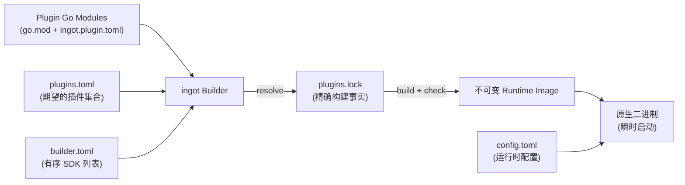

# ingot

> 构建期组合、不可变的智能体运行时。

[**English**](../README.md) · [**中文文档**](./README.zh.md) · [Usage Guide](./USAGE.md) · [使用说明](./USAGE.zh.md)

ingot 是一个基于插件的智能体（Agent）运行时。与运行时加载插件的方式不同，ingot 在**构建期**将插件组合为静态 **Component Graph**，对每个依赖做类型检查，生成 wiring 代码，并将全部内容编译为单个**不可变的原生 Runtime Image**——运行期直接启动即可。

由此获得：更快的启动速度、更低的内存占用、可验证的构建以及安全的回滚。

## 工作原理



需要了解三个核心概念：

| 概念 | 含义 |
|---|---|
| **Plugin（插件）** | 声明了 `ingot.plugin.toml` 的 Go Module；是分发、版本、配置与用户认知的边界。 |
| **Component（组件）** | Component Graph 中的节点；以纯 Go 代码声明依赖、导出与构造函数（`New`）。 |
| **Capability（能力）** | 组件之间交换的内容——稳定的 Go Contract 类型，构建期由 `go/packages` + `go/types` 校验。 |

## 特性

- **严格、规范的配置文件格式** —— 严格解析 `builder.toml`、`plugins.toml`、`plugins.lock` 与 `ingot.plugin.toml`，并提供规范化摘要（digest）。
- **单镜像多 SDK** —— Builder 解析并锁定有序 SDK 列表，识别每个 SDK 的 Contract wrapper，并可在同一个 Runtime Image 中组合使用不同 SDK module 的 Component。
- **精确、可复现的构建** —— 完整 Go Module 图与本地开发源码均会被哈希并校验；每个镜像携带 SHA-256 `ImageID`（构建输入）与 `ArtifactDigest`（二进制内容）。相同输入重建得到相同产物。
- **编译期正确性** —— 组件契约、ONE/OPTIONAL/MANY 解析、self-loop、环检测与稳定拓扑排序，全部在任何代码运行之前完成校验。
- **生成 wiring，无反射** —— 自动生成 `main.go` 与 `wiring_gen.go`，原生编译，并在镜像提交前以 `--ingot-check` 做启动校验。
- **不可变镜像与安全生命周期** —— 原子 `current` 切换、单写者锁、带崩溃恢复的事务、回滚与镜像 GC。
- **运行期就是普通 Go 对象** —— 运行中的进程是纯 Go：启动快、可调试，并支持逆序 Cleanup。

## 快速开始

```sh
# 1. 构建 CLI（或使用 ./scripts/install.sh 安装）
go build ./cmd/ingot

# 2. 初始化一个可用 home：官方插件集 + 配置模板
./ingot init

# 3. 编辑 ~/.ingot/config.toml 设置模型提供商，然后 apply
./ingot apply

# 4. 运行——未知命令会派发到当前镜像
./ingot chat
```

`ingot init` 会写入官方默认插件集（作为 `bundled-plugins/` 下的本地开发源码）、`builder.toml`、`plugins.toml` 与 `config.toml` 模板；`--apply` 会立即解析、构建并切换首个镜像。详见[使用说明](./USAGE.zh.md)。

所有状态都保存在 ingot home 中（默认为 `~/.ingot`，可用 `--home PATH` 指定其他路径）：

| 文件 | 作用 |
|---|---|
| `builder.toml` | Builder 使用的有序 SDK module 与精确请求版本。 |
| `plugins.toml` | 期望的插件集合（由你或 CLI 维护）。 |
| `plugins.lock` | 精确解析结果：完整 Module 图、摘要、构建参数。 |
| `config.toml` | 运行时配置值。 |
| `bundled-plugins/` | 物化后的官方插件源码（由 `ingot init` 写入）。 |
| `current` | 指向当前激活镜像的原子指针。 |
| `images/<ImageID>/` | 不可变的已构建镜像（二进制 + `manifest.json`）。 |

## 命令一览

```text
ingot [--home PATH] <command>

init       初始化 home：官方插件集 + 配置模板
resolve     解析 plugins.toml 并刷新 plugins.lock
build       按锁定解析结果构建新镜像
apply       解析 + 构建 + 原子切换 current
status      以 JSON 输出 desired/locked/current 状态
inspect     查看整个环境或单个插件（JSON）
rollback    将 current 回退到之前的镜像
gc          清理旧镜像（保留 current、上一个与最近 N 个）
plugin      add | remove | update | reorder | list | inspect
<other>     派发到当前 Runtime Image，如 ingot chat
```

完整的命令参考与示例请见 [使用说明](./USAGE.zh.md)（英文版：[Usage Guide](./USAGE.md)）。

## 文档

- [English README](../README.md) —— 本 README 的英文版。
- [Usage Guide](./USAGE.md) —— 英文使用说明。
- 设计文档（中文）见 [`docs/`](../docs/)：
  - [ingot 架构设计 v0.3](./ingot_架构设计_v0.3.md)
  - [`plugins.toml` v0.1](./ingot_plugins.toml_v0.1_设计方案.md)
  - [`builder.toml` v0.1](./ingot_builder.toml_v0.1_设计方案.md)
  - [`plugins.lock` v0.1](./ingot_plugins.lock_v0.1_设计方案.md)
  - [`ingot.plugin.toml` v0.1](./ingot.plugin.toml_设计方案_v0.1.md)
  - [SDK v0.1](./ingot_SDK_v0.1_设计方案.md)
  - [`ingot init` 设计 v0.1](./ingot_init_设计方案_v0.1.md)

## 仓库结构

- `cmd/ingot`：CLI 入口。
- `internal/cli`：命令行解析与面向用户的输出。
- `internal/home`：ingot home 状态、插件变更、镜像切换、回滚、GC、事务、运行时派发与 `init`。
- `internal/bundle`：官方插件 Bundle——profile、定位与 `bundled-plugins/` 物化。
- `internal/builder`：解析、组件图、代码生成与不可变镜像构建。
- `plugins/`：官方插件集（每个目录都是独立的 Plugin Go Module）。
- `scripts/`：`install.sh` / `install.ps1` 构建 CLI 并安装二进制与插件树。

插件 SDK 位于独立仓库：<https://github.com/ingot-agent/sdk>。
本地开发时，可将 SDK 放在同级目录，通过 `go.work` 或临时 `replace` 指令引入。

## 路线图

- [x] `ingot init` —— 生成默认 `builder.toml`、`plugins.toml` 与 `config.toml`，让用户从安装到可用智能体一步到位（设计：[`docs/ingot_init_设计方案_v0.1.md`](./ingot_init_设计方案_v0.1.md)）。
- [ ] `ingot doctor` —— 检查默认插件是否完整、配置是否有效以及当前镜像是否可运行。

## 开发

运行全部一致性测试与集成测试：

```sh
go test -race ./...
(cd sdk && go test -race ./...)
```

## 许可证

[MIT](../LICENSE)
