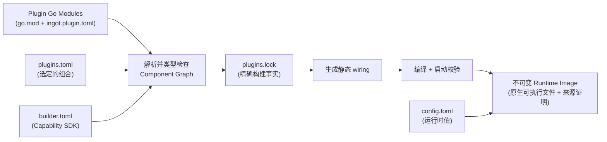

# ingot

> 从插件组合你需要的 Agent，交付为一个不可变二进制。

[**English**](../README.md) · [**中文文档**](./README.zh.md) · [Usage Guide](./USAGE.md) · [使用说明](./USAGE.zh.md)

ingot 是一个面向 Agent 的构建期组合系统。它不把 Agent 看成只有少数扩展点的固定应用，而是看成一张由可替换能力组成的图：HTTP Client、模型 Provider 与路由、工具、策略拦截器、存储、Prompt 与上下文管理、Agent Loop，以及最终面向用户的应用，都可以由插件提供。

在构建期，ingot 将选定的插件解析为静态 **Component Graph**，对每一条连接做类型检查，生成 wiring 代码，再把整张图编译为原生 **Runtime Image**。运行期不再发现插件、解析依赖图、动态加载代码，也不依赖反射完成装配；所有选定的代码都已经连接在可执行文件中。

这形成了 ingot 最重要的平衡：**组合 Agent 时拥有最大灵活性，运行 Agent 时保留最小不确定性。**

## 为什么选择 ingot

### 每一层都可替换

官方插件只是开箱即用的默认实现，并不拥有任何特权。一个插件就是带有 `ingot.plugin.toml` Manifest 的普通 Go Module，Component 之间通过有类型的 Capability Contract 通信。只要新 Component 满足图中其余部分需要的 Capability，任何一层都可以被替换。

| 层次 | 官方插件示例 | 可以替换为 |
|---|---|---|
| 应用 / UI | `app.cli` | HTTP 或 WebSocket 网关、客服系统连接器、聊天平台适配器 |
| Agent Loop | `agent.default` | 分诊工作流、领域专用 Loop、确定性编排流程 |
| 模型访问 | `http.default`、`model.openai-compatible`、`model.runtime` | 企业网络传输、其他 Provider、自定义路由或故障转移 |
| 工具 | `tool.shell`、`tool.fs`、`tool.ask`、`tool.runtime` | CRM、订单系统、搜索、数据库或内部 API |
| 策略 | `interceptor.approval`、`interceptor.script` | 审计、鉴权、限流、组织专用安全策略 |
| 状态与上下文 | `session.jsonl`、`context.compact`、`prompt.default` | 数据库存储、检索、自定义记忆与 Prompt |

这个边界刻意设计得很宽：定制能力并不止于工具和模型 Provider，而是向下覆盖 HTTP Client，向上贯穿 Agent Loop，直至承载 Agent 的应用本身。

### 灵活不等于动态

ingot 把变化放在构建期，把生产运行时固定下来：

- **生成 wiring，全程无反射** —— Component 是普通 Go 对象，由自动生成的 `main.go` 和 `wiring_gen.go` 连接。
- **构建期依赖图校验** —— Capability 类型、基数、缺失或歧义的 Provider、self-loop、环和创建顺序，都会在镜像提交前完成检查。
- **自包含交付** —— 选定的插件实现会被编译进运行时可执行文件；目标机器不需要安装 Go、ingot Builder、SDK，也不需要单独部署插件目录。
- **不可变、可追溯的镜像** —— 精确的 Module 输入和本地源码都会被锁定与哈希，二进制本身也有独立的产物摘要。
- **安全的镜像生命周期** —— 启动校验、原子激活、回滚、崩溃恢复和垃圾回收都属于标准工作流。
- **极小的运行时表面积** —— 启动过程只实例化一张预先确定的普通 Go 对象图，关闭时按创建顺序的逆序清理。

运行配置、密钥、持久化状态以及插件主动连接的外部服务仍然位于二进制之外；真正被消除的是部署阶段对构建系统和插件包的依赖。

## 不只是 Coding Agent

内置的默认 Profile 会生成一个功能完整的终端 Coding Agent，但它只是 ingot 的一种组合方式，并不是架构边界。

例如，要构建一个客服 Agent，可以把 `app.cli` 替换为网络插件：从客服系统接收会话，再把流式响应发送回去；把 Shell 和文件系统工具替换为工单、CRM、订单和知识库插件；默认模型运行时和 Agent Loop 可以保留，也可以一并替换。Builder 会验证新的依赖图，并产出同样自包含的 Runtime Image，分发时不需要再附带一套插件框架。

同一种模式还可以用于企业内部助手、数据 Agent、工作流 Agent、嵌入式 Agent，以及任何“模型调用之外的周边能力同样重要”的领域。

## 快速开始

需要 Go 1.24 或更高版本。

```sh
# 1. 构建 CLI（也可使用 ./scripts/install.sh 安装）
go build -o ingot ./cmd/ingot

# 2. 使用官方插件集和配置模板初始化 ingot home
./ingot init

# 3. 在 ~/.ingot/config.toml 中设置模型 Provider，然后组合镜像
./ingot apply

# 4. 将 chat 命令派发给当前激活的 Runtime Image
./ingot chat
```

`ingot init` 会把官方插件物化到 `bundled-plugins/`，并写入 `builder.toml`、`plugins.toml` 和 `config.toml` 模板。使用 `--profile minimal` 可获得最小可运行依赖图。安装选项和完整流程见[使用说明](./USAGE.zh.md)。

## 构建期组合如何工作



一次组合会经过三个清晰的状态：

1. `plugins.toml` 描述你想要什么。
2. `plugins.lock` 记录精确解析结果，包括完整 Go Module 图、源码摘要、SDK 和构建参数。
3. `images/<ImageID>/` 保存不可变的原生可执行文件和来源 Manifest。

修改运行参数只需修改 `config.toml`。替换实现则意味着修改插件集合并构建新镜像；旧镜像仍然保留，可随时回滚。

## 插件模型

| 概念 | 含义 |
|---|---|
| **Plugin（插件）** | 声明 `ingot.plugin.toml` 的 Go Module；是分发、版本、配置和用户操作的边界。 |
| **Component（组件）** | 静态图中的节点；声明有类型的依赖与导出，并通过 `New` 构造普通 Go 对象。 |
| **Capability（能力）** | Component 之间交换的稳定 Go Contract，由 Builder 使用 `go/packages` 和 `go/types` 在构建期检查。 |
| **Runtime Image（运行时镜像）** | 一套完成解析、代码生成、编译、检查并保持不可变的 Agent 组合。 |

Component 不会把自身注册进某个全局容器。它只需提供普通的具名 struct 和构造函数：

```go
type Dependencies struct {
    // 当前 Component 消费的 Capability。
}

type Exports struct {
    // 当前 Component 提供的 Capability。
}

func New(
    ctx context.Context,
    cfg Config,
    deps Dependencies,
) (Exports, sdk.Cleanup, error)
```

Builder 读取这些 Contract，解析 `ONE`、`OPTIONAL` 和 `MANY` 依赖，确定稳定的创建顺序，并生成普通 Go 代码原本需要手写的调用。公共 Capability Contract 位于独立的 [ingot SDK](https://github.com/ingot-agent/sdk) 中。

添加或替换插件：

```sh
ingot plugin add github.com/example/my-plugin@v1.2.3
ingot plugin add --path ../my-local-plugin
ingot plugin remove app.cli
ingot apply
```

如果新的组合存在 Capability 缺失、重复或成环，构建会在它成为当前镜像之前失败。

## 构建保证

- **严格、规范化的输入** —— `builder.toml`、`plugins.toml`、`plugins.lock` 和 `ingot.plugin.toml` 均被严格解析，并生成规范化摘要。
- **单镜像多 SDK** —— Builder 锁定有序 SDK 列表，并能在同一个 Runtime Image 中组合使用不同 SDK Module 的 Component。
- **内容寻址身份** —— `ImageID` 标识完整构建输入，`ArtifactDigest` 标识最终可执行文件字节。
- **可复现性检查** —— 重建一个已有 `ImageID` 时必须得到相同的产物摘要，而不是静默覆盖不同的二进制。
- **事务式激活** —— `apply` 依次完成解析、构建、校验，最后原子切换 `current`；失败的构建不会替换当前运行镜像。

## ingot home

所有状态默认位于 `~/.ingot`；可使用 `--home PATH` 指定其他位置。

| 路径 | 作用 |
|---|---|
| `builder.toml` | 有序 Capability SDK Module 及其请求版本。 |
| `plugins.toml` | 期望的插件组合。 |
| `plugins.lock` | 精确解析结果、源码哈希、Module 图和构建参数。 |
| `config.toml` | 运行时值，包括 Provider 配置和密钥。 |
| `bundled-plugins/` | 物化后的官方插件源码。 |
| `current` | 指向当前激活镜像的原子指针。 |
| `images/<ImageID>/` | 不可变的运行时可执行文件和 `manifest.json`。 |

## 命令一览

```text
ingot [--home PATH] <command>

init        使用官方插件 Profile 初始化 home
resolve     解析 plugins.toml 并刷新 plugins.lock
build       构建已锁定的组合，但不激活
apply       解析 + 构建 + 原子激活
status      以 JSON 输出 desired、locked、built 和 current 状态
inspect     以 JSON 查看环境或单个插件
rollback    激活上一个镜像
gc          在保留回滚安全性的前提下清理旧镜像
plugin      add | remove | update | reorder | list | inspect
<other>     派发到当前镜像，例如 ingot chat
```

完整命令参考见 [Usage Guide](./USAGE.md) 或[使用说明](./USAGE.zh.md)。

## 文档

- [English README](../README.md)
- [Contributing guide](../CONTRIBUTING.md) · [贡献指南](./CONTRIBUTING.zh.md)
- [Usage Guide](./USAGE.md) · [使用说明](./USAGE.zh.md)
- [ingot 架构设计 v0.3](./ingot_架构设计_v0.3.md)
- [Plugin Manifest 设计](./ingot.plugin.toml_设计方案_v0.1.md)
- [`plugins.toml` 设计](./ingot_plugins.toml_v0.1_设计方案.md)
- [`builder.toml` 设计](./ingot_builder.toml_v0.1_设计方案.md)
- [`plugins.lock` 设计](./ingot_plugins.lock_v0.1_设计方案.md)
- [SDK 设计 v0.1](./ingot_SDK_v0.1_设计方案.md)
- [`ingot init` 设计](./ingot_init_设计方案_v0.1.md)

## 仓库结构

- `cmd/ingot` —— CLI 入口。
- `internal/cli` —— 命令解析与面向用户的输出。
- `internal/home` —— desired/locked/current 状态、插件变更、镜像切换、回滚、GC、事务、运行时派发与初始化。
- `internal/bundle` —— 官方插件 Profile 与源码物化。
- `internal/builder` —— 解析、类型分析、Component Graph、代码生成、可复现构建与镜像校验。
- `plugins/` —— 官方插件集；每个目录都是独立 Go Module。
- `scripts/` —— Unix 和 PowerShell 安装脚本。

本地开发时，将 SDK 仓库放在本仓库同级目录；仓库内的 `go.work` 会通过 workspace replacement 选择它。

## 开发

在当前目录运行 Builder、集成、SDK 与插件测试：

```sh
go test -race ./...
for plugin_dir in plugins/*; do
  (cd "$plugin_dir" && go test -race ./...)
done
(cd ../sdk && go test -race ./...)
```

## 路线图

- [x] `ingot init` —— 创建可运行的插件 Profile 与配置。
- [ ] `ingot doctor` —— 验证插件完整性、配置和当前镜像。

## 许可证

[MIT](../LICENSE)
