# ingot Usage Guide

> English version · [中文版](./USAGE.zh.md)

This guide covers installation, the ingot home layout, every command with
examples, and the details of the build/apply workflow.

## Contents

- [Installation](#installation)
- [The ingot home](#the-ingot-home)
  - [Builder configuration and the Runtime ABI](#builder-configuration-and-the-runtime-abi)
- [Workflow overview](#workflow-overview)
- [Command reference](#command-reference)
  - [Global options](#global-options)
  - [`init`](#init)
  - [`bundle`](#bundle)
  - [`resolve`](#resolve)
  - [`build`](#build)
  - [`apply`](#apply)
  - [`status`](#status)
  - [`inspect`](#inspect)
  - [`rollback`](#rollback)
  - [`gc`](#gc)
  - [`plugin`](#plugin)
  - [Running the runtime image](#running-the-runtime-image)
  - [System prompt](#system-prompt)
- [Exit codes](#exit-codes)
- [Build & verification pipeline](#build--verification-pipeline)
- [Examples](#examples)

## Installation

Requires Go 1.24+.

```sh
go build ./cmd/ingot
```

This produces the `ingot` binary in the current directory. Alternatively,
use the official install script, which installs both the CLI and the official
plugin set (into `<prefix>/share/ingot/plugins`, discovered by `ingot init`):

```sh
./scripts/install.sh                          # install into /usr/local
./scripts/install.sh --prefix ~/.local        # custom prefix
```

Windows:

```powershell
.\scripts\install.ps1
```

Or move the binary onto your `PATH` manually:

```sh
install ./ingot ~/bin/ingot   # or wherever your PATH points
```

## The ingot home

All state lives in the ingot home, `~/.ingot` by default. Pick a different
home with the global `--home` flag (must come before the command):

```sh
ingot --home /path/to/home status
```

```
~/.ingot/
├── builder.toml        # builder configuration (ingot ABI is fixed, no SDK list)
├── plugins.toml        # desired plugin set (maintained by you or the CLI)
├── plugins.lock        # exact resolution: module graph, digests, build flags
├── state/              # Runtime Home for `ingot <command>`; plugin-owned state
├── bundled-plugins/    # materialized official plugin sources (written by `ingot init`)
├── current             # atomic pointer to the active image ID
├── current.previous    # previous image ID (used by rollback/GC safety)
├── cache/gomod/        # Go module cache used for builds
└── images/
    └── <ImageID>/      # immutable built images
        ├── ingot-runtime   # the native binary
        └── manifest.json   # image provenance
```

- `plugins.toml` and `plugins.lock` are written together atomically; a
  transaction file (`.plugins.transaction`) enables crash recovery.
- `current` is switched atomically only after a successful build and
  `--ingot-check` validation.
- `bundled-plugins/` is managed by ingot: `ingot init` writes or refreshes it,
  and the official plugins in `plugins.toml` point at it as local dev sources.
- Images are immutable: never edit anything under `images/`.

### Builder configuration and the Runtime ABI

`builder.toml` is the Builder configuration. There is no configurable SDK
list: contract modules such as the Agent SDK are imported by plugin `go.mod`
files and participate in the Component Graph through ordinary Go type
identity, then are recorded in `plugins.lock` as ordinary modules. The
`github.com/ingot-agent/ingot-abi` ABI (Component `Cleanup`/`Optional`/
`Named`, invocation metadata, lifecycle shutdown and plugin state scope) is
owned by the Builder and pinned exactly:

```toml
builder_config_version = 1
```

The pinned Runtime ABI is recorded in `plugins.lock`:

```toml
[runtime]
module_path = "github.com/ingot-agent/ingot-abi"
version = "v0.1.0"
sum = "h1:..."
```

The Builder fails the resolve or build when the ingot ABI is absent,
when Go MVS selects a different version through a plugin requirement, when a
plugin exports a host type, or when an unauthorized replacement is present.
Legacy `[[sdks]]` declarations and `INGOT_BUILDER_SDKS*` overrides are no
longer part of the schema and are rejected.

## Workflow overview

```text
install ingot
  -> ingot init           official plugin set + plugins.toml
  -> ingot apply          resolve + build + switch
  -> ingot web            open the browser workspace (app.backend)
  -> configure plugins    through their own operations (for example
                          app.backend.config); no shared config file exists
```

`apply` is a shortcut for `resolve` + `build` + switching `current`.
If you prefer explicit steps, run `resolve` and `build` separately and
inspect the result before switching.

## Command reference

All commands print results to stdout as JSON (except where noted) and errors
to stderr.

### Global options

| Option | Meaning |
|---|---|
| `--home PATH` | Use `PATH` as the ingot home instead of `~/.ingot`. Must appear before the command: `ingot --home /tmp/h status`. |

### `init`

```text
ingot init [--profile default|minimal] [--bundle PATH] [--force] [--apply]
```

Initializes a working ingot home:

1. locates the official plugin set (`--bundle` points at it explicitly;
   otherwise the executable's location is probed — `<prefix>/share/ingot/plugins`
   after an install-script run, or the repository-root `plugins/` in a dev
   checkout);
2. materializes it under `~/.ingot/bundled-plugins/` (idempotent: unchanged
   content is not rewritten);
3. writes a default `plugins.toml` (every profile plugin is a local dev
   source);
4. writes the default `builder.toml` (Builder configuration; no SDK list).

`init` writes no runtime configuration: plugins start Unconfigured and own
their own persistent state inside the Runtime Home.

| Option | Meaning |
|---|---|
| `--profile` | `default` (skeleton + common adapters, 11 plugins) or `minimal` (minimum runnable browser set, 9 plugins); default `default`. Both include `asset.local` for immutable multimodal data. |
| `--bundle` | Directory of the official plugin set (default: auto-detected relative to the executable). |
| `--force` | Overwrite an already initialized home (refuses to touch an existing `plugins.toml` otherwise). |
| `--apply` | Run `apply` (resolve + build + switch current) right after init. |

`init` is idempotent: an existing `plugins.toml` blocks re-initialization
(unless `--force`). It prints the next steps: run `ingot apply`, run
`ingot web`, then configure plugins through their own operations.

### `bundle`

```text
ingot bundle check [--bundle PATH]
ingot bundle update [--bundle PATH] [--apply]
```

`bundle check` compares the official plugin distribution shipped with the
current installation against `bundled-plugins/` in the home. It reports the
installed and available digests, whether an update is available, local drift,
and how many selected plugins use the managed bundle.

`bundle update` stages and validates the available distribution before
replacing the managed copy. It preserves `plugins.toml` and plugin order. Run
`ingot apply` afterwards, or pass `--apply` to resolve,
build, validate, and activate the updated image immediately. A failed
`--apply` restores the previous bundle and `plugins.lock`.

Re-running an official install script automatically refreshes the bundle for
an existing home before the normal apply step. `--bundle PATH` is intended for
development builds and non-standard installation layouts.

### Plugin configuration

There is no shared runtime `config.toml`. Every plugin owns its persistent
configuration inside its Runtime state scope:

```text
<runtime home>/state/<plugin>/
```

The official `prompt.default` plugin stores its `system_prompt` there. Configure
a plugin either by invoking its own operation (the browser workspace exposes
them under Operations) or by editing its state file directly. A plugin that has
not been configured yet still starts with defaults, so first-time setup is
always possible through an operation.

### `resolve`

```text
ingot resolve
```

Parses `plugins.toml`, resolves every direct plugin to an exact Go module
version (fetching the full module graph), and writes `plugins.lock`.
Prints the locked `ImageID` on success.

### `build`

```text
ingot build
```

Builds the locked resolution in `plugins.lock` into a new immutable image:

1. restores the builder-owned root module (`go.mod`/`go.sum`);
2. downloads and verifies the module graph;
3. verifies locked sources (local dev sources are re-hashed);
4. loads component contracts with `go/packages` + `go/types`;
5. resolves the component graph (ONE/OPTIONAL/MANY, cycles, stable order);
6. generates `main.go` and `wiring_gen.go`;
7. compiles a native binary with the locked toolchain settings;
8. runs `ingot-runtime --ingot-check` for startup validation;
9. commits the image and prints its `ImageID`.

Does **not** switch `current`. Use `apply`, or switch later.

### `apply`

```text
ingot apply
```

`resolve` + `build` + atomic `current` switch in one step. Prints the new
`ImageID`. This is the command you run after changing your plugin set.

### `status`

```text
ingot status
```

Prints the state of the home as JSON:

```json
{
  "desired_digest": "sha256:...",
  "locked_digest": "sha256:...",
  "locked_image_id": "sha256:...",
  "current_image_id": "sha256:...",
  "desired_locked": true,
  "locked_sources": true,
  "built": true,
  "current": true
}
```

| Field | Meaning |
|---|---|
| `desired_digest` | Canonical digest of `plugins.toml`. |
| `locked_digest` | Digest of the desired state that `plugins.lock` was resolved from. |
| `desired_locked` | `true` when desired and locked digests match (no drift). |
| `locked_sources` | `true` when all locked local dev sources match their hashes. |
| `built` | `true` when the locked image exists and verifies. |
| `current` | `true` when everything is consistent and `current` points at the locked image. |

`current` is the one field that tells you "you are running exactly what you
declared".

### `inspect`

```text
ingot inspect                 # everything
ingot inspect <id-or-name>    # one plugin
```

Prints the status plus:

- `direct_plugins`: each direct plugin with its index, ID, name, source kind,
  version, manifest digest, and components;
- `component_creation_order`: creation order from the built manifest;
- `many_order`: ordering of MANY capability consumers.

The `plugin list` and `plugin inspect` subcommands are specialized views of
this output.

### `rollback`

```text
ingot rollback                # switch to the previous image
ingot rollback <image-id>     # switch to a specific existing image
```

Points `current` at an existing image (validated for existence). Prints the
new `current` image ID. The previous image ID is preserved in
`current.previous`, so a mistaken rollback can itself be rolled back.

### `gc`

```text
ingot gc                      # keep the 3 most recent images
ingot gc --keep 5             # keep the 5 most recent
```

Removes old images. Always keeps:

- the current image;
- the previous image (`current.previous`);
- the `--keep` most recently built images (default 3).

Also cleans up abandoned staging directories. Prints the removed image IDs.

### `plugin`

#### `plugin add`

```text
ingot plugin add <module>[@query]   # e.g. github.com/example/plugin@v1.2.3
ingot plugin add <module>           # resolves the latest version
ingot plugin add --path ../local-plugin
ingot plugin add <module>@v1.2.3 --apply   # also resolve+build+switch
```

- Remote plugins: `module` is the Go module path (canonical plugin ID);
  `@query` is any Go module version query (`latest`, `v1.2.3`, `@v1`, ...).
  Without a query, the latest version is resolved.
- Local dev sources: `--path` points at a Go module on disk; its module path
  is read from `go.mod`. No version is recorded.
- Without `--apply`, only `plugins.toml` and `plugins.lock` are updated.

#### `plugin remove`

```text
ingot plugin remove <id-or-name>
```

Removes the plugin from the desired set. Accepts an ID or a plugin name.
Use `--apply` to build and switch immediately.

#### `plugin update`

```text
ingot plugin update <id-or-name>[@query]   # e.g. my-plugin@v2.0.0
ingot plugin update <id-or-name>           # default query: latest
```

Updates a plugin to a new version (re-resolves and refreshes the lock).
Use `--apply` to build and switch immediately.

#### `plugin reorder`

```text
ingot plugin reorder <id-or-name> --before <anchor>
ingot plugin reorder <id-or-name> --after  <anchor>
```

Moves a plugin before/after an anchor plugin. Order matters: it defines the
direct plugin order and influences stable resolution ordering. Use `--apply`
to build and switch immediately.

#### `plugin list`

```text
ingot plugin list
```

Prints the direct plugin set (JSON array).

#### `plugin inspect`

```text
ingot plugin inspect <id-or-name>
```

Prints one plugin's full inspection (same shape as `ingot inspect`).

### Running the runtime image

Any command that is not a built-in ingot command is dispatched to the current
runtime image:

```sh
# start the local browser workspace (default profile: app.backend)
ingot web
```

The runtime binary is executed with `INGOT_RUNTIME_HOME` set to
`<ingot home>/state`, so the image resolves its Runtime Home and plugin state
scopes there. The runtime's exit code is propagated.

`web` is the `app.backend` runtime command: it serves the embedded Vue browser
workspace on a local HTTP/SSE address (default `http://127.0.0.1:7316/`) and
prints that link. Model provider and API keys are configured through plugin
operations (or each plugin's own state file), not on the command line.

Every conversation belongs to a Session that is bound to one immutable local
Workspace directory. When you start a new conversation from the browser
workspace you choose that Workspace path; the app creates the Session, binds
the Workspace, and the session-scoped binding is what shell tools resolve their
working directory from. Deleting the Session removes the binding, and forking
a Session inherits its Workspace binding. Sessions migrated from the previous
schema may initially be unbound; the browser prompts for an existing local
directory and prevents execution until the one-time binding succeeds.

If there is no current image (or it is missing), the command fails with an
error explaining the problem.

Internal runtime flag (reserved for the builder):

```text
ingot-runtime --ingot-check
```

Runs startup validation (config decode, component instantiation, startup
value checks) without starting the agent loop. This must be the only
argument. The builder invokes it before committing an image.

## Exit codes

| Code | Meaning |
|---|---|
| `0` | Success. |
| `1` | Command failed (build, resolve, IO, verification, ...). |
| `2` | Usage error (unknown command, bad arguments, missing flag values). |

The exit code of a dispatched runtime command is the runtime's own exit code.

## Build & verification pipeline

A build is only committed after the whole pipeline passes:

```mermaid
flowchart LR
    A["Restore root module"] --> B["Download + verify modules"]
    B --> C["Verify locked graph & sources"]
    C --> D["Load contracts (go/packages, go/types)"]
    D --> E["Resolve component graph"]
    E --> F["Generate main.go + wiring_gen.go"]
    F --> G["Compile native binary"]
    G --> H["--ingot-check startup validation"]
    H --> I["Commit immutable image"]
```



Identity is content-addressed:

```text
ImageID        = SHA256(canonical build manifest)
ArtifactDigest = SHA256(final binary bytes)
```

`ImageID` identifies the build inputs; `ArtifactDigest` identifies the actual
artifact. Rebuilding the same `ImageID` is expected to reproduce the same
`ArtifactDigest`; a mismatch against an existing image fails the build
(reproducibility check) instead of silently replacing it.

## Examples

Full flow from scratch:

```sh
./scripts/install.sh
```

```sh
ingot init
ingot apply
ingot web
# then configure the model provider through the app.backend operations
```

Check that your home is consistent:

```sh
ingot status | jq .current      # true
```

Iterate on a local plugin (re-add, rebuild, check startup, roll back if bad):

```sh
ingot plugin update my-local-plugin --apply
ingot status
ingot rollback                  # oops, go back
ingot gc                        # clean up the failed images
```

Manage ordering when one plugin must run before another:

```sh
ingot plugin reorder approval --before script
```

Inspect what is actually wired:

```sh
ingot inspect | jq '.component_creation_order'
```
