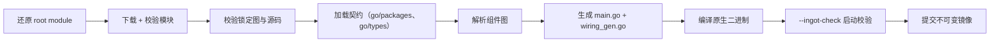

# ingot 使用说明

> 中文版 · [English version](./USAGE.md)

本文档介绍安装方法、ingot home 目录结构、全部命令及示例，以及 build/apply 工作流的细节。

## 目录

- [安装](#安装)
- [ingot home](#ingot-home)
  - [Builder SDK 配置](#builder-sdk-配置)
- [工作流概览](#工作流概览)
- [命令参考](#命令参考)
  - [全局选项](#全局选项)
  - [`init`](#init)
  - [`resolve`](#resolve)
  - [`build`](#build)
  - [`apply`](#apply)
  - [`status`](#status)
  - [`inspect`](#inspect)
  - [`rollback`](#rollback)
  - [`gc`](#gc)
  - [`plugin`](#plugin)
  - [运行 Runtime Image](#运行-runtime-image)
- [退出码](#退出码)
- [构建与校验流水线](#构建与校验流水线)
- [示例](#示例)

## 安装

需要 Go 1.24+。

```sh
go build ./cmd/ingot
```

这会在当前目录生成 `ingot` 二进制。也可以使用官方安装脚本，它会同时安装 CLI 与官方插件集（存放于 `<prefix>/share/ingot/plugins`，供 `ingot init` 定位）：

```sh
./scripts/install.sh                          # 安装到 /usr/local
./scripts/install.sh --prefix ~/.local        # 自定义前缀
```

Windows：

```powershell
.\scripts\install.ps1
```

也可以把二进制放入 `PATH`：

```sh
install ./ingot ~/bin/ingot   # 或 PATH 中的任意目录
```

## ingot home

所有状态都保存在 ingot home 中，默认为 `~/.ingot`。可以通过全局 `--home` 参数指定其他路径（必须位于命令之前）：

```sh
ingot --home /path/to/home status
```

```
~/.ingot/
├── builder.toml        # resolve/build 使用的有序 SDK module
├── plugins.toml        # 期望的插件集合（由你或 CLI 维护）
├── plugins.lock        # 精确解析结果：模块图、摘要、构建参数
├── config.toml         # 运行时配置值（由镜像读取）
├── bundled-plugins/    # 物化后的官方插件源码（由 ingot init 写入）
├── current             # 指向当前激活镜像 ID 的原子指针
├── current.previous    # 上一个镜像 ID（回滚/GC 安全使用）
├── cache/gomod/        # 构建使用的 Go 模块缓存
└── images/
    └── <ImageID>/      # 不可变的已构建镜像
        ├── ingot-runtime   # 原生二进制
        └── manifest.json   # 镜像来源信息
```

- `plugins.toml` 与 `plugins.lock` 一起原子写入；事务文件（`.plugins.transaction`）支持崩溃恢复。
- `current` 只在构建成功且通过 `--ingot-check` 校验后才会原子切换。
- `bundled-plugins/` 由 ingot 管理：`ingot init` 写入或刷新；`plugins.toml` 中的官方插件均作为本地开发源码指向这里。
- 镜像是不可变的：不要修改 `images/` 下的任何内容。

### Builder SDK 配置

`builder.toml` 按声明顺序选择一个或多个 SDK module。第一项是生成 Runtime
基础设施使用的主 SDK；Component 可以使用任一已配置 SDK 中的 `Cleanup`、
`Optional` 与 `Named`。

```toml
builder_config_version = 1

[[sdks]]
module = "github.com/ingot-agent/sdk"
version = "v0.1.4"

[[sdks]]
module = "example.com/acme-sdk/v2"
version = "v2.3.0"
# path = "../acme-sdk" # 可选的本地 checkout，相对于 builder.toml
```

环境变量在文件配置之后覆盖：

| 环境变量 | 含义 |
|---|---|
| `INGOT_BUILDER_SDKS` | 使用逗号分隔的 `module@version` 条目整体替换 SDK 列表。 |
| `INGOT_BUILDER_SDK_MODULE` | 覆盖第一项 SDK module。 |
| `INGOT_BUILDER_SDK_VERSION` | 覆盖第一项 SDK version。 |

`INGOT_BUILDER_SDKS` 不能与两个首项覆盖变量同时使用。例如：
`INGOT_BUILDER_SDKS='example.com/sdk@v1.2.0,example.com/sdk-extra/v2@v2.0.1'`。
SDK module path 必须唯一；并行使用不兼容 major 时应采用不同的 Go semantic
import path，例如 `example.com/sdk` 与 `example.com/sdk/v2`。

## 工作流概览

```text
安装 ingot
  -> ingot init          写官方插件集 + plugins.toml + 配置模板
  -> 编辑 config.toml    设置模型提供商
  -> ingot apply         解析 + 构建 + 切换
  -> ingot chat          运行智能体
```

`apply` 是 `resolve` + `build` + 切换 `current` 的快捷方式。如果希望分步执行，也可以单独运行 `resolve` 和 `build`，检查结果后再切换。

## 命令参考

除特别说明外，所有命令成功时以 JSON 输出结果到 stdout，错误输出到 stderr。

### 全局选项

| 选项 | 含义 |
|---|---|
| `--home PATH` | 使用 `PATH` 作为 ingot home，而不是 `~/.ingot`。必须放在命令之前：`ingot --home /tmp/h status`。 |

### `init`

```text
ingot init [--profile default|minimal] [--bundle PATH] [--force] [--apply]
```

初始化一个可用的 ingot home：

1. 定位官方插件集（`--bundle` 显式指定，否则按可执行文件相对位置探测：安装脚本的 `<prefix>/share/ingot/plugins` 或仓库根目录的 `plugins/`）；
2. 将其物化到 `~/.ingot/bundled-plugins/`（幂等：内容未变化时不重写）；
3. 写入默认 `plugins.toml`（profile 内所有插件均为本地开发源码）；
4. 写入默认 `builder.toml` SDK 配置；
5. 写入默认 `config.toml` 模板。

| 选项 | 含义 |
|---|---|
| `--profile` | `default`（骨架 + 常用适配器，13 个插件）或 `minimal`（最小可运行集，8 个插件），默认 `default`。 |
| `--bundle` | 指向官方插件集目录（默认按可执行文件位置自动定位）。 |
| `--force` | 覆盖已初始化的 home（默认拒绝覆盖已有 `plugins.toml`）。 |
| `--apply` | 完成后立即执行 `apply`（解析 + 构建 + 切换 current）。 |

`init` 幂等：已有 `plugins.toml` 时拒绝重复初始化（除非 `--force`）；已有 `config.toml` 时保留用户配置。输出下一步提示：编辑 `config.toml`、运行 `ingot apply`、运行 `ingot chat`。

### `resolve`

```text
ingot resolve
```

解析 `plugins.toml`，将每个直接插件解析为精确的 Go Module 版本（拉取完整模块图），并写入 `plugins.lock`。成功时输出锁定的 `ImageID`。

### `build`

```text
ingot build
```

按 `plugins.lock` 中的锁定解析结果构建新的不可变镜像：

1. 还原 Builder 拥有的 root module（`go.mod`/`go.sum`）；
2. 下载并校验模块图；
3. 校验锁定源码（本地开发源码会被重新哈希）；
4. 用 `go/packages` + `go/types` 加载组件契约；
5. 解析组件图（ONE/OPTIONAL/MANY、环检测、稳定顺序）；
6. 生成 `main.go` 与 `wiring_gen.go`；
7. 按锁定的工具链参数编译原生二进制；
8. 运行 `ingot-runtime --ingot-check` 做启动校验；
9. 提交镜像并输出其 `ImageID`。

**不会**切换 `current`。如需切换，请使用 `apply` 或稍后手动切换。

### `apply`

```text
ingot apply
```

一步完成 `resolve` + `build` + 原子切换 `current`。输出新的 `ImageID`。修改插件集合后执行此命令。

### `status`

```text
ingot status
```

以 JSON 输出 home 的状态：

```json
{
  "desired_digest": "sha256:...",
  "locked_digest": "sha256:...",
  "locked_image_id": "sha256:...",
  "current_image_id": "sha256:...",
  "desired_locked": true,
  "locked_sources": true,
  "built": true,
  "current": true
}
```

| 字段 | 含义 |
|---|---|
| `desired_digest` | `plugins.toml` 的规范化摘要。 |
| `locked_digest` | 生成 `plugins.lock` 时所依据的期望状态摘要。 |
| `desired_locked` | 为 `true` 表示期望与锁定摘要一致（无漂移）。 |
| `locked_sources` | 为 `true` 表示所有锁定的本地开发源码与哈希一致。 |
| `built` | 为 `true` 表示锁定镜像存在且校验通过。 |
| `current` | 为 `true` 表示一切一致且 `current` 指向锁定镜像。 |

`current` 是告诉你「当前运行的就是你声明的」的关键字段。

### `inspect`

```text
ingot inspect                 # 查看全部
ingot inspect <id-or-name>    # 查看单个插件
```

输出 status 以及：

- `direct_plugins`：每个直接插件的索引、ID、名称、来源类型、版本、Manifest 摘要与组件；
- `component_creation_order`：构建产物中的组件创建顺序；
- `many_order`：MANY 能力消费者的排序。

`plugin list` 与 `plugin inspect` 是该输出的两个专用视图。

### `rollback`

```text
ingot rollback                # 切换到上一个镜像
ingot rollback <image-id>     # 切换到指定的已存在镜像
```

将 `current` 指向一个已存在的镜像（会校验其存在性）。输出新的 `current` 镜像 ID。上一个镜像 ID 会保留在 `current.previous` 中，因此误回滚后可以再次回滚。

### `gc`

```text
ingot gc                      # 保留最近 3 个镜像
ingot gc --keep 5             # 保留最近 5 个
```

清理旧镜像。始终保留：

- 当前镜像；
- 上一个镜像（`current.previous`）；
- `--keep` 指定的最近构建镜像（默认 3）。

同时会清理遗留的 staging 目录。输出被删除的镜像 ID 列表。

### `plugin`

#### `plugin add`

```text
ingot plugin add <module>[@query]   # 例如 github.com/example/plugin@v1.2.3
ingot plugin add <module>           # 解析最新版本
ingot plugin add --path ../local-plugin
ingot plugin add <module>@v1.2.3 --apply   # 同时 解析+构建+切换
```

- 远程插件：`module` 是 Go Module 路径（即 canonical Plugin ID）；`@query` 是任意 Go Module 版本查询（`latest`、`v1.2.3`、`@v1` 等）。不带查询时解析最新版本。
- 本地开发源码：`--path` 指向磁盘上的 Go Module，模块路径从 `go.mod` 读取，不记录版本。
- 不带 `--apply` 时，只更新 `plugins.toml` 与 `plugins.lock`。

#### `plugin remove`

```text
ingot plugin remove <id-or-name>
```

从期望集合中移除插件。接受 ID 或插件名。加 `--apply` 可立即构建并切换。

#### `plugin update`

```text
ingot plugin update <id-or-name>[@query]   # 例如 my-plugin@v2.0.0
ingot plugin update <id-or-name>           # 默认查询：latest
```

将插件更新到新版本（重新解析并刷新 lock）。加 `--apply` 可立即构建并切换。

#### `plugin reorder`

```text
ingot plugin reorder <id-or-name> --before <anchor>
ingot plugin reorder <id-or-name> --after  <anchor>
```

将插件移动到锚点插件之前/之后。顺序很重要：它决定直接插件顺序并影响稳定解析排序。加 `--apply` 可立即构建并切换。

#### `plugin list`

```text
ingot plugin list
```

输出直接插件集合（JSON 数组）。

#### `plugin inspect`

```text
ingot plugin inspect <id-or-name>
```

输出单个插件的完整检查信息（结构同 `ingot inspect`）。

### 运行 Runtime Image

任何非内置的 ingot 命令都会派发到当前 Runtime Image：

```sh
# 全屏 TUI（默认，需要终端）
ingot chat

# 行式纯文本输出，适用于管道与重定向
ingot chat --plain
```

运行时会以你的 stdin/stdout/stderr 执行，并设置 `INGOT_HOME` 指向 ingot home，因此镜像可以找到 `config.toml` 与持久化状态。运行时的退出码会被透传。

`chat` 是 `app.cli` 的 runtime 命令：不带 `--plain` 时启动全屏 TUI（markdown transcript、tool 调用块、`Ctrl+O` 会话侧栏、Ask 选项面板；`Ctrl+Q` 退出，`Ctrl+C` 取消进行中的 turn，`F1` 帮助）。`chat --plain` 降级为 prompt 行输入与纯文本输出，stdin/stdout 非终端时（管道、重定向、非交互脚本）也能工作。模型 provider 与 API key 在 `config.toml` 中配置，不通过命令行传入。

首次发送普通消息时，app先用该消息的规范化短文本立即创建Session；首轮成功后再调用一次模型生成稳定标题并替换，后续不自动更新。`/new 项目名`创建人工命名Session，`/new`等待下一条消息自动创建，`/rename 新标题`修改当前标题；人工标题不会被AI覆盖。标题生成失败只保留首条消息标题，不影响对话。

如果当前没有镜像（或镜像缺失），命令会失败并给出说明。

内部运行时参数（保留给 Builder 使用）：

```text
ingot-runtime --ingot-check
```

执行启动校验（配置解码、组件实例化、启动值检查），不启动 Agent 主循环。该参数必须是唯一参数。Builder 在提交镜像前会调用它。

## 退出码

| 码 | 含义 |
|---|---|
| `0` | 成功。 |
| `1` | 命令失败（构建、解析、IO、校验等）。 |
| `2` | 用法错误（未知命令、参数错误、缺少参数值）。 |

派发的运行时命令的退出码即运行时自身的退出码。

## 构建与校验流水线

构建只有在整个流水线全部通过后才会提交：



身份是内容寻址的：

```text
ImageID        = SHA256(规范化构建清单)
ArtifactDigest = SHA256(最终二进制内容)
```

`ImageID` 标识构建输入；`ArtifactDigest` 标识实际产物。相同 `ImageID` 重建应复现相同的 `ArtifactDigest`；与已有镜像不一致会导致构建失败（可复现性检查），而不会静默覆盖。

## 示例

从零开始的完整流程：

```sh
./scripts/install.sh
```

```sh
ingot init
# 编辑 ~/.ingot/config.toml：填写模型提供商 base_url / api_key
ingot apply
ingot chat
```

验证 home 是否一致：

```sh
ingot status | jq .current      # true
```

迭代本地插件（重新添加、重建、检查启动、不行就回滚）：

```sh
ingot plugin update my-local-plugin --apply
ingot status
ingot rollback                  # 不行，回退
ingot gc                        # 清理失败的镜像
```

管理插件顺序（某个插件需要先于另一个运行）：

```sh
ingot plugin reorder approval --before script
```

查看实际 wiring 的内容：

```sh
ingot inspect | jq '.component_creation_order'
```
