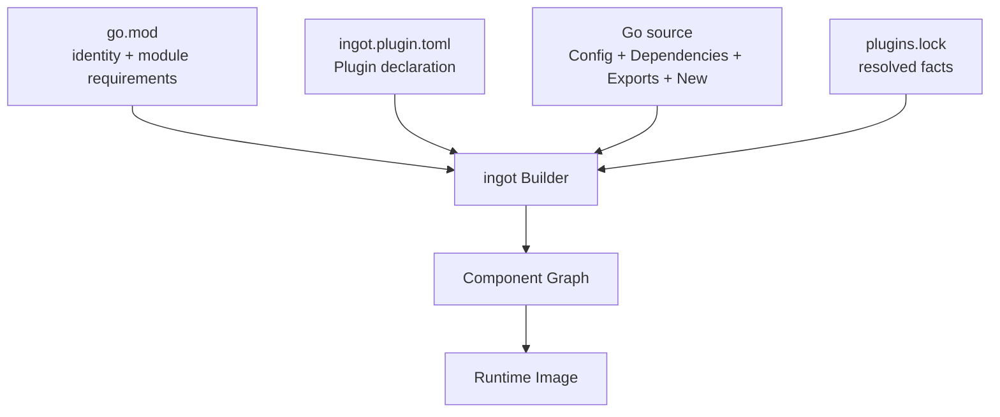
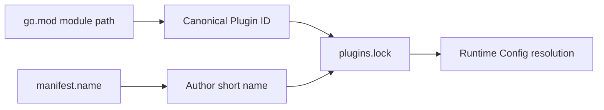
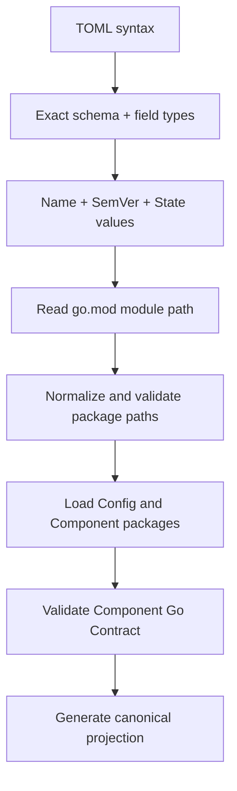
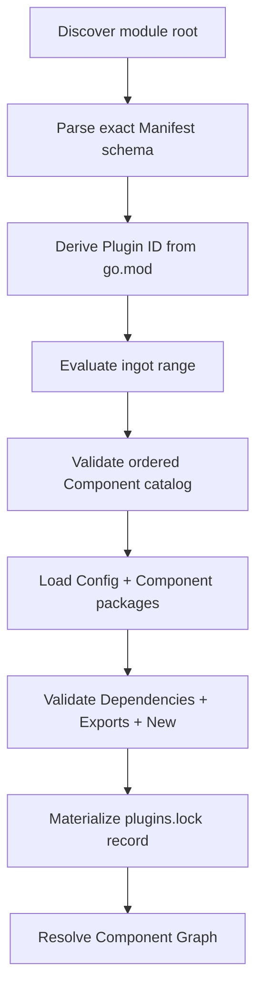

# `ingot.plugin.toml` 设计提案 v0.1

> 状态：Discussion Draft  
> 目标：定义最小、明确、可稳定演进的 Plugin Manifest

## 1. 设计目标

`ingot.plugin.toml` 用于将一个 Go Module 声明为 ingot Plugin，并为 Builder 提供加载 Component 所需的静态入口。

Manifest 只描述以下信息：

- Plugin 的作者短名称；
- ingot 兼容范围；
- root Config package；
- Component package 与声明顺序；
- 持久化 State 的兼容窗口；
- 展示元数据。

其余信息沿用既有权威来源：

| 信息 | 权威来源 |
|---|---|
| Canonical Plugin ID | `go.mod` module path |
| Plugin exact version | Go Module resolution / `plugins.lock` |
| Go language version | `go.mod` |
| SDK version | selected Go module graph |
| Runtime Config schema | root package 的 Go `Config` type |
| Capability dependency | Component `Dependencies` |
| Capability export | Component `Exports` |
| Component construction | Component `New` |
| GOOS/GOARCH 支持 | Go build constraints 与实际 package loading |
| Toolchain、CGO、build flags | Builder policy / `plugins.lock` |



## 2. 文件与 Module 边界

Manifest 文件名固定为：

```text
ingot.plugin.toml
```

规则：

- 文件位于 Go Module root，与 `go.mod` 同级；
- 一个 Go Module 最多声明一个 ingot Plugin；
- Builder 只读取 module root 的 Manifest；
- Plugin ID 直接取 `go.mod` module path；
- 一个 Plugin 包含一个或多个 Component。

典型目录：

| 路径 | 内容 |
|---|---|
| `go.mod` | Canonical Plugin ID 与 Go dependencies |
| `ingot.plugin.toml` | Plugin declaration |
| `config.go` | root `Config` |
| `component.go` | 单 Component Plugin 的实现 |
| `<component>/component.go` | Composite Plugin 的 Component 实现 |

## 3. Exact Schema

v0.1 顶层 schema：

| Field | Required | Build-relevant | 含义 |
|---|---:|---:|---|
| `manifest_version` | Yes | Yes | Manifest schema major，固定为 `1` |
| `name` | Yes | Yes | 作者短名称 |
| `ingot` | Yes | Yes | ingot compatibility range |
| `config_package` | Yes | Yes | root Config package |
| `components` | Yes | Yes | ordered Component catalog |
| `state` | No | Yes | Persistent State compatibility |
| `meta` | No | No | Display metadata |

Nested schema：

| Table | Exact fields |
|---|---|
| `[[components]]` | `name`、`package` |
| `[state]` | `schema_version`、`min_reader_version` |
| `[meta]` | `display_name`、`description`、`homepage`、`repository`、`license` |

Parser 使用 exact schema。Unknown field、duplicate key、wrong type 和 missing required field 均产生 Manifest Error。

## 4. 最小 Manifest

单 Component Plugin：

```toml
manifest_version = 1
name = "shell"
ingot = ">=0.3.0 <0.4.0"
config_package = "."

[[components]]
name = "default"
package = "."
```

本提案要求显式声明 `components`。单 Component 与 Composite Plugin 使用同一种 schema 和同一套顺序语义。

## 5. Composite Plugin

```toml
manifest_version = 1
name = "app.cli"
ingot = ">=0.3.0 <0.4.0"
config_package = "."

[[components]]
name = "interaction"
package = "./interaction"

[[components]]
name = "app"
package = "./app"
```

目录：

| Path | Package responsibility |
|---|---|
| `./` | 共享 `Config` |
| `./interaction` | `app.cli/interaction` Component |
| `./app` | `app.cli/app` Component |

所有 Component 的 `New` 接收 `config_package` 中同一个 `Config` type identity。

## 6. 字段规范

### 6.1 `manifest_version`

```toml
manifest_version = 1
```

该字段表示 Manifest schema major。Builder 对未支持的值返回 `unsupported manifest version`。

### 6.2 `name`

```toml
name = "openai-compatible"
```

`name` 是 Plugin 作者声明的短引用，用于 CLI、Runtime Config 与 diagnostics。

Grammar：

```text
[a-z][a-z0-9]*(?:[._-][a-z0-9]+)*
```

约束：

- 长度为 1–64；
- 使用 ASCII lowercase；
- 在当前 direct Plugin set 中唯一。

Canonical Plugin ID 仍为 Go module path。Short name 冲突由 lock resolution 在构建前报告，并列出冲突的 canonical IDs。

### 6.3 `ingot`

```toml
ingot = ">=0.3.0 <0.4.0"
```

该字段约束 Plugin 可参与构建的 ingot distribution/runtime protocol 版本。

v0.1 range grammar 是空格分隔的 AND comparators：

```text
>=x.y.z
>x.y.z
<=x.y.z
<x.y.z
=x.y.z
x.y.z
```

Canonicalization：

1. Bare version 转换为 `=x.y.z`；
2. Version 使用 SemVer 2.0.0 canonical form；
3. Comparator 按 `=`、`>`、`>=`、`<`、`<=` 排序；
4. 同一 operator 下按 version UTF-8 bytes 排序；
5. 完全相同的 comparator 去重；
6. Comparator 之间使用一个 ASCII space；
7. 逻辑冗余 comparator 保持原有约束集合。

Prerelease 按 SemVer precedence 求值。

### 6.4 `config_package`

```toml
config_package = "."
```

该字段指向定义 Plugin root `Config` 的 Go package。

```go
type Config struct {
    // Runtime configuration
}
```

无配置项的 Plugin 定义空 struct：

```go
type Config struct{}
```

Composite Plugin 通过 nested struct 组织配置：

```go
type Config struct {
    Interaction InteractionConfig `toml:"interaction"`
    App         AppConfig         `toml:"app"`
}
```

### 6.5 `components`

```toml
[[components]]
name = "default"
package = "."
```

每项声明一个 Component Graph node。

Component name 使用与 Plugin `name` 相同的 grammar，并在当前 Plugin 内唯一。完整 identity：

```text
<go-module-path>/<component-name>
```

`package` 指向 Component Contract 所在的 Go package。

Component 数组顺序是公开 Build Semantics，用于：

- stable topological sort 的 tie-break；
- MANY aggregation order；
- Interceptor order；
- Build Identity。

同一个 normalized package 在 Component list 中只出现一次。

### 6.6 `[state]`

拥有 Persistent State 的 Plugin 声明：

```toml
[state]
schema_version = 3
min_reader_version = 2
```

字段语义：

| Field | 含义 |
|---|---|
| `schema_version` | 当前实现写入的 Plugin State format version |
| `min_reader_version` | 当前实现可读取的最旧 State format version |

两个字段均为正整数，并满足：

```text
min_reader_version <= schema_version
```

Reader window 为：

```text
[min_reader_version, schema_version]
```

需要该持久化位置的 Component 通过显式 `state.Scope` Dependency 获得
Plugin-scoped absolute directory，并负责 format detection、reader validation
与 migration。`state.Scope` 由 generated runtime 注入，不参与普通 Provider
匹配。

省略 `[state]` 时，lock 将 State absence materialize 为：

```text
present = false
schema_version = 0
min_reader_version = 0
```

### 6.7 `[meta]`

```toml
[meta]
display_name = "OpenAI-compatible Provider"
description = "OpenAI-compatible model provider."
homepage = "https://example.com"
repository = "https://github.com/example/ingot-openai-compatible"
license = "Apache-2.0"
```

`meta.*` 服务 inspect、registry 与 UI。`license` 建议使用 SPDX identifier/expression。

Display metadata 与 Manifest Build Projection 分层。Remote module version 或 Local Dev content digest 仍可因 source 变化而更新最终 ImageID。

## 7. Package Path

`config_package` 与 `components[*].package` 使用 canonical module-relative path。

有效形式：

```text
.
./foo
./foo/bar
```

Path validator 要求：

- 使用 `/`；
- `.` 只作为完整 root path；
- 其他路径以 `./` 开头；
- 每个 segment 非空；
- 无 `.`、`..` segment；
- 无 trailing slash 或 duplicate slash；
- 无完整 `internal` segment；
- 解析结果位于当前 module source boundary 内；
- symlink 最终目标仍位于 module root 内。

Builder 由 module path 与 relative package path 生成完整 import path。

## 8. Component Go Contract

每个 Component package提供：

```go
type Dependencies struct {
    // consumed capabilities
}

type Exports struct {
    // provided capabilities
}

func New(
    ctx context.Context,
    cfg PluginConfig,
    deps Dependencies,
) (Exports, ingotabi.Cleanup, error)
```

Builder 验证：

| Position | Required type |
|---|---|
| `Dependencies` | 当前 Component package 的 exported named struct |
| `Exports` | 当前 Component package 的 exported named struct |
| Fields | top-level、named、exported |
| `New` parameter 1 | `context.Context` |
| `New` parameter 2 | `config_package.Config` |
| `New` parameter 3 | 当前 package 的 `Dependencies` |
| `New` result 1 | 当前 package 的 `Exports` |
| `New` result 2 | `ingotabi.Cleanup` |
| `New` result 3 | `error` |

Embedded field 与 unexported field 产生 Component Contract Error。

`New` 完成有界初始化，启动实例拥有的长期任务，并及时返回。Cleanup 停止并等待本实例的后台任务，然后释放本实例资源。

## 9. Config Resolution

Builder 从两个来源建立 Plugin reference：



Runtime Config 的 `[plugins]` key 可使用 canonical ID 或 short name：

```toml
[plugins."github.com/example/ingot-openai-compatible"]
```

```toml
[plugins.openai-compatible]
```

Resolution：

| 情况 | 结果 |
|---|---|
| 一个 locked Plugin 匹配一个 table | strict decode |
| ID 与 short name 同时匹配 | duplicate config error |
| locked Plugin 缺少匹配 table | missing config error |
| table 未匹配当前 image | 保留并忽略 |

## 10. Manifest Build Projection

Builder 将 Manifest 解析为 semantic model，然后生成以下 exact JSON shape：

```json
{
  "schema_version": 1,
  "manifest_version": 1,
  "name": "example",
  "ingot": ">=0.3.0 <0.4.0",
  "config_package": ".",
  "state": {
    "present": false,
    "schema_version": 0,
    "min_reader_version": 0
  },
  "components": [
    {
      "name": "default",
      "package": "."
    }
  ]
}
```

Rules：

- 所有字段始终 materialize；
- `components` 保持 declaration order；
- absent State 使用固定 zero representation；
- `meta.*`、comment、whitespace 与 TOML physical order 不进入 projection；
- module path 作为 Plugin ID 单独进入 Canonical BuildManifest。

```text
manifest_digest = "sha256:" + lowercase_hex(
    SHA256(JCS(ManifestBuildProjectionV1))
)
```

这种划分使 Manifest 保持单一声明来源，同时让 BuildManifest 明确包含 module identity。

## 11. Strict Parsing

解析顺序：



Builder 在 package loading 前完成低成本校验，并为错误提供：

- stable error code；
- Manifest file path；
- field path；
- Plugin ID 与 Component identity；
- expected/actual value；
- 修正建议。

## 12. 完整示例

### 12.1 普通 Plugin

```toml
manifest_version = 1
name = "openai-compatible"
ingot = ">=0.3.0 <0.4.0"
config_package = "."

[[components]]
name = "default"
package = "."

[meta]
display_name = "OpenAI-compatible Provider"
description = "Provides configured OpenAI-compatible model providers."
repository = "https://github.com/example/ingot-openai-compatible"
license = "Apache-2.0"
```

### 12.2 拥有 State 的 Plugin

```toml
manifest_version = 1
name = "session.sqlite"
ingot = ">=0.3.0 <0.4.0"
config_package = "."

[[components]]
name = "default"
package = "."

[state]
schema_version = 1
min_reader_version = 1
```

### 12.3 Composite Plugin

```toml
manifest_version = 1
name = "app.cli"
ingot = ">=0.3.0 <0.4.0"
config_package = "."

[[components]]
name = "interaction"
package = "./interaction"

[[components]]
name = "app"
package = "./app"

[meta]
display_name = "CLI Application"
description = "Terminal interaction and application loop."
```

## 13. Builder Validation Pipeline



Manifest validation output进入 lock resolution 的固定结构：

```text
canonical module ID
author short name
canonical ingot range
config package
ordered Component records
State compatibility
manifest digest
display metadata
```

## 14. Conformance Tests

### 14.1 Schema

- minimal/full Manifest；
- invalid TOML；
- missing required field；
- unknown field；
- wrong field type；
- unsupported `manifest_version`。

### 14.2 Identity 与 Name

- module path 作为 canonical ID；
- valid/invalid short name；
- duplicate short name in direct Plugin set；
- semantic import major `/v2` 产生对应 module ID。

### 14.3 Package 与 Component

- canonical package paths；
- boundary/symlink escape；
- `internal` segment；
- duplicate Component name/package；
- Component order preservation；
- root Config identity；
- exact `Dependencies`、`Exports` 与 `New` signature。

### 14.4 Compatibility 与 State

- canonical ingot range；
- prerelease；
- supported/unsupported distribution version；
- absent State；
- valid reader window；
- invalid State numbers/window。

### 14.5 Canonicalization

- comment、whitespace、metadata 与 TOML table order 保持相同 projection；
- Component order、name、path、compatibility 与 State change 更新 digest；
- exact JCS bytes 与 digest golden fixture。

## 15. Schema 演进

`manifest_version` 控制构建语义。以下变化发布新的 schema major：

- 改变现有字段解释；
- 改变 Component order semantics；
- 改变 Config/Component Contract discovery；
- 加入新的 build-relevant composition mechanism。

纯 Display field 可在兼容 Builder 版本中扩展 `[meta]`，Plugin 同时提高 `ingot` compatibility lower bound。

## 16. 本提案的核心决策

1. Canonical Plugin ID 只取自 `go.mod`，Manifest 不重复声明 `id`。
2. `name` 是作者短引用，并在当前 direct Plugin set 中保持唯一。
3. Component list 始终显式，单 Component 与 Composite Plugin 使用同一结构。
4. `config_package` 明确表达 root Config package。
5. GOOS、GOARCH、Go version 与 CGO 沿用 Go source、`go.mod` 和 Builder policy。
6. Capability graph 只取自 Go `Dependencies` 与 `Exports`。
7. `[state]` 只描述 Plugin persistent format 的 reader window。
8. `[meta]` 与 Manifest Build Projection 分层。
9. Parser 使用 exact schema；Builder 输出 canonical semantic projection。

该设计让 Manifest 保持为一份很薄的静态入口：Go Module 决定 Plugin 身份与代码来源，Manifest 决定 Builder 从哪里读取 Config 和 Component，Go Type 决定 Component 如何连接。
