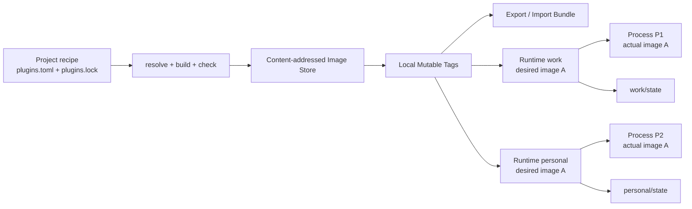

# ingot M2 Image / Runtime / Process 设计方案

> 状态：Draft
> 里程碑：M2
> 日期：2026-09-11
> 关联 ADR：0001 Image 三层身份、0002 Runtime Home、0006 Runtime 环境变量

## 1. 背景

M1 已经完成 standalone Runtime 与 Plugin-owned State：Runtime Image 可以脱离
Builder 独立启动，运行时只通过 `INGOT_RUNTIME_HOME` 定位自己的持久化目录，
每个 Plugin 在 `<runtime-home>/state/<plugin-scope>/` 中拥有独立状态。

M1 之后，Ingot Home 仍然同时承担三种职责：

1. Builder workspace：保存 `plugins.toml`、`plugins.lock` 和构建缓存；
2. 唯一 Runtime Home：顶层 `state/` 是所有 managed execution 的状态目录；
3. 唯一部署指针：`current/current.previous` 决定所有未知 CLI 命令运行哪个 Image。

这套模型不能稳定支持多 Runtime：

- 两个 Runtime 无法共享 Image 并隔离 State；
- `apply` 同时表达构建与部署，无法说明要切换哪个 Runtime；
- 运行中的进程只通过 PID 间接存在，没有稳定 Process identity、退出记录和控制面；
- Image 只有 content identity，没有面向用户的本地 tag 和离线分发能力；
- GC 只理解全局 current/previous，无法根据 Runtime 和 Process 引用关系判断可达性。

M2 将持久对象正式拆为 **Image、Runtime、Process** 三层，并提供不依赖
常驻 daemon 的本地 CLI 管理能力。

## 2. 目标

M2 必须交付以下能力：

1. 将构建产物保存为 content-addressed Image，并通过 Docker-like mutable tag 命名；
2. 将单个 target variant 导出为离线 bundle，并在另一台机器上严格验证后导入；
3. 创建多个命名 Runtime，使它们可以引用相同或不同 Image，并拥有完全隔离的 State；
4. 原子切换 Runtime 的期望 Image，运行中的 Process 继续固定使用其启动时 Image；
5. 前台或后台启动 Runtime，查询 Process、读取日志并请求正常关闭；
6. 保持 generated Runtime 轻量，只在其中强制 Runtime Home 单 writer 和 lifecycle cleanup；
7. 按完整引用图执行 Image GC；
8. 支持从任意显式指定的 `plugins.toml` 一次完成 resolve、build、check 与本地命名；
9. standalone binary 与 managed Runtime 继续遵守同一 Runtime Home、State 和 writer
   lock contract。

## 3. 非目标

M2 不包含：

- 常驻 Manager daemon 或通用任务调度器；
- 远程 Image Registry、push/pull、签名、publisher trust 或透明自动下载；
- Plugin source package 的新分发协议；
- 通过 Runtime control channel 调用 Plugin Operation；
- Host 编排的 Plugin State migration、自动 State snapshot 或自动恢复；
- 同一 Runtime Home 的多 writer 或水平扩容；
- 热替换正在运行的 Process；
- 自动计算 CPU tuning variant 的最优匹配；
- 跨平台构建。M2 Builder 仍然只构建并执行校验当前主机 target；
- 兼容未发布版本的 Home、manifest、CLI 或持久数据。M2 直接冻结新契约，旧开发数据由
  开发者自行备份后清理或重建。

完整交互式 Plugin Operation RPC 和 Application health 留给 M5。M2 的 control channel
属于外部 supervisor，只管理 OS Process lifecycle，不进入 generated Runtime。

## 4. 核心术语与不变量

### 4.1 Build Input Digest

Build Input Digest 是当前 `ImageID`，由 Canonical BuildManifest 计算：

```text
sha256(canonical build manifest)
```

它覆盖 Plugin set、精确 module graph、dev source digest、toolchain、target、build
flags 和固定 Runtime ABI。字段和命令输出统一使用 `image_id`，其语义始终是 Build
Input Digest。

### 4.2 Artifact Digest

Artifact Digest 是最终 Runtime executable bytes 的 SHA-256。相同 `image_id` 必须
对应相同 `artifact_digest`；否则视为 reproducibility violation，禁止提交或导入。

### 4.3 Image Tag 与 Target Variant

Image Tag 是用户可理解的本地可移动引用：

```text
<name>:<tag>
```

一个 tag 可以包含多个 target variant：

```text
acme/coding-agent:1.4.0
  linux/amd64  -> {image_id: sha256:A, artifact_digest: sha256:B}
  darwin/arm64 -> {image_id: sha256:C, artifact_digest: sha256:D}
  windows/amd64 -> {image_id: sha256:E, artifact_digest: sha256:F}
```

不变量：

- `name:tag` 不参与 digest 计算；
- tag 是 mutable pointer，移动 tag 不修改任何 Image bytes；
- 一个 tag 的 target variant 可以逐个补充；
- 同一 tag 的同一 `GOOS/GOARCH` 槽位可以原子移动到另一个 concrete Image；
- 同一 `GOOS/GOARCH` 槽位不允许同时存在多个 tuning/CGO/GOEXPERIMENT 变体；
- Runtime 和 Process 一旦解析 tag，始终保存 concrete digest，不跟随 tag 后续移动。

### 4.4 Runtime

Runtime 是持久部署单元，不是进程。它拥有：

- 稳定名称；
- 期望使用的 concrete Image binding；
- 一个 rollback Image binding；
- 默认启动 argv；
- Runtime Home 及其中的 Plugin-owned State；
- 当前 Process 和最后一次退出的可观测记录。

用户输入 tag 后，CLI 必须在事务边界内将其解析为 target、`image_id` 和
`artifact_digest` 再持久化。原始 tag 只作为可选来源信息，不参与实际启动决策。

### 4.5 Process

Process 是一次具体执行。它固定记录启动瞬间实际使用的 Image，不随 Runtime 的
desired Image 改变。Process 使用随机 `process_id` 作为稳定身份；PID 只是当前操作
系统实现细节，不能单独作为 liveness 或 stop 的权威依据。

### 4.6 State

State 永远属于 Runtime，不属于 Image。Image switch、rollback、tag、import、
export 和 GC 都不得移动、复制或解释 Runtime State。

State format compatibility 仍由 Plugin manifest 的 reader window 和 Plugin 实现负责。
Host 只负责 fail-closed 地传播启动失败，不承诺 rollback 后旧 Image 必然能够读取已被
新 Image 迁移的 State。

## 5. 总体架构



Recipe 和 lock 位于项目工作目录；Image Store、Tag Catalog、Runtime Registry 和 Process
observations 位于 Ingot Home。两侧具有独立的所有权和锁边界。

### 5.1 Docker-like 心智模型

M2 的产品体验采用 Docker 式对象流，但不复制其实现：

| Ingot | Docker 类比 | 关键差异 |
|---|---|---|
| `plugins.toml` recipe | Dockerfile | 声明静态 Plugin composition，不描述容器文件系统步骤 |
| Image tag / variant | tagged image | Runtime 解析后固定 digest，不跟随 tag 移动 |
| Runtime | container | State 由 Plugin 拥有，Host 不提供通用 writable layer |
| Process | running container process | 一个 Runtime Home 同时只允许一个 writer Process |
| Image bundle | image save/load archive | M2 只保存单 target native executable variant |

标准主路径应保持短且可组合：

```text
ingot build --use ./coding-agent.toml --tag acme/coding-agent:1.4.0
ingot run --name work --detach acme/coding-agent:1.4.0 -- web
ingot ps
ingot runtime logs work --follow
ingot stop work
ingot runtime switch work acme/coding-agent:1.5.0
ingot runtime restart work
```

`build` 消费 recipe 并产生 Image；`run` 消费 Image 并创建 Runtime/Process。Build 不隐式
部署到已有 Runtime，Image switch 也不隐式重启 Process，这两个边界必须始终可见。

## 6. Ingot Home 布局

M2 的项目构建文件位于工作目录：

```text
<project>/
  plugins.toml
  plugins.lock
  <other-recipe>.toml
  <other-recipe>.lock
```

M2 的 managed Home 只保存机器级 Builder 配置、缓存、Image 和 Runtime：

```text
~/.ingot/
  home.json
  builder.toml
  bundled-plugins/
  cache/
    gomod/
  images/
    catalog.json
    <image-directory-name>/
      ingot-runtime[.exe]
      manifest.json
  runtimes/
    work/
      runtime.json
      state/
        <plugin-scope>/
      run/
        writer.lock
        supervisor.lock
        process.json
        control.json
        last-exit.json
      logs/
        <process-id>.log
  .transactions/
```

约束：

- `home.json` 是 managed Home schema 的 commit marker；schema v2 Home 必须同时存在
  `images/catalog.json`，缺失时视为损坏，不得静默重建空 catalog；
- `images/<digest>/` 在成功提交后不可修改；
- `runtimes/<name>/` 自身就是 ADR 0002 定义的 Runtime Home；
- Runtime 进程只知道自己的 Runtime Home，不读取 `home.json`、catalog、process metadata
  或 Builder workspace；
- `run/` 是 Host-owned ephemeral/observability state；Plugin 不得读取或写入；
- `state/` 是 Plugin-owned persistent state；Host 不解释其内容；
- `logs/` 是 launcher-owned process output，不属于 Plugin state；
- 文件名中的 digest 继续通过 `internal/layout` 做 Windows-safe 编码，文件内容始终使用
  canonical `sha256:<hex>`。

新建路径的权限契约：

| Path | Unix mode | 说明 |
|---|---:|---|
| 新建 project lock | `0644` | 可提交的 resolved build facts；遵守用户 umask |
| project lock writer file | `0600` | 同目录临时 coordination，不进入版本控制 |
| managed Home、`images/`、`runtimes/`、Runtime Home、`run/`、`logs/` | `0700` | 不向其他本地用户开放管理面与日志 |
| `home.json`、`images/catalog.json`、`runtime.json` | `0600` | Host-owned 权威 metadata |
| `process.json`、`control.json`、`last-exit.json`、supervisor/writer lock | `0600` | Supervisor metadata；control token 不得扩大可读范围 |
| Image `manifest.json` | `0644` | immutable、非 secret 内容 |
| Image executable | `0755` | non-Windows 可执行文件 |

Plugin-owned `state/` 下的权限由 Plugin 创建文件时自行决定，但 Runtime Home 本身保持
`0700`。Windows 使用仅授予当前用户等价访问权的 ACL；已有路径权限过宽时报告 diagnostic，
不得在普通读取命令中静默改写。

### 6.1 `home.json`

```json
{
  "schema_version": 2,
  "created_at": "2026-09-11T08:00:00Z"
}
```

规则：

- `schema_version` 固定为 integer `2`；
- `created_at` 使用 UTC RFC 3339；
- unknown field、错误类型或不支持版本一律拒绝；
- 不识别 `home.json` 的目录不属于 M2 managed Home；命令必须失败并提示移动或删除旧
  Home 后重新 `ingot init`，不得猜测旧布局、自动搬动 State 或生成兼容数据。

## 7. Image Manifest v3

新构建的 Image 使用 manifest schema v3：

```json
{
  "schema_version": 3,
  "image_id": "sha256:...",
  "artifact_digest": "sha256:...",
  "target": {
    "goos": "linux",
    "goarch": "amd64",
    "cgo_enabled": false,
    "goexperiment": [],
    "tuning": [
      {"key": "GOAMD64", "value": "v1"}
    ]
  },
  "build_manifest": {},
  "direct_plugins": [],
  "component_creation_order": [],
  "many_order": {},
  "host_dependencies": {}
}
```

`build_manifest` 必须同时包含：recipe semantic digest、target-neutral lock/resolution facts、
实际 target、Go toolchain、build flags、Runtime ABI 和 target-specific Component Graph
projection。Recipe/lock 的文件名与绝对路径、Image tag 和 Runtime name 都不得进入
BuildManifest。

验证顺序固定为：

1. strict decode manifest；
2. canonicalize `build_manifest`；
3. 重新计算 Build Input Digest，并与目录名和 `image_id` 同时比较；
4. 从 `build_manifest.target` 投影 target，并与顶层 `target` 比较；
5. 根据 manifest target 选择 `ingot-runtime` 或 `ingot-runtime.exe`；
6. 重新计算 executable SHA-256，并与 `artifact_digest` 比较；
7. 若调用方给出 expected BuildManifest，再做 byte-for-byte canonical comparison。

M2 只接受 schema v3 manifest。旧 schema 不读取、不升级，也不允许 export/repack；开发
环境需要保留的 Image 必须使用当前 Builder 重新构建。

## 8. Image 名称、Tag 与引用语法

### 8.1 Image Name

Image name grammar：

```text
segment *("/" segment)
segment = [a-z][a-z0-9]*(?:[._-][a-z0-9]+)*
```

附加限制：

- 1 至 4 个 segment；
- 每个 segment 1 至 64 bytes；
- 完整 name 不超过 128 bytes；
- 只允许 lowercase ASCII；
- `/` 只表达未来 Registry namespace，不映射为 catalog 目录。

### 8.2 Tag

Tag 使用以下 grammar：

```text
tag = [a-z0-9_][a-z0-9_.-]{0,127}
```

规则：

- tag 区分大小写会造成 CLI 与 Registry 混乱，因此 M2 只允许 lowercase ASCII；
- `1.4.0`、`stable`、`latest`、`dev` 都只是普通 tag；
- 不执行 SemVer 解析、排序、自动选最新版或默认补 `latest`；
- 同一个 `name:tag` 是 mutable pointer，可以由显式 build/tag/import 原子移动；
- Image ID 才是 immutable identity。

### 8.3 Reference

支持三种输入：

```text
sha256:<64 lowercase hex>
<name>:<tag>
<name>:<tag>@<goos>/<goarch>
```

规则：

- digest reference 不允许 target suffix；
- `runtime create/switch` 省略 target 时使用当前主机 `GOOS/GOARCH`；
- `image export` 省略 target 时使用当前主机 target；
- `image inspect <name>:<tag>` 不给 target 时展示 tag 的全部 variants；
- `image verify <name>:<tag>` 不给 target 时验证 tag 的全部本地 variants；
- `image pin/unpin` 的 named ref 不给 target 时解析当前主机 variant；
- target 不存在时错误必须列出可用 target；
- raw digest 通过 manifest 获得 target、artifact digest 和其他 metadata；
- name 不允许省略 tag，M2 不隐式补 `latest`；
- 所有命令越过 mutation 边界前都必须得到 concrete Image binding。

## 9. Image Catalog Schema

`images/catalog.json` 使用 strict JSON schema v1：

```json
{
  "catalog_version": 1,
  "tags": [
    {
      "name": "acme/coding-agent",
      "tag": "1.4.0",
      "variants": [
        {
          "target": {
            "goos": "linux",
            "goarch": "amd64",
            "cgo_enabled": false,
            "goexperiment": [],
            "tuning": [
              {"key": "GOAMD64", "value": "v1"}
            ]
          },
          "image_id": "sha256:...",
          "artifact_digest": "sha256:..."
        }
      ]
    }
  ],
  "pins": [
    {"image_id": "sha256:..."}
  ]
}
```

Catalog 写入前必须规范排序：

- tags：name、tag byte order；
- variants：`goos/goarch` byte order；
- pins：image ID byte order；
- target tuning 和 goexperiment 沿用 BuildManifest 的 canonical order。

Catalog mutation 全部在 Ingot Home writer lock 内完成，并通过 temp file、`fsync`、
atomic replace、parent directory sync 提交。Fresh init 必须创建空 schema v1 catalog；
schema v2 Home 中 catalog 缺失或损坏时，所有需要打开 managed Home 的 Image、
Runtime、Process 和 GC 命令都 fail-closed，不允许查询命令返回不完整视图，也不允许普通命令
静默重建空 catalog。Standalone Runtime binary 不读取 managed Home schema，因此不受影响。

Tag mutation 只替换 catalog 中的 pointer：

- 设置不存在的 target slot 时新增 variant；
- 设置已存在的 target slot 时原子移动到新的 concrete Image；
- 其他 target slot 保持不变；
- 删除 tag 时删除其全部 target variants；
- tag 移动或删除不修改已有 Runtime、rollback binding、Process 或 Image bytes。

## 10. Image 生命周期

### 10.1 Build

`ingot build` 是 M2 的主构建入口：

```text
ingot build [--use <recipe.toml>] [--lock <recipe.lock>] [--locked] [--tag <name>:<tag>]
```

Recipe 发现顺序固定为：

1. 显式 `--use <path>`；
2. CLI 当前工作目录中的 `./plugins.toml`；
3. 不存在则失败。

不向父目录搜索，也不回退到 Ingot Home。`--use` 选择另一份 recipe，并具有以下契约：

- path 在 CLI 当前工作目录解析，必须是普通文件；
- recipe 内的相对 Plugin `path` 仍相对于该 recipe 所在目录解析；
- recipe 文件名、绝对位置、comments 和原始 bytes 不进入 Image identity；canonical desired
  model、resolved graph、local source digest 和 build environment 进入 identity；
- 不复制或改写被选择的 recipe；
- 不读取或覆盖 Home 中的任何隐式 recipe/lock；
- `--use -` 不在 M2 支持，避免 stdin recipe 无法定义稳定的相对路径基准。

Lock 发现顺序固定为：

1. 显式 `--lock <path>`；
2. recipe 同目录、同 basename 的 `.lock` 文件。

因此 `plugins.toml` 对应 `plugins.lock`，`coding-agent.toml` 对应 `coding-agent.lock`。
Recipe 没有 `.toml` suffix 时默认追加 `.lock`。Lock 是项目文件，可以与 recipe 一起提交。

为保证同一 lock 可在多个主机 target 上复用，M2 `plugins.lock` 只固定 target-neutral 的
Plugin/source/module resolution、checksum、manifest facts 与 required Ingot ABI。`GOOS`、
`GOARCH`、CGO、tuning、GOEXPERIMENT、实际 Go toolchain、build flags 和 target-specific
Component Graph projection 属于每次 Image 的 BuildManifest，不进入项目 lock。不同 target
使用同一 lock 构建时不会仅因主机变化改写 lock。

普通 build 流程为：

```text
load selected plugins.toml
  -> load adjacent lock
  -> if lock missing or stale: resolve exact graph and atomically write lock
  -> build and --ingot-check
  -> commit content-addressed Image
  -> if --tag is present, atomically set current target slot
```

`--locked` 是 boolean CI/reproducible build 模式：要求 lock 已存在并与 recipe、required
Ingot ABI 和完整 resolution facts 匹配。缺失或 stale 时失败，不执行版本解析，也不修改 lock。
`--lock` 只覆盖 lock path，不改变这一行为。

`resolve` 的写入规则同样显式：

- `resolve [--use <recipe>] [--lock <path>]` 使用相同发现规则；
- 成功后原子更新选定 lock；
- recipe 与 lock 不能是同一路径；
- writer serialization 使用 lock 同目录的 Host-owned advisory lock file；
- recipe/lock 写锁必须先于 Ingot Home writer lock 获取，禁止反向获取。

`--tag` 接受显式 `name:tag`，不接受 target suffix；省略时生成可由 digest 引用的 untagged
Image。若 tag 的当前 host target 已指向其他 Image，则在 build 成功后原子移动该 slot。
其他 target slot 和已有 Runtime 均不受影响。

Builder 只构建当前主机 target，target 来自实际 build manifest，不能由 `--tag` 覆盖。
重复执行相同 recipe、lock 与 build environment 必须得到相同 Image ID 和 Artifact Digest。

### 10.2 Tag

```text
ingot image tag <ref-or-digest> <name>:<tag>
ingot image untag <name>:<tag>
```

- source 必须解析成 concrete Image 并通过完整验证；
- target descriptor 来自 Image manifest，CLI 不能覆盖；
- `tag` 只设置或移动 source Image 对应的 target slot；
- 重复设置相同 mapping 是 idempotent success；
- `untag` 删除整个 `name:tag` 及其全部 target slots，但不删除 Image bytes；
- tag mutation 不修改任何 Runtime desired/rollback binding 或 Process actual Image。

### 10.3 Pin 与 Remove

```text
ingot image pin <ref-or-digest>
ingot image unpin <ref-or-digest>
ingot image remove <digest>
```

Pin 最终只持久化 concrete Image ID，主要用于保护 untagged build 或暂未绑定 Runtime 的
调试制品。对已有 pin 重复操作是 idempotent success。

`image remove` 只接受 digest，并在 Image 没有 tag、pin、Runtime、rollback 或 live Process
引用时删除 bytes；存在任何 root 时失败并列出引用。任意 managed Runtime 处于 `external`
时 actual Image 不可知，remove 同样 fail-closed。普通清理仍优先使用 `ingot gc`。

## 11. Image Bundle

### 11.1 格式

文件扩展名为 `.ingot-image`，物理格式为 deterministic ZIP。一个 bundle 只包含
一个 target variant：

```text
bundle.json
manifest.json
ingot-runtime      # non-Windows target
ingot-runtime.exe  # Windows target
```

不得包含目录、symlink、hardlink、duplicate entry、absolute path、`..` path 或额外文件。

`bundle.json` schema v1：

```json
{
  "bundle_version": 1,
  "tag": {
    "name": "acme/coding-agent",
    "tag": "1.4.0"
  },
  "target": {
    "goos": "linux",
    "goarch": "amd64",
    "cgo_enabled": false,
    "goexperiment": [],
    "tuning": [
      {"key": "GOAMD64", "value": "v1"}
    ]
  },
  "image_id": "sha256:...",
  "artifact_digest": "sha256:..."
}
```

从 raw digest 导出时 `tag` 为 `null`。Bundle 不携带 pin、其他 tag 或 Runtime 信息。

### 11.2 Deterministic Export

```text
ingot image export <ref-or-digest> [--target <goos>/<goarch>] --output <path>
```

- named ref 先解析为 concrete Image，并在 descriptor 中记录该 tag；
- raw digest 可以直接导出，descriptor 的 `tag` 为 `null`；
- ZIP entry 顺序固定为 `bundle.json`、`manifest.json`、runtime executable；
- descriptor 和 manifest 使用 UTF-8、LF、结尾 newline；
- ZIP timestamp 固定为 Unix epoch-compatible constant；
- owner/group、host path 和本地 mtime 不进入 bundle；
- executable 在 non-Windows target 中记录 `0755`，其他文件记录 `0644`；
- exporter 先重新验证 Image，验证失败不产生最终 output；
- output 使用同目录临时文件和 atomic replace，禁止留下看似成功的 partial bundle。

ZIP bytes 的 digest 不是 Image identity，不进入 catalog。

### 11.3 Secure Import

```text
ingot image import <path> [--no-tag]
```

Import 顺序：

1. 获取 Home writer lock；
2. 检查普通文件和总 archive size；
3. strict scan ZIP central directory；
4. 拒绝未知、重复、嵌套或非普通 entry；
5. 对单 entry uncompressed size 和总 uncompressed size 设上限；
6. strict decode `bundle.json` 和 `manifest.json`；
7. 验证可选 tag grammar，并比较两个文件中的 target、Image ID 和 Artifact Digest；
8. canonicalize BuildManifest 并重算 Image ID；
9. 流式解压 executable，同时计算 digest，禁止先无限制读入内存；
10. 在 `images/.staging-*` 中写入并 sync；
11. 若 final Image 已存在则验证并要求相同，否则 atomic rename 提交；
12. bundle 携带 tag 且未给 `--no-tag` 时，原子设置对应 target slot；
13. 提交 import journal。

若 store rename 后发生 IO crash，journal recovery 必须完成相同 tag mutation；若 bundle
没有 tag、指定 `--no-tag`，或恢复无法完成且该 Image 是本事务新建、也没有其它 root，恢复
逻辑可以保留为 untagged Image 并报告结果，后续由 pin/remove/GC 处理。

默认限制：

- bundle file 最大 1 GiB；
- executable uncompressed 最大 1 GiB；
- JSON 文件各最大 4 MiB；
- entry 数量必须恰好为 3。

Import 允许 foreign target，但绝不自动执行 `--ingot-check`。Ingot Plugin 与 Runtime
Image 是本机代码，import success 只表示内容身份完整，不表示可信或安全。

## 12. Runtime Registry

### 12.1 Runtime Name

Runtime name 使用单个 Image name segment grammar，长度 1 至 64 bytes。它直接作为
`runtimes/<name>/` 的目录名，因此禁止 `/`、`\\`、`.`、`..` 和大小写别名。

### 12.2 `runtime.json`

```json
{
  "runtime_version": 1,
  "name": "work",
  "desired_image": {
    "source": {
      "name": "acme/coding-agent",
      "tag": "1.4.0"
    },
    "target": {
      "goos": "linux",
      "goarch": "amd64",
      "cgo_enabled": false,
      "goexperiment": [],
      "tuning": [
        {"key": "GOAMD64", "value": "v1"}
      ]
    },
    "image_id": "sha256:...",
    "artifact_digest": "sha256:..."
  },
  "rollback_image": null,
  "default_argv": ["web"],
  "generation": 1,
  "created_at": "2026-09-11T08:00:00Z",
  "updated_at": "2026-09-11T08:00:00Z"
}
```

规则：

- `name` 必须与父目录名完全相同；
- `desired_image` 和 `rollback_image` 保存包含完整 target 与两个 digest 的 concrete
  binding；
- named ref binding 的 `source` 记录解析时使用的 `name:tag`，只用于展示；raw digest
  binding 的 `source` 为 `null`；
- `default_argv` 是完整参数数组，不经过 shell parsing；
- `generation` 从 1 开始；desired Image 或 default argv 发生语义变化时递增；
- argv 元素不得包含 NUL；空数组合法；
- Runtime 不持久化 cwd、环境变量或 secret；managed process 继承调用 CLI/Manager 的
  environment，仅覆盖 `INGOT_RUNTIME_HOME`；
- `desired_image` 必填且不能为 `null`；Runtime create 必须提供 Image；
- unknown field 和不支持 schema 必须拒绝。

### 12.3 Create

```text
ingot runtime create <name> --image <ref> [-- <default-argv>]
```

流程：

1. 在 Home lock 内解析 ref 为 concrete binding；
2. 检查 target `GOOS/GOARCH` 与当前主机一致；
3. 验证 Image bytes；
4. 在 `runtimes/.staging-*` 创建完整 Runtime Home；
5. 写入并 sync `runtime.json`；
6. atomic rename 为 `runtimes/<name>`；
7. sync `runtimes/`。

Runtime 已存在时失败，不合并 State 或 metadata。

### 12.4 Switch 与 Drift

```text
ingot runtime switch <name> <ref>
```

流程只修改 Runtime registry：

```text
old desired -> rollback_image
new concrete binding -> desired_image
```

- 新旧 Image ID 相同则 idempotent success，不修改 rollback；
- Image 必须适用于当前主机并通过验证；
- active Process 不停止、不重启，也不修改其 actual Image；
- active Process actual ID 与 desired ID 不同时，输出 `restart_required: true`；
- 无 managed Process record 但 writer lock held 时视为 `external`，由于 actual Image 不可知，
  switch 必须 fail-closed；
- switch 不使用实际 Runtime State 执行 `--ingot-check`，避免触发 Plugin State migration
  side effect；
- 下一次 start/run 才由 Plugin 对真实 State fail-closed。

成功切换到不同 Image 时 `generation` 递增。Timestamp 变化但 Image binding 未变化不算
语义 mutation，也不得递增 generation。

### 12.5 Rollback

```text
ingot runtime rollback <name>
```

Rollback 原子交换 desired 与 rollback binding，因此 rollback 本身可再次 rollback。它与
switch 使用相同的 running drift 语义，不复制 State、不自动重启、不保证 reader
compatibility。Runtime 处于 `external` 时同样拒绝 rollback。

### 12.6 Default Command

```text
ingot runtime command set <name> -- <argv...>
ingot runtime command clear <name>
```

`run/start/restart` 默认使用 registry argv。`run/start -- <argv...>` 仅覆盖本次执行，
不得回写 registry。`restart` 总是使用当前 registry default argv，不复用上一次临时覆盖。
set/clear 只有在 argv 实际变化时才递增 Runtime generation。
Runtime 处于 `external` 时拒绝修改 default argv，避免产生无法解释的 actual/desired 状态。

### 12.7 Delete

```text
ingot runtime delete <name> [--purge]
```

- live/provisional Process record、supervisor lock 或 writer lock held 时拒绝；
- 先清理可确认 stale 的 `run/` 文件；
- 未给 `--purge` 时，`state/` 或 `logs/` 中存在任何用户数据则拒绝；
- `run/` 中只有 Host-owned stale metadata 不视为用户数据；
- `--purge` 删除整个 Runtime Home；
- 删除 Runtime 不删除 Image，后续由 GC 根据引用图处理。

## 13. Process Model

### 13.1 Runtime 与 Supervisor 边界

Generated Runtime 只保留执行 Plugin Graph 必需的最小 bootstrap：

1. 解析 `INGOT_RUNTIME_HOME`；
2. 创建 Runtime Home 必需目录并获取 writer lock；
3. 处理系统 termination signal；
4. 构造静态 Component Graph；
5. 响应 Plugin 的 `lifecycle.Controller.RequestShutdown`；
6. 逆序 cleanup 并返回 exit code。

Generated Runtime 不实现或读取：

- Image catalog、tag、Runtime registry 或 desired/actual drift；
- Process UUID、supervisor identity 或 process metadata；
- launch intent、reserved launch argument 或额外 management environment variable；
- executable digest verification；
- JSON record、日志重定向、TCP listener、token、health 或 readiness。

Image verification、Process management 和 observations 全部属于 Ingot CLI/supervisor。
`INGOT_RUNTIME_HOME` 仍是 Runtime 唯一 public environment contract。

### 13.2 Writer Lock

每个 normal Runtime Process 在构造任何 Plugin 之前，对：

```text
<runtime-home>/run/writer.lock
```

获取 non-blocking exclusive OS lock，并持有到所有 Component cleanup 完成。失败时输出明确
的 already-running error 并退出，不读取或写入 Plugin State。

Unix 使用 `flock` 等价语义；Windows 使用 `LockFileEx` 等价语义。这是 generated Runtime
唯一新增的 OS coordination 机制，因此 standalone binary 同样执行。`--ingot-check` 使用
独立临时 Runtime Home 获取同一锁，但不创建任何 supervisor metadata。

Managed launcher 另行持有 `<runtime-home>/run/supervisor.lock`，用于串行化 managed
start/restart。它不能替代 Runtime writer lock，因为 standalone binary 不经过 supervisor。

### 13.3 Per-Process Supervisor

Managed execution 的进程关系为：

```text
foreground: ingot CLI (supervisor) -> Runtime Image
detached:   ingot supervise        -> Runtime Image
```

`ingot supervise` 是 Ingot CLI executable 的保留内部模式，不是 Image 的组成部分，也不是
常驻全局 daemon。它只服务一个 managed Runtime Process，并在 child 退出、记录结果后退出。

Supervisor 负责：

- 在 spawn 前验证 concrete Image、target 和 Artifact Digest；
- 生成 Process ID，持有 supervisor lock，并写 Process record；
- 设置 `INGOT_RUNTIME_HOME`，按 registry/temporary argv 启动 child；
- 为 detached child 重定向 stdout/stderr；
- 保存 runtime PID 与 OS process birth identity，避免只凭 PID 判断；
- 提供 metadata/shutdown control endpoint；
- 将 graceful shutdown 转换为平台对应的 termination signal；
- wait child，记录 exit code，写 last-exit 并清理 active metadata。

Supervisor 不解释 Plugin State，不注入 Plugin capability，也不知道 Application 是否 ready。
Detached 模式多一个 supervisor OS Process，是保持 Runtime Image 轻量并可靠获取 exit status、
跨平台 shutdown 与日志的明确代价。

### 13.4 Process Record

```json
{
  "process_version": 1,
  "process_id": "550e8400-e29b-41d4-a716-446655440000",
  "mode": "detached",
  "phase": "running",
  "supervisor_pid": 12340,
  "supervisor_birth_id": "opaque-platform-value",
  "runtime_pid": 12345,
  "runtime_birth_id": "opaque-platform-value",
  "image_id": "sha256:...",
  "artifact_digest": "sha256:...",
  "target": {
    "goos": "linux",
    "goarch": "amd64",
    "cgo_enabled": false,
    "goexperiment": [],
    "tuning": [
      {"key": "GOAMD64", "value": "v1"}
    ]
  },
  "runtime_generation": 1,
  "argv": ["web"],
  "started_at": "2026-09-11T08:00:00Z",
  "log_path": "logs/550e8400-e29b-41d4-a716-446655440000.log"
}
```

`run/process.json` 由 supervisor 独占写入。允许 mode：`foreground`、`detached`；允许
phase：`starting`、`running`、`stopping`。`running` 只表示 child 已成功 spawn 且 PID/birth
identity 匹配，不表示 Component Graph 或 Application ready。

Spawn 前先写 `runtime_pid: null` 的 provisional record，使 Image 在 Home lock 释放前成为
GC root；spawn 成功后补齐 PID/birth identity 并切换为 `running`。Detached Process 的
`log_path` 是 Runtime Home 内的规范相对路径；foreground 为 `null`。每次更新都 atomic
replace。Standalone binary 不创建 Process record，也不出现在 `ingot ps` 中。

### 13.5 Supervisor Control

`run/control.json` 权限为 `0600`：

```json
{
  "control_version": 1,
  "process_id": "550e8400-e29b-41d4-a716-446655440000",
  "endpoint": "http://127.0.0.1:43127",
  "token": "<base64url-encoded 256-bit random value>"
}
```

Server 只监听随机 `127.0.0.1:0`，不监听公网地址，不启用 TLS。所有请求必须携带：

```text
Authorization: Bearer <token>
```

API v1：

| Method | Path | 语义 |
|---|---|---|
| `GET` | `/v1/metadata` | process ID、supervisor/runtime identity、actual Image、argv、started time |
| `POST` | `/v1/shutdown` | idempotent 请求 supervisor 向 child 发送 graceful termination signal |

Request body 必须为空，response 使用 strict bounded JSON。Host header 不参与路由。
Endpoint 属于 supervisor；Runtime 和 Plugin 无法注册、读取或覆盖它。

### 13.6 Foreground Run

```text
ingot runtime run <name> [-- <temporary-argv>]
```

- stdin/stdout/stderr 继承当前终端；
- CLI 自身作为 supervisor，持有 supervisor lock 并提供 control endpoint；
- CLI 在 Home lock 内解析并验证 desired Image，写 provisional record 并 spawn；
- Home lock 保持到 child PID/birth identity 写入或 spawn 失败，防止 GC startup race；
- child 启动后释放 Home lock，CLI 继续 wait 并负责 last-exit；
- Runtime exit code 原样传播；
- 已有 writer Process 时返回 conflict。

### 13.7 Detached Start

```text
ingot runtime start <name> [--timeout 30s] [-- <temporary-argv>]
```

- 为 process ID 创建 `logs/<process-id>.log`，stdout/stderr 写入同一文件；
- CLI 启动独立 session/process group 中的 `ingot supervise`；
- supervisor 获取 supervisor lock、启动 control endpoint、写 provisional record，再 spawn
  Runtime child；
- `--timeout` 只限制 supervisor setup、control 建立和 child spawn acknowledgment；
- 父 CLI 等待 supervisor 报告 child 已成功 spawn 或 supervisor/spawn failure；
- 成功只表示 OS Process running，不等待或伪造 Application readiness；
- Plugin constructor 随后失败可能发生在父 CLI 返回之后，由 supervisor 写入 last-exit；
- supervisor 在后台持续 wait child，因此 Runtime 不依赖原始 CLI 存活。

### 13.8 Docker-style Run

```text
ingot run --name <runtime-name> [--detach] <image-ref> [-- <argv>]
```

`run` 是 `runtime create` 加第一次 `runtime run/start` 的便利入口：

- M2 要求显式 `--name`，不生成难以发现的随机 Runtime name；
- 默认以前台模式运行；`--detach` 使用 detached start；
- Runtime 已存在时失败，不隐式 start、switch 或复用已有 State；
- Runtime create 先完整提交，随后才 spawn Process；startup 失败时保留 Runtime、State、
  log 和 last-exit 供 inspect/retry，不回滚 Runtime create；
- argv 同时成为 Runtime `default_argv` 和第一次执行的 argv；
- Image ref 在 create 事务中解析成 concrete binding，遵守相同 target/verification 规则；
- M2 不提供 `--rm`，避免退出时自动删除可能包含 Plugin State 的 Runtime Home。

### 13.9 Stop 与 Restart

```text
ingot stop <runtime-name> [--timeout 10s]
ingot stop --process <process-id> [--timeout 10s]
ingot runtime restart <name> [--timeout 30s]
```

位置参数始终按 Runtime name 解释；按 Process identity 停止时必须显式使用 `--process`，
不得根据字符串形状猜测目标类型。Runtime target 没有 managed live Process 时返回
idempotent already-stopped success；Process target 必须匹配 live Process record。

`stop` 通过 supervisor metadata 再次确认 process ID、supervisor 与 child birth identity，
调用 shutdown endpoint，并等待 child 退出、last-exit 提交和 supervisor lock 释放。

M2 不提供基于 PID 的 force kill；control 不响应时返回 timeout，并要求使用操作系统工具
人工处理，避免 PID reuse 误杀无关进程。

`restart` 依次执行 graceful stop 和 start，使用最新 desired Image 与 registry default
argv。任一步失败即停止，不自动切换 rollback Image。

### 13.10 Exit 与 Reconciliation

正常退出时 generated Runtime 只逆序执行 Component cleanup、释放 writer lock 并返回 exit
code。Supervisor wait 到 child 退出后：

1. 写 `last-exit.json`，包含 process snapshot、`exited_at`、exit code 和 reason；
2. 删除 `process.json`、`control.json`；
3. 最后释放 supervisor lock 并退出。

Generated entrypoint 必须重构为 `runtimeMain() int`，并仅在最外层 `main()` 中调用
`os.Exit(runtimeMain())`。所有 Component cleanup 和 writer lock 释放都发生在
`runtimeMain` 返回前，禁止在仍需 defer 收尾的函数中直接 `os.Exit`。Supervisor metadata
不进入该函数。

`last-exit.json` schema v1：

```json
{
  "process_version": 1,
  "process_id": "550e8400-e29b-41d4-a716-446655440000",
  "mode": "detached",
  "supervisor_pid": 12340,
  "supervisor_birth_id": "opaque-platform-value",
  "runtime_pid": 12345,
  "runtime_birth_id": "opaque-platform-value",
  "image_id": "sha256:...",
  "artifact_digest": "sha256:...",
  "target": {
    "goos": "linux",
    "goarch": "amd64",
    "cgo_enabled": false,
    "goexperiment": [],
    "tuning": [
      {"key": "GOAMD64", "value": "v1"}
    ]
  },
  "runtime_generation": 1,
  "argv": ["web"],
  "started_at": "2026-09-11T08:00:00Z",
  "exited_at": "2026-09-11T09:00:00Z",
  "exit_code": 0,
  "reason": "completed",
  "error": "",
  "log_path": "logs/550e8400-e29b-41d4-a716-446655440000.log"
}
```

`reason` 允许 `completed`、`runtime_error`、`signal`、`startup_error`、`supervisor_error`、
`unknown`。只有 Host-owned、去除 secret 的错误摘要可以进入 `error`。`last-exit.json`
保存退出 Process 的完整 identity、target、argv 与 log pointer；foreground 没有 launcher
log，因此 `log_path` 为 `null`。

`ps`、`runtime inspect`、start 和 GC 在 Home lock 内执行 reconciliation：

- control、supervisor birth identity 和 child birth identity 全部匹配：managed live；
- supervisor 存活、child 存活但 control 不可用：`unresponsive`，仍是 GC root；
- supervisor 已退出但 child birth identity 仍匹配：`orphaned`，仍是 GC root，不自动接管；
- supervisor 与 child 都不存在或 birth identity 不匹配：stale，写 reason `unknown` 的
  `last-exit.json` 并删除 process/control；
- 无 Process record 但 Runtime writer lock held：存在 direct standalone/external Process，
  managed start 拒绝，状态投影为 `external`；
- 绝不因为 PID 数值存在就单独判定 live。

M2 不尝试 adopt orphaned Process，也不基于 PID force kill。Control 不可用时返回明确错误，
由用户使用操作系统工具处理。

### 13.11 Logs

```text
ingot runtime logs <name> [--process <process-id>] [--follow]
```

- 未指定 `--process` 时，优先选择当前 detached Process 的 log；没有 active detached
  Process 时选择 `last-exit.json` 指向且仍存在的 log；两者都没有则返回 not-found；
- `--process` 只在指定 Runtime 的 `logs/` 下选择严格 UUID 文件名，不跨 Runtime 搜索；
- foreground Process 不创建 launcher log，`log_path` 为 `null`；standalone 不属于 managed
  Process，因此不参与此命令；
- `--follow` 在目标仍 live 时持续读取，退出并读到 EOF 后正常结束；
- 日志正文按原始 bytes 写 stdout，不包装 JSON、不解析或重写 Plugin 输出；诊断写 stderr；
- 日志可能包含 Plugin 自行输出的敏感内容，Core 不承诺自动脱敏。

## 14. Runtime 状态投影

`ingot runtime inspect <name>` 输出至少包含：

```json
{
  "name": "work",
  "desired_image": {},
  "rollback_image": {},
  "default_argv": ["web"],
  "process": {},
  "last_exit": null,
  "state": "running",
  "restart_required": false
}
```

Runtime state 枚举：

| State | 条件 |
|---|---|
| `stopped` | 无 live Process，且最后一次启动未失败 |
| `starting` | live Process phase 为 starting |
| `running` | managed child identity 匹配且 phase 为 running |
| `stopping` | live Process phase 为 stopping |
| `unresponsive` | supervisor 与 child 存活，但 control endpoint 不可用 |
| `orphaned` | supervisor 已退出，但 recorded child identity 仍存活 |
| `external` | 无 managed Process record，但 Runtime writer lock held |
| `failed` | 无 live Process，last exit 为非零或 unknown |

`restart_required` 在 live Process actual Image ID 与 desired Image ID 不同，或 Process
记录的 `runtime_generation` 与当前 registry generation 不同时为 true。单次 temporary
argv override 不修改 generation，因此不会被误判为 registry drift。

`ingot ps` 只列出 managed starting/running/stopping/unresponsive/orphaned Process，按
Runtime name 排序。Standalone/external Process 只在对应 Runtime inspect 中投影为
`external`，没有 Process ID。历史只保留每个 Runtime 的 `last-exit.json`；M2 不建立无界
Process history。

## 15. Image GC

### 15.1 Roots

GC mark phase必须保留：

1. catalog 中所有 tag variants；
2. 每个 Runtime 的 desired Image；
3. 每个 Runtime 的 rollback Image；
4. provisional、starting、running、stopping、unresponsive 或 orphaned Process record 的
   actual Image；
5. catalog pins；
6. `--keep-recent N` 指定的最近未引用 Image。

项目工作目录中的 recipe/lock 不属于 Ingot Home，GC 不扫描工作区，也不把 lock 视为
Image root。需要长期保留的构建结果必须 tag、pin 或绑定 Runtime。

### 15.2 Algorithm

```text
acquire Home writer lock
  -> recover catalog/runtime transactions
  -> reconcile process records
  -> if any managed Runtime is external: fail without deletion
  -> strictly load all roots
  -> verify every referenced Image exists and is self-consistent
  -> if any root is missing/corrupt: fail without deletion
  -> scan valid image directories and old staging directories
  -> mark roots + recent retention
  -> delete unmarked directories
  -> sync images directory
  -> return structured report
```

`--keep-recent` 默认 3，按 immutable image directory creation/commit mtime 排序。GC 不移动
或删除 tag；需要释放 tagged Image 时先显式 `image untag`。

`external` Process 没有 actual Image record，因此无法安全构造完整 root set。任意 managed
Runtime Home 出现 external writer lock 时，本次 GC 必须报告该 Runtime 并完全停止 sweep；
不得假设它正在执行 registry desired Image。

Corrupt、命名非法或无法验证的未知目录不自动删除，只报告 diagnostic，避免 GC 将文件
系统损坏误判为普通 unreachable Image。

## 16. 并发、锁与事务

### 16.1 锁层级

共有四类写锁：

1. Recipe/lock writer lock：位于项目 lock 同目录，保护 recipe mutation 与 lock replace；
2. Ingot Home writer lock：保护 Image Store/Catalog、Runtime registry、事务恢复和 GC；
3. Supervisor lock：保护一个 Runtime 同时只有一个 managed supervisor；
4. Runtime writer lock：由 Runtime Process 持有，保护 Runtime State 单 writer contract。

锁顺序固定为：

```text
recipe lock -> Home writer lock -> supervisor lock probe -> Runtime writer lock probe
```

不需要的锁不得提前获取。Supervisor 和 Runtime Process 永远不获取 Home writer lock；
Runtime Process 不获取 supervisor lock。Host cleanup 和 Plugin code 不得在持有 Runtime
writer lock 时调用 Ingot CLI metadata mutation，从而避免锁反转。

### 16.2 Atomic Files

所有权威 JSON 使用：

```text
create temp in same directory
  -> chmod
  -> write all bytes
  -> fsync file
  -> close
  -> atomic replace
  -> fsync parent directory
```

Runtime create 和 Image import 使用 staging directory + atomic rename。Windows 使用现有
platform-specific atomic replacement helper。

### 16.3 Crash Recovery

跨多个权威文件或包含 destructive directory mutation 的操作使用
`.transactions/<uuid>.json` journal。Journal 记录 operation kind、旧值、新值和 phase。
`Home.Open` 在暴露正常命令前恢复或完成事务。

必须 journal 的操作：

- catalog 与 Image store 同时提交的 import；
- Runtime delete。

Runtime switch/rollback 只原子替换一个 `runtime.json`，Runtime create 使用 staging directory
加 atomic rename，均不需要 journal。单文件 catalog tag/untag/pin mutation 只需要 atomic
file replace。Build 在 Image commit 后再设置 tag；两步之间 crash 只会留下合法 untagged
Image，重试 build/tag 即可恢复，因此不需要 journal。

Recipe mutation 不使用 Home `.transactions/`。需要同时替换 recipe 与 lock 的 Plugin
mutation 在 lock 同目录使用短生命周期 project transaction marker；所有 recipe-oriented
command 在读取前先恢复该 marker。普通 resolve/build 只替换一个 lock 文件，不需要
project transaction。

## 17. Pre-release Breaking Transition

M2 不提供 migration、legacy reader、兼容 flag 或双写期。理由是项目尚未正式发布，继续
维护临时格式会扩大实现面并模糊最终契约。

M2 CLI 打开 Home 时必须先读取 `home.json`：

- schema v2 且完整时正常继续；
- `home.json` 缺失、版本不受支持或仍存在仅属于旧布局的顶层 `current/state` 时立即失败；
- 错误只说明当前 Home 不兼容以及如何选择新的 `--home`，不得自动删除、移动或解释旧数据；
- Home 初始化只接受不存在、空目录或已是有效 schema v2 的目录；非空不兼容目录必须由
  开发者显式移动、备份或删除；
- 旧 Image manifest 不进入 catalog，也不成为 GC root；需要的 Image 使用 M2 Builder 重建；
- 旧 Plugin State 是否可手工复制由对应 Plugin 开发者负责，Core 不提供转换保证。

推荐开发环境切换流程（以下以 Unix shell 为例）：

```text
mv ~/.ingot ~/.ingot.pre-m2
ingot init
ingot build --use ./coding-agent.toml --tag acme/coding-agent:1.0.0
ingot run --name work --detach acme/coding-agent:1.0.0 -- web
```

`ingot init` 有两个独立且幂等的效果：初始化/验证 schema v2 Home，以及在当前工作目录
缺少 `plugins.toml` 时写入所选 profile recipe。它不覆盖已有 recipe，也不预先创建 lock；
首次 resolve/build 生成 `plugins.lock`。Fresh init 不自动创建 Runtime。

不需要保留旧数据时的标准新用户流程为：

```text
ingot init
ingot build --tag acme/coding-agent:1.0.0
ingot runtime create work --image acme/coding-agent:1.0.0 -- web
ingot runtime start work
```

## 18. CLI 变更

### 18.1 保留

```text
init
resolve [--use <recipe.toml>] [--lock <recipe.lock>]
build [--use <recipe.toml>] [--lock <recipe.lock>] [--locked] [--tag <name>:<tag>]
status
inspect
gc
plugin ...
bundle ...
```

`status` 和 `inspect` 使用与 build 相同的 recipe/lock 发现规则，只描述当前项目的
desired/locked/built 状态，移除 `current_image_id/current`。Runtime 状态通过
`runtime list/inspect` 查询。

所有 recipe-oriented command，包括 `plugin add/remove/update/reorder/list/inspect`，都接受
相同的 `--use/--lock` 并默认作用于 cwd `plugins.toml/plugins.lock`。Mutation command 在
recipe writer lock 内构造 candidate、resolve candidate，然后通过项目侧 transaction marker
原子提交 recipe 与 lock；不得写入 Home 中的隐式默认文件。

### 18.2 删除

- 顶层 `apply`；
- 顶层 `rollback`；
- 未知命令自动派发到 current Image；
- `init --apply`；
- `plugin add/remove/update/reorder --apply`；
- `bundle update --apply`。

这些入口不得偷偷映射到隐式 default Runtime。需要构建命名 Image 时使用 `build --tag`，
需要部署时使用 `run --name` 或显式 `runtime create/switch`。

### 18.3 新增命令总表

```text
image list
image inspect <ref>
image verify <ref-or-digest>
image tag <ref-or-digest> <name>:<tag>
image untag <name>:<tag>
image pin|unpin ...
image remove <digest>
image export <ref-or-digest> [--target os/arch] --output <path>
image import <path> [--no-tag]

runtime create <name> --image <ref> [-- <argv>]
runtime list
runtime inspect <name>
runtime switch <name> <ref>
runtime rollback <name>
runtime command set|clear <name> ...
runtime run <name> [-- <argv>]
runtime start <name> [--timeout 30s] [-- <argv>]
runtime restart <name> [--timeout 30s]
runtime logs <name> [--process <id>] [--follow]
runtime delete <name> [--purge]

run --name <runtime-name> [--detach] <image-ref> [-- <argv>]
ps
stop <runtime-name> [--timeout 10s]
stop --process <process-id> [--timeout 10s]
```

除 `runtime run`/foreground `run` 继承的前台 stdio 与 `runtime logs` 的原始日志流外，所有
查询和 mutation success 使用稳定 JSON object 输出；不再让部分命令只输出裸 digest。
usage error 返回 2，domain/IO/verification error 返回 1，foreground runtime 返回实际
exit code。

## 19. Error Model

新增错误码按子系统分组：

```text
INGOT-HOME-SCHEMA-*
INGOT-BUILD-INPUT-*
INGOT-BUILD-LOCK-*
INGOT-IMAGE-REF-*
INGOT-IMAGE-CATALOG-*
INGOT-IMAGE-BUNDLE-*
INGOT-IMAGE-TARGET-*
INGOT-RUNTIME-REGISTRY-*
INGOT-RUNTIME-IMAGE-*
INGOT-PROCESS-LOCK-*
INGOT-PROCESS-CONTROL-*
INGOT-PROCESS-START-*
INGOT-GC-REFERENCE-*
```

错误至少携带稳定 code、用户可读 message，并在适用时携带 path、runtime、process ID、
image ref、want 和 actual。Secret token、完整 environment 和 Plugin State 内容不得进入
错误或日志。

## 20. 内部模块边界

建议将当前 `internal/home` 中混合的职责拆分为：

- `internal/image`：Image ref/target、manifest verification、store、catalog、bundle、GC
  mark data；
- `internal/managedruntime`：Runtime registry、binding、switch/rollback、status 和 delete；
- `internal/process`：foreground supervisor、detached supervisor、control、OS process
  identity、reconciliation 和日志定位；
- `internal/home`：Home schema、全局锁、事务恢复，以及以上模块的 facade；
- `internal/builder`：继续负责 resolve、graph、generate、compile 和 pre-commit check，使用
  `internal/image` 提交/验证 Image。

依赖方向固定为：

```text
cli -> home facade
home -> image + managedruntime + process + builder
managedruntime -> image
process -> image + managedruntime
builder -> image manifest/store primitives
image -/-> builder
```

不得形成 `image -> builder` cycle。Canonical BuildManifest 仍由 Builder 产生，但 Image
package只把它视为可 canonicalize 和 hash 的 JSON payload。

M2 不修改 Plugin constructor、SDK Operation 或 ingot ABI public contract。Generated
source 只增加跨平台 writer lock，并继续使用现有 signal、cleanup 和
`lifecycle.Controller`；所有 Process management logic 留在 Core supervisor。

## 21. 安全边界

- Image import、tag 或 checksum verification 不代表代码可信；文档必须明确 Runtime
  Image 与普通本机 executable 具有同等权限；
- import 不执行二进制，run/start 才执行；
- bundle parser 必须限制 entry 数量、压缩后/解压后大小和 JSON 大小；
- 所有 archive path 必须按结构解析，禁止仅依赖字符串替换；
- control token 使用 CSPRNG 生成，每个 Process 独立且退出即失效；
- control server 只绑定 IPv4 loopback，token 文件和 process metadata 使用 `0600`；
- CLI JSON 和普通日志不输出 token；
- Runtime name、Image name、ref 和 digest 在参与路径拼接前必须先完成 grammar validation；
- Plugin State 和 secret 不进入 catalog、runtime registry、process record 或 bundle。

## 22. 实施顺序

### M2.0 Contract Freeze

- 修订 ADR 0001，固定 content identity、mutable tag 与 target variants；
- 修订 `plugins.toml/plugins.lock` 设计：项目目录所有权、cwd/`--use` 发现、adjacent lock、
  `--locked` 语义，以及 target-neutral lock schema；
- 新增 Image Catalog/Bundle、Runtime Registry、Process Supervisor 三份 ADR；
- 修正 roadmap：M1 没有实现 Runtime control channel；M2 control 属于 supervisor；
  Plugin Operation RPC 明确属于 M5；
- 固定本文中的 schema、CLI 和 breaking transition contract。

### M2.1 Named Images

- 抽取 Image verification/store 边界；
- 写并只读取 manifest v3；
- 将 cwd recipe、adjacent lock 和 `build --use/--lock/--locked/--tag` 作为主构建入口；
- 实现 catalog、ref parser、mutable tag、untag、pin/remove；
- 实现 deterministic export 和 secure import；
- 将 GC 改造成引用图 mark/sweep 的 Image 部分。

### M2.2 Managed Runtimes

- 引入 Home schema v2 和 Runtime registry；
- 实现 create/list/inspect/switch/rollback/command/delete；
- 移除 current/apply/implicit dispatch；
- 实现 foreground run、Docker-style `run --name` 与 Runtime State isolation。

### M2.3 Process Lifecycle

- generated Runtime 只增加 writer lock，保持无 process metadata/control；
- 实现 foreground supervisor 与 detached `ingot supervise`；
- supervisor-owned process record、loopback control server 与 client；
- detached start、restart、ps、stop、logs；
- stale/orphaned/external reconciliation、desired/actual drift 和 startup/GC race protection；
- 完成跨平台测试、使用说明和 roadmap Done 状态。

每个阶段独立 PR，前一阶段的持久格式通过测试冻结后再进入下一阶段。

## 23. 测试计划

### 23.1 Image Identity 与 Catalog

- Image name、tag、target 和 digest grammar 正反例；
- tag 不存在时创建，重复相同 mapping idempotent；
- 同 tag/target 设置不同 digest 时原子移动；
- 移动一个 target slot 不改变其他 target slots；
- tag 移动后已有 Runtime 与 Process concrete binding 不变；
- untag 删除全部 slots 但不删除 Image bytes；
- `latest/stable/dev/SemVer-like` tag 都没有内置行为；
- catalog atomic write、截断恢复、unknown field 和排序 golden。

### 23.2 Bundle

- Linux、macOS、Windows fixture export/import round trip；
- export bytes deterministic；
- foreign target import 成功但 run 被拒绝；
- BuildManifest、top-level target、Image ID、Artifact Digest 任一不一致均失败；
- ZIP traversal、absolute path、duplicate、extra entry、symlink、oversized、truncated、CRC
  failure；
- existing identical store idempotent；import tag 可以显式移动 target slot；
- `--no-tag` 导入只提交 Image bytes；raw digest export/import 不创建 tag；
- import crash journal recovery。

### 23.3 Runtime

- 两个 Runtime 共享同一 Image，State path 不同；
- 两个 Runtime 使用不同 Image 并行；
- create staging crash 不产生半个 Runtime；
- switch 更新 rollback；same Image switch 不污染 rollback；
- running switch 产生 restart_required，Process actual Image 不变；
- rollback 交换引用但不复制/修改 State；
- tag 移动后 existing binding 可继续启动原 concrete Image；新 create 解析新 Image；
- external writer lock 存在时 switch/rollback/default argv mutation fail-closed；
- default argv 与 temporary override 不互相污染；
- delete 对 non-empty state/logs fail-closed，`--purge` 显式删除。

### 23.4 Process

- writer lock 在任何 Plugin constructor 前获取；
- 同 Runtime 第二个 foreground/background start 失败；
- 不同 Runtime 可同时运行；
- foreground stdin/stdout/stderr 与 exit code 传播；
- generated Runtime binary 不包含 catalog、JSON record、token 或 control listener；
- detached supervisor spawn、startup failure、日志和 exit status；
- metadata/shutdown token 鉴权；不存在伪 readiness/health；
- shutdown idempotent、signal forwarding 并触发 Runtime 逆序 cleanup；
- normal exit 由 supervisor 写 last-exit 并清理 process/control；
- supervisor crash + child live 投影为 orphaned 并继续保护 Image；
- control unavailable + supervisor/child live 投影为 unresponsive；
- 无 managed record + writer lock held 投影为 external；
- process launch 与 GC 并发时实际 Image 不被删除；
- standalone binary 只使用 `<binary>.home/run/writer.lock`，不创建 managed control schema。

### 23.5 Build Recipe 与 Breaking Transition

- 无 `--use` 时只读取 cwd `plugins.toml`；缺失时不向父目录或 Home fallback；
- `build --use` 的 path 以 CLI cwd 解析，Plugin local path 以 recipe 目录解析；
- 默认 lock 与 recipe 同目录同 basename，`--lock` 可以覆盖；
- recipe path、comments 和 formatting 变化不改变 identity；semantic desired 变化会改变 identity；
- 普通 build 在 lock missing/stale 时原子生成或更新 adjacent lock；
- `resolve --use/--lock` 与 build 使用相同发现规则；
- recipe/lock digest、ABI、module/source checksum 或 manifest facts 不匹配时 `--locked`
  fail-closed；target 改变本身不使 lock stale；
- `--tag` 设置或移动 current target slot；无 `--tag` 时产生 untagged Image；
- schema 缺失或旧 Home/manifest 被拒绝，不存在 legacy reader 或隐式 upgrade；
- `run --name` create+start，startup failure 保留 Runtime，existing Runtime 不被复用。

### 23.6 GC

- 每类 root 独立保护；
- Process actual Image 与 desired drift 时两者都保护；
- 所有 tag variants 都是 root；untagged/unpinned/unbound Image 可回收；
- pin 保护 raw Image；
- missing/corrupt root 时完全不 sweep；
- stale Process 对账后不再保护 Image；orphaned/unresponsive 继续保护；
- 任意 managed Runtime 为 external 时 GC 完全不 sweep；
- recent retention 和 staging cleanup deterministic。

所有阶段完成后按仓库规范对每个 Go module 执行完整 `go test -race ./...`，并在 Unix
与 Windows CI 上覆盖平台专用锁、进程分离、路径和 atomic replace。

## 24. M2 Done

满足以下全部条件才可将 M2 标记为完成：

1. 同一个 tag 的至少两个 target bundle 可以分别导出、导入并在 catalog 中汇聚；
2. 两个不同 Image 可以通过两个 Runtime 同时运行；
3. 两个 Runtime 可以共享同一 Image，且 Plugin State 完全隔离；
4. Runtime switch 不复制 State，运行中 switch 能明确展示 desired/actual drift；
5. rollback 只交换 Image binding，并对 State incompatibility fail-closed；
6. foreground 和 detached Process 都有稳定 process ID、日志、exit status 和 graceful stop；
7. 一个 Runtime Home 同时只能有一个 writer Process；
8. GC 不会删除 tag、Runtime、rollback、Process 或 pin 引用的 Image；
9. cwd recipe/adjacent lock 与 `build --use/--lock/--locked` 可以并存多套且互不污染；
10. `build --tag <name>:<tag>` 的结果可以直接供 `run --name` 创建 Runtime；
11. generated Runtime 除 writer lock 外不包含 Process management metadata、control server
    或 supervisor protocol；
12. standalone binary 与 managed Runtime 共享 Runtime Home、State、writer lock、signal 和
    cleanup contract，但 standalone 不实现 managed control plane；
13. M2 不依赖 `app-webui`、任何特定 Plugin identity 或常驻全局 daemon；
14. 所有新增持久格式、CLI JSON 和跨平台行为有自动化测试与中英文使用文档。

## 25. 后续里程碑接口

M2 为 M5 Manager Backend 提供稳定基础：

- Manager 可以直接包装 Image Catalog、Runtime Registry 和 Process lifecycle API；
- long-running build/task orchestration 由 M5 增加，不改变 M2 Image/Runtime identity；
- M5 的 Plugin Operation RPC 与 Application health 在独立协议中复用 supervisor process
  discovery，不注入 M2 generated Runtime bootstrap；
- M6 Composition UI 通过相同 `build --tag`/`image tag` API 创建或移动 tag，再显式
  switch Runtime；
- M7 Remote Registry 可以围绕相同 Image digest、tag、target variant 和 bundle 增加远程
  transport、manifest list、provenance 和 trust；远程不可变发布策略不反向污染 M2 本地
  mutable tag 语义。
