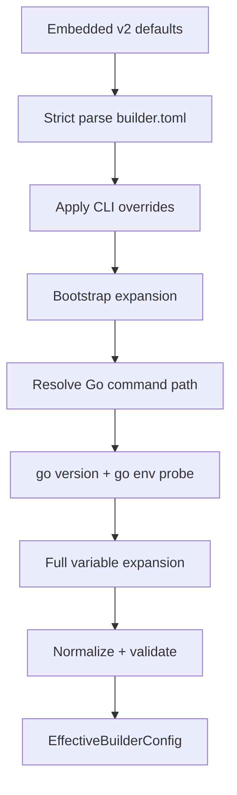

# ingot Builder Go 参数与环境覆盖实现方案 v0.2

> 状态：Implementation Draft  
> 日期：2026-09-21  
> 目标文件：`~/.ingot/builder.toml`  
> 关联文件：`plugins.toml`、`plugins.lock`、Canonical BuildManifest、Image Manifest  
> 关联实现：`internal/builder`、`internal/home`、`internal/cli`

## 1. 背景

当前 `builder.toml` v1 只包含 schema version：

```toml
builder_config_version = 1
```

Builder 内部已经存在部分 Go 构建参数模型：

- `ResolveOptions` 包含 toolchain、target、GOEXPERIMENT、target tuning、tags、
  `ldflags`、`gcflags`、`asmflags`、`GOMODCACHE` 与 `GOPROXY`；
- `plugins.lock` 保存 toolchain、target、固定环境和上述编译 flags；
- 最终 `go build` 会追加 lock 中的 tags 与 compiler/linker flags。

但这些能力没有完整的用户输入链路。CLI 当前传入空的 `ResolveOptions{}`，
`builder.toml` 只被读取和校验，不会生成实际 Resolve/Build 参数。与此同时，
Builder 在不同位置硬编码了：

- `go` 命令名；
- Resolve 阶段的 `GOPROXY` fallback；
- Locked Build 的 Go 环境；
- `go build` 固定参数；
- target tuning 默认值与校验规则。

由于 Builder 直接使用 `exec.CommandContext` 启动 Go 工具链而不经过 shell，配置或
CLI 参数中的 `$NAME` 当前不会自动展开。直接改为 shell 执行会引入平台差异、quoting
歧义和命令注入风险，因此 v0.2 由 Builder 自己实现跨平台变量展开。

## 2. 目标

v0.2 实现以下能力：

1. 扩展现有 Home 级 `builder.toml`，提供持久的 Go 工具链、Resolve 环境、缓存路径、
   Build 参数和 Build 环境配置；
2. 为一次命令提供 CLI overrides；
3. 支持 `$NAME`、`${NAME}`、`${NAME:-default}` 与 `$$`；
4. 明确区分 Resolve 环境与 Locked Build 环境；
5. 将影响产物的展开后参数 materialize 到 lock 和 Canonical BuildManifest；
6. 保持 Locked Build offline、readonly、无 shell、fail-closed；
7. 使用实际选中的 Go 可执行文件探测并校验 toolchain version；
8. 当有效构建配置与 lock 不一致时，正常 build 自动刷新 lock，`--locked` 明确失败；
9. 对日志和持久化内容中的凭证进行保护。

## 3. 非目标

v0.2 不实现：

- 项目级 Builder 配置文件；
- 多 target matrix；
- 非当前主机的交叉编译；
- `CGO_ENABLED=true`；
- C/C++ compiler identity；
- shell command substitution、管道、重定向、glob 或 arithmetic expansion；
- secret manager；
- Runtime Process 环境配置；
- 不受约束的 `GOFLAGS` 透传。

Home `builder.toml` 是机器级默认值。需要单项目临时差异时使用 CLI overrides。项目级
持久构建意图可在后续版本中通过独立文件或 `plugins.toml` build section 引入。

## 4. 核心原则

### 4.1 不通过 shell 执行

所有 Go 命令继续使用 argv 方式启动：

```go
exec.CommandContext(ctx, goCommand, arguments...)
```

Builder 负责配置解析、变量展开和 argv 构造。任何配置值都不能被拼接成 shell command。

### 4.2 配置意图与锁定事实分离

```text
builder.toml + CLI overrides + host environment
    -> EffectiveBuilderConfig
    -> Resolve
    -> plugins.lock
    -> Locked Build
```

`builder.toml` 与 CLI 表达用户意图；`plugins.lock` 保存一次 Resolve 后的精确构建事实。
Locked Build 不重新解释变量引用，也不从当前环境重新计算影响产物的值。

### 4.3 Operational 与 Identity 分离

| 类别 | 示例 | 进入 lock/ImageID |
|---|---|---:|
| Resolve transport | `GOPROXY`、`GOSUMDB`、`GOPRIVATE`、HTTP proxy | No |
| Cache/location | Go command path、`GOMODCACHE`、`GOCACHE`、`GOTMPDIR` | No |
| Build identity | tags、ldflags、gcflags、asmflags、额外 build args | Yes |
| Build environment | 用户允许传入且可能影响产物的 env | Yes |
| Builder invariant | `GOWORK=off`、`-mod=readonly`、Build `GOPROXY=off` | 固定进入既有 policy projection |

Resolve transport 和本地路径只影响如何获得已锁定输入，不应因为代理地址或缓存目录不同而
产生不同 ImageID。影响编译结果的值必须进入构建身份。

### 4.4 Builder invariants 不是普通默认值

以下值继续由 Builder 强制，不允许通过通用 env 或 build args 覆盖：

```text
GOWORK=off
GOTOOLCHAIN=local
GOENV=off                 # materialized Go commands
GOPROXY=off               # Locked Build only
CGO_ENABLED=0
-mod=readonly             # Locked Build only
-trimpath
-buildvcs=false
```

它们维护 workspace 隔离、toolchain 不自动漂移、离线构建、root module readonly 和产物
路径稳定性。

### 4.5 破坏性版本边界

v0.2 采用一次性破坏性升级，不提供向后兼容路径：

- Builder 配置只接受 `builder_config_version = 2`；
- `plugins.lock`、Canonical BuildManifest 与 Image Manifest 只接受 schema v4；
- 不实现双 schema 解析、双 canonicalization 或 legacy 数据自动转换；
- 不保留旧 ImageID，也不复用基于 v3 manifest 生成的已有 Image；
- 升级后必须重新生成 Home 配置，并对项目重新 Resolve 和 Build。

该边界用于避免兼容分支长期侵入配置解析、锁定、ImageID 计算和构建主链路。

## 5. 配置模型

### 5.1 Schema version

v0.2 使用：

```toml
builder_config_version = 2
```

新 Builder 只接受 `builder_config_version = 2`。缺失版本、v1 和任何其他版本都返回
unsupported schema error，不注入旧默认值，也不尝试自动改写。

新安装与 `ingot setup --force` 写入 v2。已有 v1 Home 配置必须由用户执行
`ingot setup --force` 重新生成，或按本方案手工改写后才能继续使用。

### 5.2 默认文件

嵌入发行版的默认文件为：

```toml
builder_config_version = 2

[go.toolchain]
command = "go"

[go.resolve.env]

[go.paths]
gomodcache = ""
gocache = ""
gotmpdir = ""

[go.build]
tags = []
ldflags = []
gcflags = []
asmflags = []
args = []

[go.build.env]
```

空路径表示使用 Builder 管理或宿主默认路径，不表示向子进程传递空环境变量。

### 5.3 完整示例

```toml
builder_config_version = 2

[go.toolchain]
command = "${INGOT_GO_COMMAND:-go}"

[go.resolve.env]
GOPROXY = "${GOPROXY:-https://goproxy.cn,direct}"
GOSUMDB = "${GOSUMDB:-sum.golang.org}"
GOPRIVATE = "${GOPRIVATE:-}"
GONOPROXY = "${GONOPROXY:-}"
GONOSUMDB = "${GONOSUMDB:-}"
HTTPS_PROXY = "${HTTPS_PROXY:-}"
NO_PROXY = "${NO_PROXY:-}"

[go.paths]
gomodcache = "${INGOT_GOMODCACHE:-}"
gocache = "${GOCACHE:-}"
gotmpdir = "${GOTMPDIR:-}"

[go.build]
tags = ["${INGOT_BUILD_TAG:-release}"]
ldflags = [
  "-s",
  "-w",
  "-X",
  "main.version=${BUILD_VERSION}",
  "-X",
  "main.commit=${GIT_COMMIT:-unknown}",
]
gcflags = []
asmflags = []
args = ["-p=${GO_BUILD_PARALLELISM:-4}"]

[go.build.env]
GOFIPS140 = "${GOFIPS140:-off}"
```

### 5.4 字段定义

#### `[go.toolchain]`

| Field | Type | Default | Identity | 语义 |
|---|---|---|---:|---|
| `command` | string | `go` | command path No；实际 version Yes | Go executable name 或 path |

`command` 包含目录分隔符时按路径处理；相对路径相对于 `builder.toml` 所在目录解析。
纯命令名使用 `exec.LookPath`。最终执行路径转换为 clean absolute path，但绝对路径不进入
lock 或 ImageID。

#### `[go.resolve.env]`

类型为 `map[string]string`。它覆盖 Resolve 阶段 Go 命令和必要 VCS 子进程看到的环境。
典型字段包括：

```text
GOPROXY
GOSUMDB
GOPRIVATE
GONOPROXY
GONOSUMDB
HTTP_PROXY
HTTPS_PROXY
NO_PROXY
SSH_AUTH_SOCK
```

该表允许其他用户环境键，但禁止覆盖第 9.2 节列出的 Builder-owned keys。展开后的
Resolve env 不进入 lock、BuildManifest 或 ImageID。

#### `[go.paths]`

| Field | Type | Default |
|---|---|---|
| `gomodcache` | string | `<INGOT_HOME>/cache/gomod` |
| `gocache` | string | process `GOCACHE`，否则 OS user cache 下的 `go-build` |
| `gotmpdir` | string | `os.TempDir()` |

配置文件中的相对路径相对于 `builder.toml` 所在目录；CLI path override 相对于命令启动
目录。最终均转换为 clean absolute path。路径不进入 ImageID。

#### `[go.build]`

| Field | Type | 默认值 | 顺序语义 | Identity |
|---|---|---|---|---:|
| `tags` | string array | `[]` | set，展开后去重并排序 | Yes |
| `ldflags` | string array | `[]` | ordered argument list | Yes |
| `gcflags` | string array | `[]` | ordered argument list | Yes |
| `asmflags` | string array | `[]` | ordered argument list | Yes |
| `args` | string array | `[]` | ordered argv token list | Yes |

每个 array element 是一个逻辑值。`ldflags`、`gcflags`、`asmflags` 在最终调用中按 Go
命令要求编码成单个 flag value；Builder 不使用宿主 shell quoting 规则。

例如：

```toml
ldflags = ["-s", "-w", "-X", "main.version=1.2.3"]
```

构造为一个 argv token：

```text
-ldflags=-s -w -X main.version=1.2.3
```

`args` 中每项已经是一个完整 `go build` argv token，例如：

```toml
args = ["-a", "-p=4"]
```

不接受 package operand；Builder 仍只构建生成 root module 的当前 main package。

#### `[go.build.env]`

类型为 `map[string]string`。所有 key/value 在 Resolve 时展开、规范化并作为有序记录写入
lock。Locked Build 只使用 lock 中的值，不重新读取同名宿主环境变量。

本表中的值可能进入 lock、BuildManifest、错误诊断和最终二进制。不得在此传入 token、
password、private key 或其他 secret。

## 6. 变量展开

### 6.1 语法

v0.2 支持：

| 语法 | 语义 |
|---|---|
| `$NAME` | required variable |
| `${NAME}` | required variable |
| `${NAME:-default}` | absent 或空字符串时使用 default |
| `$$` | 字面量 `$` |

变量名必须匹配：

```text
[A-Za-z_][A-Za-z0-9_]*
```

不支持：

```text
$(command)
`command`
${NAME:=value}
${NAME?message}
$((expression))
~
glob
%NAME%
$env:NAME
```

TOML 与 CLI 使用同一套跨平台语法。Windows 用户也使用 `${NAME}`，而不是 `%NAME%`。

### 6.2 两阶段展开

Toolchain command 必须先于 `go env` probe 确定，因此展开分两阶段：

1. Bootstrap expansion：仅使用 process environment 与 CLI `--builder-var`，展开
   `[go.toolchain].command`；
2. Full expansion：选定 Go command 并执行 probe 后，使用完整 Expansion Context 展开
   其余配置。

### 6.3 Expansion Context

同名变量优先级从高到低：

```text
CLI --builder-var
process environment
selected toolchain `go env` probe
```

`go env` probe 至少读取：

```text
GOVERSION
GOOS
GOARCH
GOPROXY
GOSUMDB
GOPRIVATE
GONOPROXY
GONOSUMDB
GOPATH
GOMODCACHE
GOCACHE
GOTMPDIR
GOEXPERIMENT
CGO_ENABLED
```

process environment 覆盖 `go env -w` 持久值，与 Go 自身优先级一致。

### 6.4 展开规则

1. required variable 不存在时返回配置错误；
2. required variable 存在但值为空时展开为空；
3. `${NAME:-default}` 在变量不存在或值为空时使用 default；
4. default 可以继续包含本规范变量引用；最大递归深度为 16；
5. 从 environment 取得的 value 作为字面量插入，不再次解释其中的 `$`；
6. default expansion 出现自引用或超过最大深度时失败；
7. 展开在任何排序、去重、路径规范化和 lock materialization 之前完成；
8. 展开结果包含 NUL 时失败；
9. 不执行 whitespace splitting。一个 TOML array element 展开后仍是一个 element。

示例：

```toml
ldflags = ["-X", "main.version=${BUILD_VERSION}"]
```

当 `BUILD_VERSION=1.2.3` 时，lock 保存：

```toml
ldflags = ["-X", "main.version=1.2.3"]
```

Locked Build 不保留 `${BUILD_VERSION}`，也不重新读取当前环境。

### 6.5 空值处理

Resolve env 中展开为空字符串的条目表示 unset，不传给子进程：

```toml
GOPRIVATE = "${GOPRIVATE:-}"
```

Build env 中空字符串是显式值并进入 lock。需要从 Build env 删除一个继承值时，Builder
clean environment 本身已经阻止任意继承，因此无需 unset marker。

## 7. CLI overrides

### 7.1 公共数据模型

CLI 不直接构造 `ResolveOptions`。所有可能触发 Resolve 的命令先生成统一的：

```go
type BuilderOverrides struct {
    Variables  map[string]string
    GoCommand  *string
    ResolveEnv map[string]string
    BuildEnv   map[string]string
    Tags       OptionalStringList
    LDFlags    OptionalStringList
    GCFlags    OptionalStringList
    ASMFlags   OptionalStringList
    BuildArgs  OptionalStringList
}
```

`OptionalStringList` 必须区分“未提供”和“显式提供空列表”，避免无法清除配置文件中的默认
数组。

### 7.2 CLI flags

所有可能触发 Resolve 的命令共享以下 flags：

```text
--builder-var KEY=VALUE
--go-command COMMAND
--go-resolve-env KEY=VALUE
--go-build-env KEY=VALUE
--go-tag VALUE
--go-ldflag VALUE
--go-gcflag VALUE
--go-asmflag VALUE
--go-build-arg VALUE
--clear-go-build-list NAME
```

`--clear-go-build-list` 的 `NAME` 只接受 `tags`、`ldflags`、`gcflags`、`asmflags` 或
`args`，用于显式清除 `builder.toml` 中对应列表。

适用命令至少包括：

```text
ingot project resolve
ingot project generate
ingot build
ingot up
ingot plugin add
ingot plugin rm
ingot plugin update
ingot plugin move
ingot collection apply
```

### 7.3 Merge 语义

```text
embedded defaults
    < Home builder.toml
    < CLI overrides
```

- scalar：CLI 替换配置值；
- env map：按 key 替换；
- list：只要对应 CLI flag 出现一次，全部 CLI values 组成新列表并替换配置列表；
- `--clear-go-build-list NAME` 将对应列表显式替换为空，且不得与同一列表的 value flag
  同时出现；
- `--builder-var` 只参与展开，不自动进入 Go 子进程环境；
- 同一个 CLI map key 重复出现时最后一个值生效；
- malformed `KEY=VALUE`、空 key、包含 NUL 的 key/value 失败。

PowerShell 中若希望 `$` 由 Builder 而不是 shell 处理，应使用单引号，例如：

```powershell
ingot build --go-ldflag 'main.version=${BUILD_VERSION}'
```

## 8. EffectiveBuilderConfig

### 8.1 数据结构

配置加载后生成完全 materialized 的内部对象：

```go
type EffectiveBuilderConfig struct {
    GoCommandPath string
    GoVersion     string

    ResolveEnv map[string]string

    GOMODCACHE string
    GOCACHE    string
    GOTMPDIR   string

    Build BuildInputs
}

type BuildInputs struct {
    Tags     []string
    LDFlags  []string
    GCFlags  []string
    ASMFlags []string
    Args     []string
    Env      []EnvironmentEntry
}

type EnvironmentEntry struct {
    Key   string
    Value string
}
```

`BuildInputs.Env` 按 key UTF-8 bytewise ascending 排序。Build args 与 compiler/linker flags
保持输入顺序。

### 8.2 构造步骤



任何阶段失败都不得修改 `plugins.lock`、Image、tag 或 Runtime binding。

## 9. 校验规则

### 9.1 Go command 与 toolchain

Builder 必须：

1. 解析唯一 Go executable path；
2. 执行 `<go> version`；
3. 解析 exact release version；
4. 在临时目录中以 `GOWORK=off`、`GOTOOLCHAIN=local` 执行 `<go> env -json ...`；
5. Resolve、package loading 与 Build 全部使用同一 executable path；
6. 将探测出的 exact version 写入 lock，而不是使用 `runtime.Version()`；
7. Locked Build 前再次探测并要求与 lock 一致；
8. 构建后使用 `debug/buildinfo.ReadFile` 要求产物 GoVersion 与 lock 一致。

v0.2 继续只接受 `go1.x.y` release toolchain。`devel`、beta、rc 和 gccgo 延后设计。

### 9.2 Reserved environment keys

`[go.resolve.env]` 与 `[go.build.env]` 都不得覆盖：

```text
GOWORK
GOTOOLCHAIN
GOENV
GOFLAGS
GOMOD
GOOS
GOARCH
CGO_ENABLED
GOEXPERIMENT
GO386
GOAMD64
GOARM
GOARM64
GOMIPS
GOMIPS64
GOPPC64
GORISCV64
GOWASM
PATH
HOME
USERPROFILE
GOCACHE
GOMODCACHE
GOTMPDIR
TMP
TEMP
TMPDIR
```

`GOPROXY` 在 Resolve env 中允许，在 Build env 中禁止。Locked Build 固定
`GOPROXY=off`。

target、CGO、GOEXPERIMENT 和 tuning 继续使用 Builder 的结构化模型。v0.2 不通过通用
env 开放这些能力。

### 9.3 Build args

`go.build.args` 每项必须：

- 非空；
- 以 `-` 开头；
- 不包含 NUL；
- 不是 package operand；
- 不覆盖 Builder-owned flag；
- 不依赖 v0.2 尚未建模的外部输入。

禁止的 flag name：

```text
-C
-o
-mod
-modfile
-overlay
-toolexec
-pkgdir
-compiler
-trimpath
-buildvcs
-tags
-ldflags
-gcflags
-asmflags
-n
-race
-msan
-asan
-pgo
```

原因：

- output、module mode、source overlay 和 tool execution 必须由 Builder 控制；
- 结构化字段已经拥有 tags 与 compiler/linker flags；
- race/msan/asan 依赖当前禁止的 CGO 或平台能力；
- PGO profile 是外部内容输入，必须先设计摘要与 staging 规则；
- `-n` 不生成产物。

未知但非保留 flag 可以传给 Go 工具链；Go 工具链负责最终语法校验。所有 `args` 均保守
地进入 ImageID，即使某些 flag 只影响构建执行方式。

### 9.4 Tags 与 flags

- tags 展开后不得为空；
- tags 继续匹配 `[A-Za-z0-9_.]+`，去重并排序；
- `ldflags`、`gcflags`、`asmflags` 允许空列表，但单个元素不得包含 NUL；
- 不对 flags 进行宿主 shell splitting；
- Go toolchain 的错误必须保留 Builder error code，并附带已脱敏的命令摘要。

## 10. Resolve 环境

### 10.1 Probe 与 materialization

Builder 首先使用选定 toolchain 探测 Go env。完成 Full expansion 后，Resolve Go 命令使用：

```text
sanitized inherited environment
+ effective resolve env
+ Builder-owned resolve overrides
```

Builder-owned resolve overrides：

```text
GOWORK=off
GOTOOLCHAIN=local
GOENV=off
CGO_ENABLED=0
GOOS=<host GOOS>
GOARCH=<host GOARCH>
GOMODCACHE=<effective path>
```

`GOENV=off` 确保 probe 之后的 Resolve 不再隐式读取可能变化的 `go env -w` 文件；需要的
Go env 值已经 materialize 到 effective resolve env。

### 10.2 GOPROXY

`GOPROXY` 的有效值优先级为：

```text
CLI --go-resolve-env GOPROXY=...
builder.toml [go.resolve.env].GOPROXY
process environment GOPROXY
selected toolchain go env GOPROXY
Go toolchain default
```

Builder 不在代码中保留额外代理 URL fallback。若所有来源都为空，由 Go toolchain 自身
决定默认值。

### 10.3 使用阶段

effective Resolve env 用于：

```text
go mod download -json all
go list -mod=mod -m -json all
```

以及这些命令启动的 VCS/network helper。它不用于最终 Locked Build。

## 11. Locked Build 环境与命令

### 11.1 环境

Locked Build 从现有 clean allowlist environment 开始，设置：

```text
PATH=<Builder selected toolchain and required host path>
HOME=<user home>
GOCACHE=<effective path>
GOMODCACHE=<effective path>
GOTMPDIR=<effective path>
GOENV=off
GOWORK=off
GOTOOLCHAIN=local
GOPROXY=off
CGO_ENABLED=0
GOOS=<locked host target>
GOARCH=<locked host target>
GOEXPERIMENT=<locked value>
<locked tuning key>=<locked value>
```

然后合并 lock 中已校验的 `build.env`。Builder-owned key 不会出现在 `build.env`，因此不存在
覆盖顺序歧义。

### 11.2 命令构造

最终命令顺序固定为：

```text
<go> build
  -mod=readonly
  -trimpath
  -buildvcs=false
  [-tags=<sorted comma-separated tags>]
  [-ldflags=<encoded ordered flags>]
  [-gcflags=<encoded ordered flags>]
  [-asmflags=<encoded ordered flags>]
  [locked build.args...]
  -o <staged binary path>
```

Builder-owned 参数只出现一次。用户参数不得改变 output path、package operand 或 root module。

## 12. Lock 与 BuildManifest

### 12.1 Schema upgrade

因为新增任意 `build.args` 与 materialized `build.env`，v0.2 写入：

```text
plugins.lock lock_version = 4
Canonical BuildManifest schema_version = 4
Image Manifest schema_version = 4
```

### 12.2 Lock 表示

`[build]` 扩展为：

```toml
[build]
trimpath = true
buildvcs = false
tags = ["release"]
ldflags = ["-s", "-w", "-X", "main.version=1.2.3"]
gcflags = []
asmflags = []
args = ["-p=4"]

[[build.env]]
key = "GOFIPS140"
value = "off"
```

`build.env`：

- 按 key 排序；
- key 唯一；
- 保存展开后的 exact value；
- 进入 Canonical BuildManifest 与 ImageID；
- 不允许 secret。

### 12.3 不进入 lock 的值

以下值不进入 lock：

```text
Go executable absolute path
GOPROXY and other Resolve env
GOMODCACHE/GOCACHE/GOTMPDIR absolute paths
CLI variable source
未展开的 ${...} template
```

toolchain 的 actual exact version 继续进入 lock。

### 12.4 破坏性升级

新 Builder 只接受以下版本组合：

```text
plugins.lock lock_version = 4
Canonical BuildManifest schema_version = 4
Image Manifest schema_version = 4
```

lock v3、Canonical BuildManifest v3 和 Image Manifest v3 均为 unsupported schema。Builder
不得用旧规则重建 ImageID，不得自动补齐字段，也不得维护 v3/v4 双 canonicalization。

升级后，用户必须重新 Resolve 生成 lock v4，并重新 Build 生成 v4 manifest 和新 ImageID。
旧 Image store 不保证可复用，应清理或由新的完整构建结果替换。

## 13. Lock stale 规则

### 13.1 Semantic Build Projection

Builder 从 `EffectiveBuilderConfig` 生成：

```text
SemanticBuildProjection = {
  actual toolchain version,
  current supported host target,
  locked GOEXPERIMENT and tuning,
  trimpath/buildvcs policy,
  tags,
  ldflags,
  gcflags,
  asmflags,
  build args,
  build env
}
```

该 projection 与 lock 对应字段逐项比较。Go executable path、Resolve env 和 cache path 不
参与比较。

### 13.2 行为

| 条件 | 普通命令 | `--locked` |
|---|---|---|
| plugin/source drift | Resolve 并更新 lock | Error |
| semantic build config drift | Resolve 并更新 lock | Error |
| toolchain exact version drift | Resolve 并更新 lock | Error |
| 仅 GOPROXY 变化 | 保留有效 lock | 保留有效 lock |
| 仅 cache path 变化 | 保留有效 lock | 保留有效 lock |
| Go command path 变化但 version 相同 | 保留有效 lock | 保留有效 lock |

`--locked` 错误必须显示字段级差异，但不得输出敏感 Resolve env value。

## 14. Secret 与日志策略

### 14.1 Resolve secrets

`GOPROXY`、HTTP proxy 或 VCS 环境可能包含凭证。Builder 必须：

- 不写入 lock、BuildManifest、Image Manifest；
- 不输出完整 env；
- URL 诊断移除 userinfo；
- error message 默认只显示 env key；
- JSON output 不返回展开后的 Resolve env；
- crash/transaction marker 不保存 Resolve env。

### 14.2 Build identity values

`go.build` 与 `go.build.env` 的展开结果进入持久化身份，因此用户不得在其中放置 secret。
文档和错误提示必须明确：通过 `-ldflags -X` 写入 token 不会使 secret 安全，它还可能进入
最终 binary。

v0.2 不提供“secret value 只以 digest 进入 lock”的机制；这需要单独设计可重建性、输入
获取和验证协议。

## 15. 错误模型

新增稳定错误码：

| Code | 场景 |
|---|---|
| `INGOT-BUILDER-CONFIG-VERSION` | 不支持的 builder config version |
| `INGOT-BUILDER-VARIABLE-SYNTAX` | 非法 `$` expression |
| `INGOT-BUILDER-VARIABLE-MISSING` | required variable 不存在 |
| `INGOT-BUILDER-VARIABLE-CYCLE` | default expansion cycle/depth overflow |
| `INGOT-BUILDER-GO-COMMAND` | command 无法定位或启动 |
| `INGOT-BUILDER-GO-VERSION` | version 非 exact supported release |
| `INGOT-BUILDER-GO-PROBE` | `go env` probe 失败 |
| `INGOT-BUILDER-ENV-RESERVED` | 用户覆盖 Builder-owned env |
| `INGOT-BUILDER-BUILD-ARG` | malformed build arg |
| `INGOT-BUILDER-BUILD-ARG-RESERVED` | 覆盖 Builder-owned flag |
| `INGOT-BUILDER-BUILD-ARG-UNSUPPORTED` | 依赖未建模能力的 flag |
| `INGOT-BUILD-CONFIG-DRIFT` | `--locked` 下 semantic config 与 lock 不一致 |
| `INGOT-BUILD-TOOLCHAIN-ARTIFACT` | binary build info 与 lock toolchain 不一致 |

错误对象应包含 `Field`，例如：

```text
go.build.ldflags[3]
go.resolve.env.GOPROXY
go.build.env.GOFIPS140
```

## 16. 实现分层

### 16.1 `internal/builder/config.go`

增加：

```go
type BuilderConfig struct {
    BuilderConfigVersion int             `toml:"builder_config_version"`
    Go                   GoBuilderConfig `toml:"go"`
}

type GoBuilderConfig struct {
    Toolchain GoToolchainConfig `toml:"toolchain"`
    Resolve   GoResolveConfig   `toml:"resolve"`
    Paths     GoPathConfig      `toml:"paths"`
    Build     GoBuildConfig     `toml:"build"`
}
```

具体嵌套类型使用 typed fields 和 `map[string]string`。解析器只实现 strict v2 schema：
版本必须精确为 2，所有未知字段、未知 table 和错误类型都立即失败，不保留 v1 分支，也不
使用宽松 schema 接受未来字段。

### 16.2 新增 `internal/builder/interpolate.go`

职责：

- 解析规范变量语法；
- Bootstrap/Full expansion；
- missing/default/escape 语义；
- recursion limit；
- 不依赖 shell；
- 返回带 field path 的 Builder Error。

不直接读取全局环境；调用者传入 immutable lookup function，便于测试。

### 16.3 新增 `internal/builder/effective.go`

职责：

- 合并 defaults、file config、CLI overrides；
- 解析 Go command；
- toolchain probe；
- 构造 Expansion Context；
- 展开、规范化路径和集合；
- 校验 reserved env/args；
- 生成 `EffectiveBuilderConfig`；
- 生成 semantic projection；
- 比较 lock drift。

### 16.4 `internal/builder/resolve.go`

调整：

- 不再硬编码 executable name `go`；
- 不再使用 `runtime.Version()` 作为 toolchain identity；
- 不再在代码中提供 `https://proxy.golang.org,direct` fallback；
- 使用 effective Resolve env 和 paths；
- lock materialize actual probed version 与 BuildInputs；
- `runGo` 接收明确的 command path。

建议签名：

```go
func runGo(
    ctx context.Context,
    commandPath string,
    directory string,
    environment []string,
    arguments ...string,
) ([]byte, error)
```

### 16.5 `internal/builder/lock.go`

调整：

- 只支持 lock v4 parse，其他版本返回 unsupported schema error；
- `BuildLock` 增加 `Args` 与 `Env`；
- reserved、排序、唯一性与 canonical validation；
- 只生成 Canonical BuildManifest v4，不保留旧 canonicalization；
- RestoreRootModule 行为保持 readonly；
- BuildManifest v4 包含新增 identity fields。

### 16.6 `internal/builder/graph.go`

调整：

- `lockedEnvironment` 接收 effective paths 与 locked build env；
- Go command path 由调用链显式传递；
- `packages.Config.Env` 使用与最终 build 相同的 semantic env；
- tags 继续进入 `packages.Config.BuildFlags`；
- build args 中影响 package selection/type checking 的后续字段必须显式建模，不能自动把
  所有 raw args 传给 `go/packages`。

### 16.7 `internal/builder/build.go`

调整：

- 使用配置选定且版本已验证的 Go command；
- 使用 lock 中的 BuildInputs 构造 argv；
- 运行后通过 `debug/buildinfo.ReadFile` 校验 toolchain 与关键 build settings；
- command error 输出脱敏摘要；
- 复现性比较规则不变。

### 16.8 `internal/home/project.go`

调整：

- 读取 `builder.toml` 后生成 effective config，而不是只做 parse validation；
- stale 判断加入 semantic build projection；
- resolve、generate、build 使用同一个 effective config snapshot；
- 同一命令执行期间不得因环境变化重新展开；
- `--locked` 返回字段级 config drift。

### 16.9 `internal/cli`

增加统一 `builderFlags`，由所有可能触发 Resolve 的命令复用。CLI 层只解析 overrides，
不实现变量展开、reserved 校验或 lock 比较。

## 17. 并发与一致性

1. 一次 CLI invocation 只构造一个 immutable `EffectiveBuilderConfig`；
2. 同一 invocation 的 Resolve 与 Build 使用相同 toolchain path/version snapshot；
3. Builder config 与 process environment 在 project/home lock 获取后读取；
4. lock commit 继续使用现有原子写入和 transaction marker；
5. config drift 导致 Resolve 时，旧 lock 在新 lock 完整生成前保持不变；
6. cache path 可以被不同进程共享，但依赖 Go module cache 自身协议；
7. 本方案不允许在 Build 中修改 `builder.toml`。

## 18. 测试计划

### 18.1 Config schema

- v1、缺失版本和未知版本均被拒绝；
- v2 默认文件 round-trip；
- unknown field/table、wrong type、unsupported version；
- env map duplicate/invalid key；
- relative path base；
- CLI scalar/map/list merge；
- 显式空 list 清除配置 list。

### 18.2 Interpolation

- `$NAME`、`${NAME}`；
- `${NAME:-default}` absent、empty、non-empty；
- `$$`；
- 多变量与 UTF-8 value；
- missing required variable；
- malformed brace/name；
- nested default；
- recursion depth/cycle；
- env value 中 `$` 不递归；
- whitespace 不 splitting；
- NUL rejection；
- Windows variable lookup 与 PowerShell literal input。

### 18.3 Toolchain

- command name 与 absolute path；
- relative command path；
- command missing；
- malformed/unsupported version；
- ingot runtime version 与 PATH Go version 不同时锁定实际 Go；
- Resolve/Build 使用同一个 executable；
- binary build info mismatch 被拒绝。

### 18.4 Resolve env

- GOPROXY config、process env、`go env -w` 与 CLI precedence；
- GOSUMDB/private fields；
- empty resolve env 表示 unset；
- reserved key rejection；
- proxy credential redaction；
- Resolve env 不改变 ImageID；
- cache path 变化不改变 ImageID。

### 18.5 Build args/env

- tags sort/unique；
- ordered compiler/linker flags；
- arg order preservation；
- reserved/unsupported arg rejection；
- build env sort/unique；
- build env 与 args 进入 ImageID；
- 展开后的值进入 lock，环境后续变化不影响 Locked Build；
- package loading 与 final build 使用一致 tags/env；
- Go command invalid flag 返回稳定 Builder error。

### 18.6 Breaking upgrade

- lock v3 在 parse 阶段被拒绝；
- Canonical BuildManifest v3 与 Image Manifest v3 在验证阶段被拒绝；
- 旧数据不触发补字段、自动转换或 v3 ImageID 重建；
- 删除旧 lock/Image 后重新 Resolve 和 Build 可完整生成 v4 数据；
- v4 exact TOML schema；
- BuildManifest v4 canonical JSON golden；
- args/env 任一变化都改变 ImageID；
- Resolve env、command path、cache path 变化不改变 ImageID。

### 18.7 Home/CLI integration

- `project resolve` 写入配置后的 lock；
- `build` stale 自动刷新；
- `build --locked` config drift 失败；
- `project generate` 输出展开后的 BuildManifest；
- plugin mutation 与 collection apply 使用相同 overrides；
- Resolve/Build 失败不覆盖旧 lock/Image；
- 并发 project mutation 保持单写者语义。

所有 Go module 最终执行仓库要求的完整 race test，并执行 `git diff --check`。

## 19. 分阶段实施

### Phase 1：配置与展开基础

- strict builder config v2 schema；
- v1 与其他旧 schema rejection；
- interpolation engine；
- EffectiveBuilderConfig；
- actual Go command/version probe；
- unit tests。

### Phase 2：Resolve environment

- `[go.resolve.env]`；
- `[go.paths]`；
- GOPROXY 与 private module 配置；
- `GOENV=off` materialized Resolve；
- redaction；
- integration tests。

完成本阶段后即可解决用户无法稳定覆盖 `GOPROXY` 的问题。

### Phase 3：Build identity inputs

- `[go.build]` 与 `[go.build.env]`；
- only lock v4 / BuildManifest v4 / Image Manifest v4；
- v3 metadata rejection；
- stale comparison；
- locked argv/environment；
- binary build info verification。

### Phase 4：CLI overrides

- 统一 builder flags；
- 接入全部可能触发 Resolve 的命令；
- `--locked` drift diagnostics；
- shell-specific documentation。

### Phase 5：破坏性发布与文档

- 更新 `builder.toml` 设计文档；
- 更新 `plugins.lock` 设计文档；
- 更新中英文 Usage；
- 更新 setup/init 默认文件；
- 发布说明明确新 Builder 拒绝 v1 config 和所有 v3 metadata；
- 要求升级用户通过 `ingot setup --force` 重新生成 Home 配置；
- 要求所有项目重新 Resolve，并重新 Build 生成新的 Image store 内容；
- 明确不提供自动转换工具，也不承诺保留历史 ImageID。

## 20. 验收标准

实现完成必须满足：

1. 用户可以在 `builder.toml` 或 CLI 中指定 Resolve `GOPROXY`；
2. `${...}` 在 Windows、Linux、macOS 上具有相同语义；
3. Builder 不通过 shell 运行 Go；
4. 实际调用的 Go version 与 lock、BuildManifest、binary build info 一致；
5. 影响产物的展开结果被精确锁定，Locked Build 不重新读取宿主变量；
6. Resolve transport、Go path 和 cache path 不进入 ImageID；
7. Locked Build 仍为 `GOWORK=off`、`GOTOOLCHAIN=local`、`GOENV=off`、
   `GOPROXY=off`、`-mod=readonly`；
8. 用户不能通过 env 或 args 覆盖 Builder-owned policy；
9. config semantic drift 能自动刷新 lock，`--locked` 能 fail closed；
10. v1 config、lock v3、Canonical BuildManifest v3 和 Image Manifest v3 都以稳定错误被拒绝；
11. 清理旧数据后，`ingot setup --force`、Resolve 和 Build 能完整生成 v2/v4 数据与新 Image；
12. proxy credential 不出现在 lock、manifest、普通日志或 JSON output；
13. 完整 race-enabled test suite 通过。

## 21. 后续扩展

在 v0.2 稳定后再单独设计：

- 项目级 Builder configuration；
- named build profiles；
- cross compilation 与 target matrix；
- CGO compiler/toolchain identity；
- PGO profile content digest 与 staging；
- secret reference + digest verification；
- Builder 自动安装并锁定 Go toolchain；
- 从实际 toolchain 动态验证 target tuning，而不是维护长期静态 allowlist。
