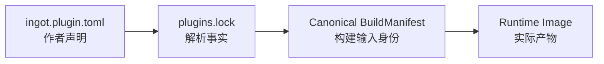
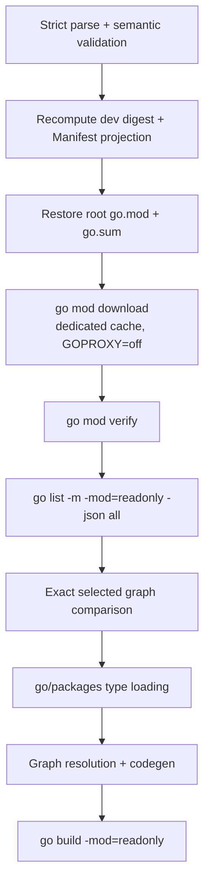

# ingot `plugins.lock` v0.1 设计方案

> 状态：Implemented
> 目标文件：`plugins.lock`  
> 关联规范：架构 v0.3、Plugin Manifest v0.1、SDK v0.1

## 1. 定位

`plugins.lock` 是一次完整 Build Resolution 的持久化结果。它固定精确版本、direct Plugin 顺序、Component catalog、完整 module graph、Local Dev replacement、toolchain、target 和 build environment，使 Builder 能够还原同一个 root module graph 与 Canonical BuildManifest。



Runtime Config value、secret、用户输入与 Runtime State 使用独立存储。

## 2. 核心规则

1. Bootstrap/Builder 生成并更新 lock。
2. `[[plugins]]` 数组顺序是 Direct Plugin Order。
3. Normal locked build 使用 offline、readonly、fail-closed 流程。
4. Builder 将 TOML 解析为 Semantic Model，再生成 Canonical BuildManifest。
5. Parser 校验 exact schema、required field、union 和 collection uniqueness。
6. Local Dev 的机器路径只用于定位；内容摘要进入跨机器 Build Identity。
7. 相同 Canonical BuildManifest 产生相同 ImageID；受支持的 hermetic build 应产生相同 ArtifactDigest。

## 3. Exact Schema

以下示例包含一个 remote Plugin 和一个 Local Dev Plugin。lock v3 schema 之外的字段均产生 Lock Validation Error。

```toml
lock_version = 3
plugins_digest = "sha256:..."
ingot_version = "0.3.0"
builder_version = "0.3.0"
replacements = [
  { module_path = "github.com/example/ingot-local-tool", synthetic_version = "v0.0.0", dev_path = "/workspace/ingot-local-tool", content_sha256 = "sha256:..." }
]

[runtime]
module_path = "github.com/ingot-agent/ingot-abi"
version = "v0.1.0"
sum = "h1:..."

[toolchain]
version = "go1.21.13"

[target]
goos = "linux"
goarch = "amd64"
cgo_enabled = false
goexperiment = []
tuning = [{ key = "GOAMD64", value = "v1" }]

[environment]
gowork = "off"
gotoolchain = "local"
goproxy = "off"
mod = "readonly"

[build]
trimpath = true
buildvcs = false
tags = []
ldflags = []
gcflags = []
asmflags = []

[[plugins]]
id = "github.com/example/ingot-deepseek"
name = "deepseek"
source_kind = "module"
version = "v1.2.3"
module_sum = "h1:..."
manifest_digest = "sha256:..."
root_package = "."
has_state = false
state_schema_version = 0
state_min_reader_version = 0

  [[plugins.components]]
  name = "default"
  package = "."

[[plugins]]
id = "github.com/example/ingot-local-tool"
name = "local-tool"
source_kind = "dev"
manifest_digest = "sha256:..."
root_package = "."
has_state = false
state_schema_version = 0
state_min_reader_version = 0

  [[plugins.components]]
  name = "default"
  package = "."

[[modules]]
path = "github.com/ingot-agent/ingot-abi"
version = "v0.1.0"
sum = "h1:..."
go_mod_sum = "h1:..."

[[modules]]
path = "github.com/pelletier/go-toml/v2"
version = "v2.2.4"
sum = "h1:..."
go_mod_sum = "h1:..."

[[modules]]
path = "github.com/example/ingot-deepseek"
version = "v1.2.3"
sum = "h1:..."
go_mod_sum = "h1:..."
```

## 4. 顶层字段

以下字段全部 required：

```text
lock_version
plugins_digest
ingot_version
builder_version
runtime
toolchain
target
environment
build
plugins
modules
replacements
```

空集合使用空 TOML array。`plugins` 至少包含一个条目。远程 ingot ABI 必须以
相同 version 与 sum 出现在 `modules`；开发 workspace replacement 则进入
`replacements`，并从 `modules` 排除。

### 4.1 Version

| Field | 语义 |
|---|---|
| `lock_version` | schema major，固定为 integer `3` |
| `ingot_version` | distribution/runtime protocol 的 exact canonical SemVer，也是 Manifest `ingot` range 的求值版本 |
| `builder_version` | 实际执行 resolve、codegen 和 build 的 Builder exact canonical SemVer |

`ingot_version` 与 `builder_version` 分别 materialize，任一变化都会改变 ImageID。

### 4.2 Runtime ABI 与 Toolchain

`[runtime]` 单独保存 Builder 固定的 ingot ABI identity：

- `module_path` 必须精确等于 `github.com/ingot-agent/ingot-abi`；
- `version` 必须等于当前 Builder 支持的 exact ABI version；
- 远程 module 的 `sum` 必须与 `modules` 中同一节点一致；
- 开发 workspace replacement 的 `sum` 为空，源码身份由对应 replacement 的
  `content_sha256` 固定。

Agent SDK 与领域 Contract Module 不具有特殊 lock record；它们是普通
`modules` 或 workspace `replacements`。

`[toolchain].version` 使用带 `go` 前缀的 exact version，例如 `go1.21.13`。

### 4.3 Target

`[target]` 保存：

- `goos`、`goarch`；
- `cgo_enabled`，v0.1 固定为 `false`；
- `goexperiment`，按 set 处理；
- `tuning`，使用 `{key, value}` inline-table array。

`tuning.key` 属于当前 toolchain 与 GOARCH 的 Builder allowlist，例如 `GOAMD64`。适用 key 显式 materialize 默认值，条目按 key 排序。Unknown key、duplicate key 与 invalid value 产生 Validation Error。

`goexperiment` 去重后按 UTF-8 bytewise ascending 排序。

### 4.4 Environment 与 Build

v0.1 的 environment exact values：

```toml
[environment]
gowork = "off"
gotoolchain = "local"
goproxy = "off"
mod = "readonly"
```

Build 规则：

- `trimpath = true`；
- `buildvcs = false`；
- `tags` 是 set，去重并排序；
- `ldflags`、`gcflags`、`asmflags` 是 ordered argument list；
- Builder 使用 clean/allowlist environment，并显式设置影响产物的 Go knobs。

## 5. Direct Plugin Record

每个 `[[plugins]]` 包含：

```text
id
name
source_kind
manifest_digest
root_package
has_state
state_schema_version
state_min_reader_version
components
```

`id`、`name`、root package、state 和 components 与 locked Manifest Projection 精确一致。Direct set 中 `id` 与 `name` 分别唯一。

Normal build 从 locked source 重新 strict-parse `ingot.plugin.toml`，重算 `manifest_digest`，并逐字段比较 materialized Plugin record。比较在 Go package loading 前完成。

### 5.1 Remote Module

`source_kind = "module"` 时：

- `version` 与 `module_sum` required；
- 对应 `id@version` 存在于 `[[modules]]`；
- version 与 checksum 精确一致。

### 5.2 Local Dev

`source_kind = "dev"` 时，`replacements` 中存在且只存在一个 `module_path == plugin.id` 的条目。Plugin record 使用 dev union；source locator 与内容身份保存在 replacement record。

### 5.3 State Materialization

无 `[state]`：

```toml
has_state = false
state_schema_version = 0
state_min_reader_version = 0
```

有 `[state]`：

```toml
has_state = true
state_schema_version = 3
state_min_reader_version = 2
```

### 5.4 Component Order

`[[plugins.components]]` 至少一项。Single Component shorthand materialize 为：

```toml
[[plugins.components]]
name = "default"
package = "."
```

数组保持 Manifest declaration order。

## 6. Module Graph 与 Replacement

### 6.1 Immutable Modules

`[[modules]]` 保存完整 selected immutable module graph，排除 Builder-owned root module 与 Local Dev replacement node。

每项字段：

```text
path
version
sum
go_mod_sum
```

仅下载 `go.mod` 的 module 可使用空 `sum`，`go_mod_sum` 始终存在。Canonical semantic model 按 `(path, version)` 排序；同一 path 只有一个 selected version。

### 6.2 Replacements

v0.1 replacement 表示三类本地开发源码：direct Local Dev Plugin、ingot ABI
workspace checkout，以及普通 Contract Module workspace checkout。

```text
module_path
synthetic_version
dev_path
content_sha256
```

`dev_path` 是 absolute、clean 的机器 locator。Plugin 的 `synthetic_version` 从
module path 推导；ingot ABI 使用 Builder 固定版本；普通 Contract Module 使用
Go 首轮选择出的 canonical version。

| Module path | Synthetic version |
|---|---|
| 无 `/vN`，`N >= 2` | `v0.0.0` |
| 以 `/vN` 结束，`N >= 2` | `vN.0.0` |
| ingot ABI 本地开发条目 | Builder 固定的 exact ABI version |
| 普通 Contract Module 本地开发条目 | Go selected canonical version |

条目按 `module_path` 排序。

### 6.3 DevSourceDigest v1

`content_sha256` 算法：

1. Root 同时包含目标 `go.mod` 与 `ingot.plugin.toml`；
2. 递归遍历全部 entry，跳过 `.git/`、`.hg/`、`.svn/`；
3. 将 `vendor/`、assets、generated source 与 testdata 纳入摘要；
4. logical path 相对 root，使用 `/`，采用 valid UTF-8；
5. entry 按 logical path 的 UTF-8 bytes 升序；
6. regular file 记录原始 bytes；mtime、owner 和 permission 不进入摘要；
7. symlink target 使用 relative path，解析后位于 root 内且避开排除目录；摘要记录 link path 与 canonical relative target；
8. socket、FIFO、device node 等 special file 产生 Validation Error；
9. directory 不产生 record，空目录不影响摘要。

Canonical record stream：

同算法应用于非 Plugin module（如 ingot ABI 或本地 Contract Module）时使用
ModuleSourceDigest：root 只需包含 `go.mod`（不要求 `ingot.plugin.toml`），其余
步骤相同。

```text
ASCII "INGOT-DEV-SOURCE-DIGEST-V1\n"

regular file:
    byte 'F'
    uint64_be(path_byte_length)
    path_utf8_bytes
    uint64_be(content_byte_length)
    raw_content_bytes

symlink:
    byte 'L'
    uint64_be(path_byte_length)
    path_utf8_bytes
    uint64_be(target_byte_length)
    canonical_target_utf8_bytes
```

```text
content_sha256 = "sha256:" + lowercase_hex(SHA256(record_stream))
```

缓存可使用 size、mtime 与 inode 作为优化；无法证明缓存有效时重新读取 source bytes。

## 7. Manifest Build Projection v1

`manifest_digest` 的 exact JSON semantic shape：

```json
{
  "schema_version": 1,
  "manifest_version": 1,
  "id": "github.com/example/ingot-plugin",
  "name": "example",
  "root_package": ".",
  "ingot": ">=0.3.0 <0.4.0",
  "build": {
    "os": ["darwin", "linux", "windows"],
    "arch": ["amd64", "arm64"],
    "cgo": false
  },
  "state": {
    "present": false,
    "schema_version": 0,
    "min_reader_version": 0
  },
  "components": [
    {"name": "default", "package": "."}
  ]
}
```

Canonical rules：

- `name` 参与 Config/CLI resolution，因此进入 projection；
- `build.os` 与 `build.arch` 使用 set semantics；省略时 materialize 为 `[]`；
- absent State 固定为 `present=false` 和两个 `0`；
- `components` 保持 order；implicit `default` 显式 materialize；
- `meta.*`、comment、whitespace 与 TOML table physical order 不进入 projection。

```text
manifest_digest = "sha256:" + lowercase_hex(
    SHA256(JCS(ManifestBuildProjectionV1))
)
```

## 8. Canonical BuildManifest v3

Lock Semantic Model 生成以下 exact JSON shape，并使用 RFC 8785 JCS：

```json
{
  "schema_version": 3,
  "ingot_version": "0.3.0",
  "builder_version": "0.3.0",
  "runtime": {
    "module_path": "github.com/ingot-agent/ingot-abi",
    "version": "v0.1.0",
    "sum": "h1:..."
  },
  "toolchain": {
    "go_version": "go1.21.13"
  },
  "target": {
    "goos": "linux",
    "goarch": "amd64",
    "tuning": {"GOAMD64": "v1"},
    "goexperiment": [],
    "cgo_enabled": false
  },
  "environment": {
    "gowork": "off",
    "gotoolchain": "local",
    "goproxy": "off",
    "mod": "readonly"
  },
  "build": {
    "trimpath": true,
    "buildvcs": false,
    "tags": [],
    "ldflags": [],
    "gcflags": [],
    "asmflags": []
  },
  "plugins": [
    {
      "id": "github.com/example/ingot-deepseek",
      "name": "deepseek",
      "source": {
        "kind": "module",
        "version": "v1.2.3",
        "module_sum": "h1:..."
      },
      "manifest_digest": "sha256:...",
      "root_package": ".",
      "state": {
        "present": false,
        "schema_version": 0,
        "min_reader_version": 0
      },
      "components": [
        {"name": "default", "package": "."}
      ]
    }
  ],
  "modules": [
    {
      "path": "github.com/example/ingot-deepseek",
      "version": "v1.2.3",
      "sum": "h1:...",
      "go_mod_sum": "h1:..."
    }
  ],
  "replacements": [],
  "bindings": []
}
```

Local Dev Plugin source：

```json
{"kind":"dev","content_sha256":"sha256:..."}
```

BuildManifest replacement：

```json
{
  "module_path": "github.com/example/ingot-plugin",
  "kind": "dev",
  "content_sha256": "sha256:..."
}
```

`dev_path` 与 `synthetic_version` 服务 root module restore，不进入 Canonical BuildManifest。`bindings` 在 v0.1 固定为 `[]`。

字段与 collection 规则：

| Path | 规则 |
|---|---|
| 顶层字段 | 全部 materialize |
| `plugins` | 保持 direct Plugin order |
| `plugins[*].components` | 保持 Manifest order |
| `modules` | 按 `(path, version)` 排序 |
| `replacements` | 按 `module_path` 排序 |
| `target.goexperiment`、`build.tags` | set，去重并排序 |
| `ldflags`、`gcflags`、`asmflags` | ordered argument list |
| target tuning | 只 materialize当前 GOARCH 的适用 key 与默认值 |
| optional value | 按 schema 指定 absent 或 materialized default；identity schema 不使用 `null` |

```text
ImageID = "sha256:" + lowercase_hex(
    SHA256(JCS(CanonicalBuildManifestV3))
)
```

Runtime Image 另行记录：

```text
ArtifactDigest = "sha256:" + lowercase_hex(
    SHA256(final runtime binary bytes)
)
```

## 9. Root Module Restore

Builder-owned root module：

```go
module ingot.local/runtime-image
```

`go` directive 由 locked toolchain version 去掉 `go` 前缀生成。

Root `go.mod` materialization：

| 输入 | 输出 |
|---|---|
| remote direct Plugin | `require <plugin.id> <exact version>` |
| Local Dev direct Plugin | `require <plugin.id> <synthetic version>` |
| ingot ABI | `require github.com/ingot-agent/ingot-abi <Builder 固定版本>` |
| generated config decoder | `require <module path> <MVS selected locked version>` |
| 其他 immutable module | `require <module path> <selected exact version>` |
| Local Dev replacement（Plugin/ABI/Contract Module） | `replace <module path> => <dev_path>` |

Root `go.sum` 仅由 `[[modules]]` 中非空 `sum` 与 `go_mod_sum` 生成。

## 10. Normal Locked Build Verification



以下 mismatch 在 type loading 前产生 Build Error：

- unexpected/missing module；
- selected version 或 checksum；
- module cache verification；
- replacement 或 synthetic version；
- DevSourceDigest；
- ingot ABI record；
- Manifest digest 与 materialized Plugin record。

Normal build 保持 lock、root module 与 selected graph readonly。Dependency fetch、版本选择和 lock rewrite 由显式 resolve 流程执行。

## 11. Direct Plugin Order

| 操作 | 顺序语义 |
|---|---|
| `plugin add` | append 到 `[[plugins]]` 末尾 |
| `plugin update` | 保留原 index |
| `lock refresh` | 保留仍存在 Plugin 的相对顺序 |
| `plugin remove` | 删除目标，保留其余相对顺序 |
| remove 后重新 add | 作为新项 append |
| `plugin reorder` | 按用户指定顺序重写数组 |

下载、filesystem enumeration、map iteration 与 goroutine completion order 不参与该顺序。

Bootstrap `inspect` 输出：

- `directPluginIndex`；
- Component creation order；
- 有效 MANY/Interceptor order。

## 12. 写入、并发与恢复

- lock 更新先写同目录临时文件，flush/close 后原子 replace；
- 同一 ingot home 的 add、update、remove、refresh、reorder 与 build 使用单写者锁；
- resolve/build 失败时保留旧 lock 与 `current`；
- 不兼容 `lock_version` 进入显式 migration/refresh；
- Writer 使用固定 TOML 格式便于 diff，Raw bytes 不参与 ImageID。

## 13. Config Resolution

Lock 保存 Plugin canonical `id` 与作者 `name`。Config Loader 先建立唯一的 `id/name → Plugin` 映射，再解码 `[plugins]` table。Runtime Config value 不写入 lock；v0.1 reference 仅包含 `id` 与 `name`。

## 14. Conformance Tests

至少维护以下 golden 与 negative fixtures：

- exact field presence、unknown field、wrong type；
- remote/dev union；
- duplicate Plugin ID/name、Component、module、replacement；
- direct Plugin order mutation 与 reorder；
- set canonicalization 与 ordered-list preservation；
- ManifestBuildProjection exact JCS bytes 与 digest；
- CanonicalBuildManifest exact JCS bytes 与 ImageID；
- `dev_path` 改变而 content digest 相同；
- source byte、symlink、special file 与 traversal order；
- module cache、selected graph、checksum 与 replacement mismatch；
- Local Dev synthetic version 与 digest mismatch；
- 同一 ImageID 的 ArtifactDigest reproducibility；
- 失败的 lock/image 提交保留旧 lock/current。

## 15. 设计不变量

1. Manifest 保存作者声明，lock 保存解析事实。
2. `[[plugins]]` 固定 Direct Plugin Order。
3. Lock 足以还原 root module、Component catalog 和 Canonical BuildManifest。
4. Machine locator 与跨机器 content identity 分层。
5. Manifest digest、ImageID 与 ArtifactDigest 分别标识声明语义、构建输入与实际产物。
6. Normal locked build 使用 exact、offline、readonly verification。
7. 所有 order/set/presence 规则由 schema 明确定义。
