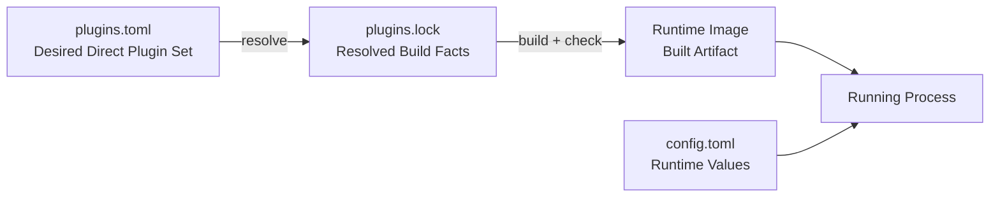
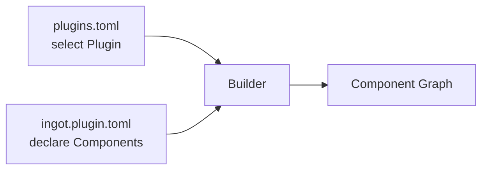
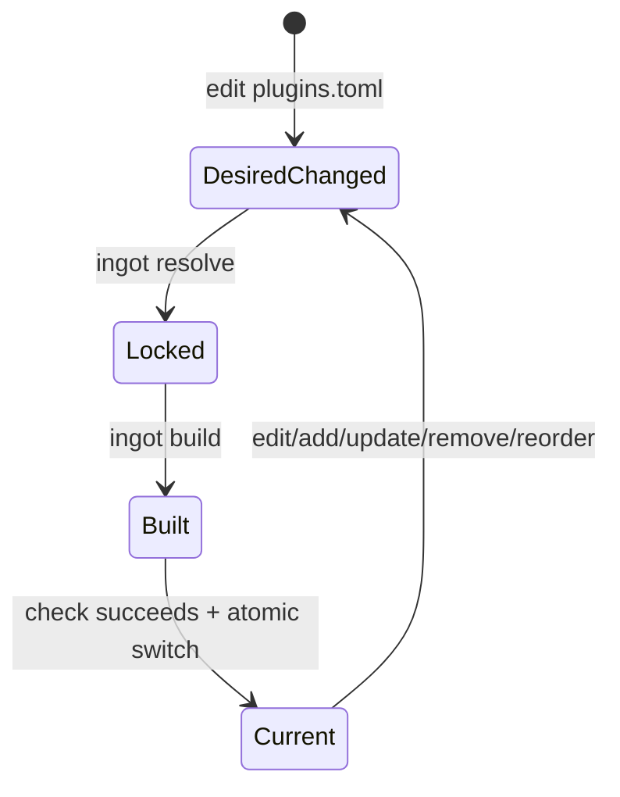
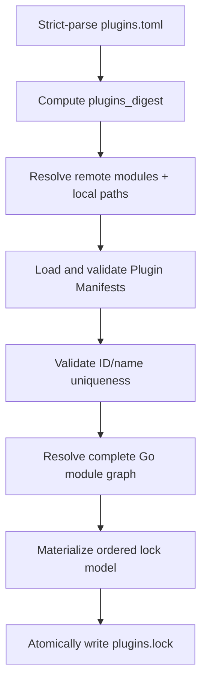
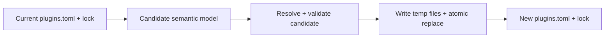

# ingot `plugins.toml` v0.1 设计方案

> 状态：Discussion Draft  
> 目标文件：`plugins.toml`  
> 目标位置：`~/.ingot/plugins.toml`  
> 关联文件：`plugins.lock`、`config.toml`

## 1. 定位

`plugins.toml` 是用户声明 Direct Plugin Set 的配置文件。它描述用户希望包含的 Plugin、直接版本、Local Dev source 与排列顺序。

ingot 使用三个职责独立的用户环境文件：

| 文件 | 维护者 | 内容 | 变化后的动作 |
|---|---|---|---|
| `plugins.toml` | 用户或 CLI | Direct Plugin desired state | resolve + build |
| `plugins.lock` | Bootstrap/Builder | 完整、精确的 Build Resolution | build |
| `config.toml` | 用户 | Runtime Config value | restart current image |



用户通过 `plugins.toml` 表达构建意图；Builder 通过 `plugins.lock` 固定完整解析事实；Runtime 通过 `config.toml` 获得行为参数。

## 2. 设计原则

1. Direct Plugin Set 具有唯一的用户声明来源。
2. Remote Plugin 在文件中使用 exact Go module version。
3. Remote 与 Local Dev 使用互斥、可严格校验的 source 结构。
4. Plugin 数组顺序是 Direct Plugin Order。
5. Plugin 以整体加入构建，其 Component catalog 来自 `ingot.plugin.toml`。
6. Runtime Config 与 Plugin composition 分层。
7. Raw TOML formatting 与 canonical semantics 分层。
8. Lock 保存本文件的 semantic digest，明确识别 desired/locked drift。

## 3. Exact Schema

完整示例：

```toml
plugins_version = 1

[[plugins]]
module = "github.com/ingot/http-default"
version = "v1.2.3"

[[plugins]]
module = "github.com/ingot/model-openai-compatible"
version = "v0.4.1"

[[plugins]]
module = "github.com/example/my-local-plugin"
path = "../my-local-plugin"
```

v0.1 顶层字段：

| Field | Required | Type | 含义 |
|---|---:|---|---|
| `plugins_version` | Yes | integer | Schema major，固定为 `1` |
| `plugins` | Yes | ordered array of tables | Direct Plugin declarations |

每个 `[[plugins]]` 的 exact fields：

| Field | Required | Type | 含义 |
|---|---:|---|---|
| `module` | Yes | string | Canonical Plugin ID / Go module path |
| `version` | Conditional | string | Remote exact Go module version |
| `path` | Conditional | string | Local Dev module locator |

每项恰好使用一种 source：

| Source | Required fields | 另一 source 字段 |
|---|---|---|
| Remote Module | `module`、`version` | `path` absent |
| Local Dev | `module`、`path` | `version` absent |

`plugins` 至少包含一项。Parser 将 unknown field、duplicate key、wrong type、missing field 与 union mismatch 报告为 `PluginsFileError`。

## 4. Remote Plugin

Remote declaration：

```toml
[[plugins]]
module = "github.com/example/ingot-tool"
version = "v1.2.3"
```

### 4.1 `module`

`module` 是：

- Go module path；
- canonical Plugin ID；
- 目标 module root 中 `go.mod` 的 expected module path；
- 目标 `ingot.plugin.toml` 所属 Plugin 的 identity。

Builder 使用 Go module path 的精确语义进行比较。

### 4.2 `version`

`version` 是 exact canonical Go module version，例如：

```text
v1.2.3
v0.8.0-beta.2
v0.0.0-20260822091230-0123456789ab
```

Builder 通过 Go Module System 验证：

- version canonical form；
- semantic import major 与 module path 一致；
- module 可解析；
- module checksum 可验证；
- module root 包含有效 `ingot.plugin.toml`。

`version` 在文件中保存 exact value。Version query 仅作为 CLI 输入：

```bash
ingot plugin add github.com/example/ingot-tool@latest
```

CLI 解析 query 后写入：

```toml
version = "v1.4.2"
```

因此每次用户文件变更都能直接 review，后续 resolve 也保持明确输入。

### 4.3 Major Version

Go Semantic Import Versioning 决定 major identity：

```text
github.com/example/ingot-tool     + v1.4.2
github.com/example/ingot-tool/v2  + v2.1.0
```

跨 major 更新改变 module path，因此表现为 Plugin identity change。State 与 Config migration 通过显式迁移流程处理。

## 5. Local Dev Plugin

Local declaration：

```toml
[[plugins]]
module = "github.com/example/ingot-tool"
path = "../ingot-tool"
```

### 5.1 `module`

Local Dev 仍显式声明 canonical Plugin ID。Builder 验证：

```text
plugins[*].module
= local path/go.mod module path
= Local Manifest 所属 module identity
```

显式 `module` 使用户无需读取目标目录即可识别 desired Plugin，也使 path 指向错误目录时获得稳定诊断。

### 5.2 `path`

`path` 可以是：

- 相对于 `plugins.toml` 所在目录的路径；
- 当前主机上的 absolute path。

用户文件推荐使用 relative path。Builder：

1. 使用当前主机文件系统语义解析 path；
2. relative path 以 `plugins.toml` 所在目录为基准；
3. 得到 clean absolute locator；
4. 验证目标目录同时包含 `go.mod` 与 `ingot.plugin.toml`；
5. 验证 declared module identity；
6. 计算 DevSourceDigest；
7. 将 locator、synthetic version 与 digest materialize 到 `plugins.lock`。

`path` 是 source locator；DevSourceDigest 是 Build Identity。相同源码位于不同机器路径时可生成相同 ImageID。

构建期 Builder 会将 local dev 源码逐字节复制到构建 staging 内，并通过相对路径 `replace` 编译，因此**产物二进制同样与源码所在目录无关**：相同源码（相同 DevSourceDigest）在任何目录、任何机器上构建都得到一致的 `ArtifactDigest`（build-info 中不泄露绝对路径）。

### 5.3 Synthetic Version

Local Dev root module require 使用确定性 synthetic version：

| Module path | Synthetic version |
|---|---|
| 无 `/vN`，`N >= 2` | `v0.0.0` |
| 以 `/vN` 结束，`N >= 2` | `vN.0.0` |

该值由 Builder 推导并写入 lock，用户文件只保留 `module` 与 `path`。

## 6. Direct Plugin Order

`[[plugins]]` 的数组顺序是 Direct Plugin Order。

```toml
[[plugins]]
module = "github.com/example/a"
version = "v1.0.0"

[[plugins]]
module = "github.com/example/b"
version = "v1.0.0"
```

表示 A 位于 B 之前。该顺序参与：

- Component stable topological sort tie-break；
- MANY aggregation order；
- Interceptor order；
- Prompt Contributor order；
- Canonical BuildManifest 与 ImageID。

Builder 将数组顺序逐项 materialize 到 `plugins.lock`。Filesystem enumeration、map iteration、下载完成顺序与 goroutine completion order 不参与该顺序。

### 6.1 Mutation Semantics

| 操作 | 结果 |
|---|---|
| Add | append 到数组末尾 |
| Update | 保留原 index |
| Remove | 删除目标，保持其余相对顺序 |
| Remove 后重新 Add | 作为新项 append |
| Reorder | 按用户指定顺序移动现有项 |
| Resolve/Refresh | 保持输入数组顺序 |

同一个 `module` 在 direct Plugin array 中只出现一次。

## 7. Plugin 与 Component 的选择边界

用户通过 `plugins.toml` 选择 Plugin。每个 Plugin 包含的 Component set 与 Component order 由该 Plugin 的 `ingot.plugin.toml` 声明。

Plugin 出现在数组中即表示 included；数组中没有该 Plugin 即表示 excluded。Schema 使用成员关系直接表达选择结果。



这一边界保证：

- Plugin 是用户安装、更新和移除的单位；
- Component 是 Builder 的 graph node；
- Composite Plugin 按作者声明的完整结构参与构建；
- Config、State 与 lifecycle ownership 保持在 Plugin boundary 内。

## 8. Runtime Config 边界

`plugins.toml` 控制 Build Composition：

```text
Plugin set
Plugin exact version
Local Dev source
Direct Plugin order
```

`config.toml` 控制 Runtime Behavior：

```text
API key
endpoint
model selection
timeout
workspace
port
approval policy
prompt style
```

Runtime Config 示例：

```toml
[plugins.openai-compatible]
base_url = "https://api.example.com"
api_key = "${secret:openai}"
```

修改 `config.toml` 后重新启动 current image。修改 `plugins.toml` 后执行 resolve、build、check 与 image switch。

## 9. Canonical Desired Plugins v1

Builder 将 `plugins.toml` 解析为 semantic model，再生成以下 exact JSON shape：

```json
{
  "schema_version": 1,
  "plugins": [
    {
      "module": "github.com/ingot/http-default",
      "source": {
        "kind": "module",
        "version": "v1.2.3"
      }
    },
    {
      "module": "github.com/example/my-local-plugin",
      "source": {
        "kind": "path",
        "path": "../my-local-plugin"
      }
    }
  ]
}
```

Canonical rules：

- 顶层字段全部 materialize；
- `plugins` 保持 declaration order；
- source 使用 exact tagged union；
- `module` 使用 validated Go module path bytes；
- `version` 使用 canonical exact Go module version；
- relative `path` 使用 `/` 作为 declaration separator，并执行 lexical clean；
- relative 与 absolute path 保持不同 locator semantics；
- comment、whitespace、quote style 与 TOML physical table order 不进入 semantic model；
- JSON 使用 RFC 8785 JCS。

```text
plugins_digest = "sha256:" + lowercase_hex(
    SHA256(JCS(CanonicalDesiredPluginsV1))
)
```

`plugins_digest` 标识用户的 Direct Plugin desired state。Local Dev 的 source content 由独立 DevSourceDigest 进入 Build Identity。

## 10. 与 `plugins.lock` 的关系

`plugins.lock` 顶层增加 required field：

```toml
plugins_digest = "sha256:..."
```

Resolve 必须建立以下对应关系：

| `plugins.toml` | `plugins.lock` |
|---|---|
| `plugins_version` | 通过 `plugins_digest` 绑定 semantic input |
| Plugin array order | `[[plugins]]` exact order |
| `module` | locked Plugin `id` |
| Remote `version` | locked exact version 与 module checksum |
| Local `path` | replacement `dev_path` |
| Local module source | DevSourceDigest 与 synthetic version |
| Plugin Manifest | name、Component catalog、State、manifest digest |

Lock 继续保存：

- ingot 与 Builder exact version；
- SDK 与 toolchain；
- target 与 build environment；
- ordered direct Plugin materialization；
- 完整 immutable module graph；
- Local Dev replacement；
- Manifest projection digest；
- Canonical BuildManifest 所需全部字段。

Raw `plugins.toml` bytes 不进入 lock identity。

## 11. Desired、Locked 与 Current 状态

系统同时存在三种状态：



状态判断：

| 条件 | 状态 | 所需操作 |
|---|---|---|
| `plugins_digest` 与 lock 不同 | Desired changed | `ingot resolve` |
| digest 一致，目标 image 尚未构建 | Locked | `ingot build` |
| image 已构建，尚未切换 | Built | check + switch |
| `current` 指向目标 ImageID | Current | ready |

Runtime commands 执行 `current` 指向的 image。Desired state 通过 `ingot apply` 进入 current。

## 12. Resolve 流程



Resolve 可以访问网络并填充 dedicated module cache。成功结果包含 exact versions、checksums、Manifest facts、complete transitive module graph 与 Local Dev digests。

Normal locked build：

1. 重新解析 `plugins.toml` 并计算 digest；
2. 与 lock 中 `plugins_digest` 精确比较；
3. 重算 Local Dev 与 Manifest digests；
4. 还原 root module；
5. 在 offline、readonly 环境中验证 selected graph；
6. 加载 Component packages；
7. 生成 wiring 并编译。

## 13. CLI

### 13.1 Add

```bash
ingot plugin add github.com/example/ingot-tool@v1.2.3
```

也可接收一次性 version query：

```bash
ingot plugin add github.com/example/ingot-tool@latest
```

流程：

1. 解析 module query；
2. 得到 exact version；
3. 将新 entry append 到 candidate array；
4. resolve candidate state；
5. 成功后写入 `plugins.toml` 与 `plugins.lock`。

Local Dev：

```bash
ingot plugin add --path ../my-plugin
```

CLI 从 Local `go.mod` 读取 module path，并写入 `module` 与用户提供的 `path`。

### 13.2 Update

```bash
ingot plugin update openai-compatible
```

Update 在相同 module path 内解析新 exact version，保留 direct Plugin index，并更新 user file 与 lock。

指定版本：

```bash
ingot plugin update openai-compatible@v0.5.0
```

### 13.3 Remove

```bash
ingot plugin remove openai-compatible
```

Remove 删除对应 entry，保持其余相对顺序，并重新 resolve lock。

### 13.4 Reorder

```bash
ingot plugin reorder approval --before script
```

Reorder 只改变 Plugin array order。新的 order 进入 lock、MANY/Interceptor semantics 与 ImageID。

### 13.5 Resolve、Build 与 Apply

```bash
ingot resolve
ingot build
ingot apply
```

| Command | 行为 |
|---|---|
| `resolve` | 将 desired state 解析为新 lock |
| `build` | 使用匹配的 lock 执行 offline build 与 check |
| `apply` | resolve、build、check，并原子切换 `current` |

Plugin mutation command 可以提供 `--apply`，在成功更新 desired/lock 后继续执行 apply。

### 13.6 Inspect 与 Status

```bash
ingot plugin list
ingot plugin inspect <id-or-name>
ingot status
```

至少展示：

- desired module、source 与 direct index；
- resolved name、version 与 source digest；
- Manifest Component list；
- effective Component creation order；
- effective MANY/Interceptor order；
- desired、locked 与 current 是否一致。

## 14. 写入与失败语义

### 14.1 CLI Mutation

CLI mutation 使用 candidate model：



Resolve 失败时保留原 `plugins.toml` 与 `plugins.lock`。成功时：

1. 在目标目录写入 temporary files；
2. flush 并 close；
3. 使用单写者锁提交；
4. 通过 transaction marker 或可恢复提交顺序处理进程崩溃；
5. 提交后保证 user file 与 lock 的 digest 匹配。

### 14.2 手工编辑

手工编辑直接改变 desired state。此时已有 lock 与 current 保持可用，`ingot status` 显示 drift。下一次 resolve 成功后生成匹配的新 lock。

### 14.3 Build Failure

Build 或 check 失败时保留 `current`。如果 desired 与 lock 已成功更新，系统保持 `Locked` 状态，用户修正问题后可再次执行 build/apply。

### 14.4 Writer

CLI 使用稳定 TOML 格式写入，并保持 Plugin order。Comment preservation 是用户体验要求；semantic identity 仅取 canonical model。

## 15. Config 与 Rollback

Runtime Config table 可使用 locked Plugin canonical ID 或 Manifest short name。`plugins.toml` 不保存 Plugin Config value。

删除 Plugin 时，其 `config.toml` table 可以保留。重新加入或 image rollback 后，Runtime 根据目标 lock 重新解析匹配 table。

Image rollback 只切换 `current`。`plugins.toml` 继续表示 desired state，因此 rollback 后可能出现：

```text
desired ImageID != current ImageID
```

`ingot status` 明确展示这一状态。用户可选择再次 apply desired state，或使用显式命令将 desired state 恢复为目标 image 对应的 Direct Plugin declarations。

## 16. Security 与 Trust

Remote 与 Local Plugin 均作为受信任 Go code 编译进 Runtime Image。

Resolve 记录并验证：

- canonical module identity；
- exact version；
- module 与 `go.mod` checksum；
- Manifest semantic digest；
- Local Dev content digest；
- complete transitive module graph。

Private module authentication、proxy 与 source policy沿用 Go Module environment 和 ingot distribution policy。Secret 与 credentials 由 Runtime Config/secret system 管理。

## 17. Diagnostics

`plugins.toml` 相关错误至少包含：

- stable error code；
- file path；
- `plugins[index]`；
- module path；
- source kind；
- field path；
- expected 与 actual value；
- 候选 exact versions或冲突 Plugin IDs；
- 建议操作。

示例：

```text
INGOT-PLUGINS-LOCAL-MODULE-MISMATCH
plugins[2].module: github.com/example/a
path go.mod module: github.com/example/b
path: ../my-plugin
```

## 18. Conformance Tests

### 18.1 Parsing

- minimal/full file；
- invalid TOML；
- unsupported `plugins_version`；
- unknown field；
- wrong type；
- empty Plugin list；
- duplicate module。

### 18.2 Source Union

- remote `module + version`；
- Local Dev `module + path`；
- missing source field；
- 同时存在 `version + path`；
- invalid exact version；
- module/version major mismatch；
- pseudo-version。

### 18.3 Local Dev

- relative/absolute path；
- path resolved relative to user file；
- module identity match/mismatch；
- missing `go.mod`；
- missing/invalid Manifest；
- synthetic version derivation；
- DevSourceDigest change。

### 18.4 Ordering

- Add appends；
- Update preserves index；
- Remove preserves remaining order；
- Re-add appends；
- Reorder changes digest/ImageID；
- parallel resolution completion 保持 input order。

### 18.5 Canonicalization

- comment、whitespace 与 quote style 保持 digest；
- module、version、path 与 order change 更新 digest；
- exact CanonicalDesiredPluginsV1 JCS bytes；
- relative path lexical normalization；
- Raw TOML bytes 与 semantic digest 分层。

### 18.6 Lock Integration

- `plugins_digest` match/mismatch；
- desired order 与 locked order exact match；
- remote version/checksum materialization；
- Local replacement/digest materialization；
- Manifest name/Component/State materialization；
- complete module graph；
- normal build offline/readonly。

### 18.7 Transaction 与 State

- failed CLI resolve保留旧 user file/lock；
- successful mutation 提交匹配的 pair；
- crash recovery；
- manual edit 产生 desired/locked drift；
- build/check failure保留 current；
- rollback 产生可诊断的 desired/current drift。

## 19. Schema 演进

`plugins_version` 表示 user-file schema major。Builder 遇到未支持的 major 时返回 `unsupported plugins version`。

该文件的字段均影响 build request。以下变化发布新的 schema major：

- 改变 source union；
- 改变 version semantics；
- 改变 Plugin order semantics；
- 改变 path resolution；
- 加入 Component selection、conditional inclusion 或 build-time binding 等组合能力。

Version query policy、registry search 与交互式 CLI 属于命令层；持久化文件继续保存解析后的 exact declaration。

## 20. 设计不变量

1. `plugins.toml` 是 Direct Plugin desired state 的用户声明来源。
2. `plugins.lock` 是完整 Build Resolution 的持久化事实。
3. Remote declaration 使用 exact Go module version。
4. Local declaration 显式保存 expected module ID 与 source path。
5. Plugin array order 是 Direct Plugin Order。
6. Plugin 作为整体加入；Component catalog 来自 Plugin Manifest。
7. Runtime Config value 只进入 `config.toml`。
8. `plugins_digest` 绑定 desired semantic model 与 lock。
9. Build/check failure 保留 current image。
10. Runtime command 执行 current；apply 将 desired state 转换为 current。

## 21. 最终形态

典型用户文件保持简洁：

```toml
plugins_version = 1

[[plugins]]
module = "github.com/ingot/http-default"
version = "v1.2.3"

[[plugins]]
module = "github.com/ingot/model-openai-compatible"
version = "v0.4.1"

[[plugins]]
module = "github.com/ingot/model-runtime"
version = "v0.3.0"

[[plugins]]
module = "github.com/ingot/tool-runtime"
version = "v0.3.0"

[[plugins]]
module = "github.com/example/company-tools"
path = "../company-tools"

[[plugins]]
module = "github.com/ingot/agent-default"
version = "v0.3.0"

[[plugins]]
module = "github.com/ingot/app-cli"
version = "v0.3.0"
```

这份文件只回答两个问题：包含哪些 Direct Plugin，以及它们采用什么顺序。版本与 Local source 作为每个 Plugin declaration 的一部分明确记录；完整依赖图、构建环境和产物身份由 lock 与 BuildManifest 继续管理。
