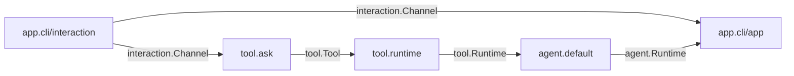
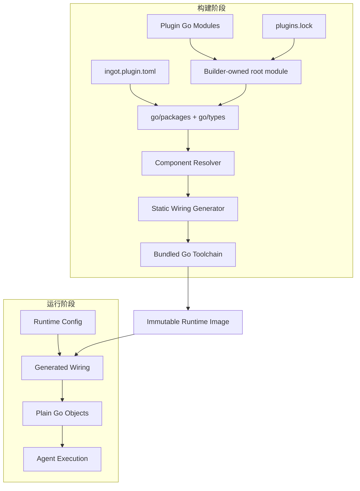
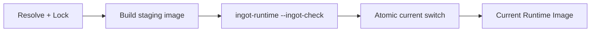
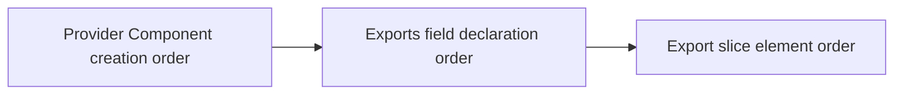
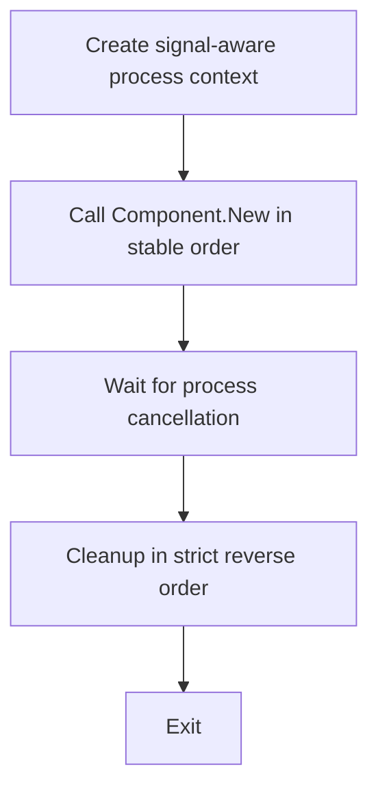
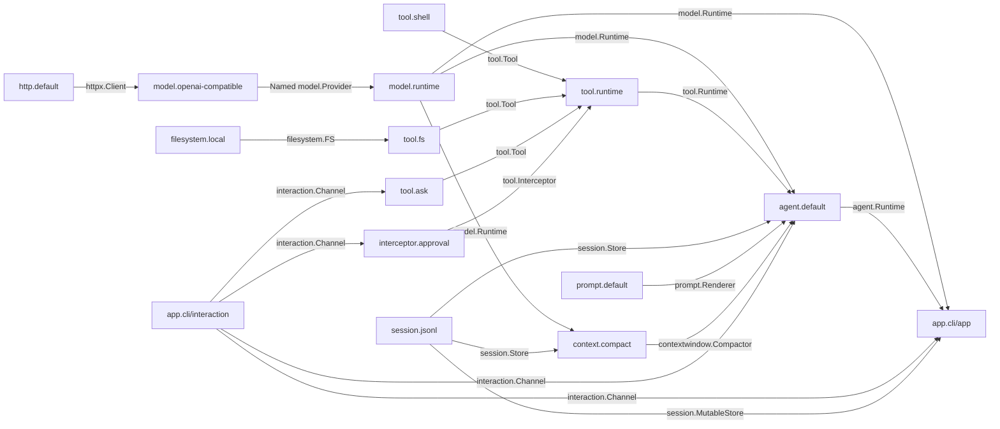
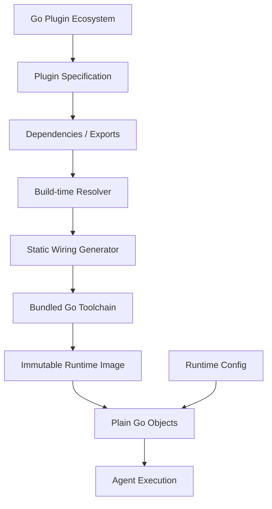

# ingot 重构架构设计 v0.3

> 状态：Draft  
> 关联规范：Plugin Manifest v0.1、`plugins.lock` v0.1、SDK v0.1

## 1. 目标

ingot 将插件在构建期组合为静态 Component Graph，并生成专用的原生 Runtime Image。运行期直接启动已构建的 Go 程序。

设计目标：

- 保留可组合的插件生态；
- 缩短启动时间并降低常驻内存；
- 在构建期完成发现、解析、校验、排序与代码生成；
- 以 Go Module、Go Type 和普通 Go 对象作为实现基础；
- 固定构建输入与顺序语义，使 Runtime Image 可验证、可复现、可回滚。

## 2. 核心模型

### 2.1 Plugin 与 Component

| 概念 | 职责 |
|---|---|
| Plugin | 分发、版本、配置、所有权和用户认知边界 |
| Component | 构造、依赖、导出和生命周期边界；Component Graph 的节点 |
| Capability | Component 之间通过稳定 Go Contract 交换的能力 |
| Runtime Instance | `New` 创建的独立运行实例；可由 `sdk.Named[T]` 提供名称 |

常见插件包含一个 Component。需要跨越多个拓扑位置时，一个 Plugin 可显式声明多个 Component。Component identity 为：

```text
<plugin-id>/<component-name>
```

单 Component shorthand 使用名称 `default`。

Composite Plugin 的所有 Component 共享一个 root `Config` 类型，各自通过 `Dependencies` 与 `Exports` 进入 Component Graph。同一 Plugin 内的 Component 按普通图规则连接。

`app.cli` 展示了 Composite Plugin 的用途：



### 2.2 Build Time 与 Runtime



构建阶段处理：

- Plugin 与 Component 发现；
- Go Module 版本和完整依赖图；
- Capability target 校验与类型匹配；
- ONE、OPTIONAL、MANY 解析；
- self-loop、cycle 和稳定顺序；
- wiring 与 `main` 代码生成；
- Runtime Image 编译与切换前校验。

运行阶段处理：

- Plugin Config 解码；
- 静态 wiring 实例化；
- Capability 调用；
- 进程取消与逆序 Cleanup。

## 3. 系统组成

### 3.1 Bootstrap

用户入口命令为 `ingot`。Bootstrap 管理：

- `plugin add`、`plugin remove`、`plugin update`、`plugin reorder`；
- dependency fetch 与 lock refresh；
- `build`、`inspect`、`rollback`、image GC；
- `current` 切换；
- Runtime Image 启动。

建议的数据布局：

| 路径 | 内容 |
|---|---|
| `~/.ingot/plugins.lock` | 当前解析结果 |
| `~/.ingot/config.toml` | Runtime Config |
| `~/.ingot/images/<ImageID>/ingot-runtime` | 原生 Runtime |
| `~/.ingot/images/<ImageID>/manifest.json` | ImageID、ArtifactDigest 与 provenance |
| `~/.ingot/current` | 当前 ImageID 的原子指针 |

正常命令 `ingot chat` 读取 `current`，定位 image 并 `exec` 对应的 `ingot-runtime`。`chat` 是 `app.cli` runtime 命令：默认进入全屏 TUI，`--plain` 降级为可取消行输入（pipes/重定向）；运行时进程参数由 generated main 通过 `application.Process` 暴露给 Component。

### 3.2 Builder

Builder 是 Component-oriented program generator，职责如下：

1. 严格解析 Manifest 与 lock；
2. 还原 root `go.mod` 和 `go.sum`；
3. 校验已锁定 module graph 与本地源码摘要；
4. 使用 `go/packages` 和 `go/types` 加载 Component Contract；
5. 解析 Component Graph；
6. 生成 `wiring_gen.go` 与 `main.go`；
7. 使用固定 Go toolchain 编译；
8. 执行 `ingot-runtime --ingot-check`；
9. 提交 Runtime Image。

### 3.3 Runtime Image

Runtime Image 是不可变目录。一次成功构建产生：

- `ingot-runtime`；
- `manifest.json`；
- Canonical BuildManifest 对应的 `ImageID`；
- 二进制内容对应的 `ArtifactDigest`。

```text
ImageID = SHA256(JCS(CanonicalBuildManifestV1))
ArtifactDigest = SHA256(final runtime binary bytes)
```

`ImageID` 标识构建输入，`ArtifactDigest` 标识实际产物。在受支持的 hermetic 环境中，相同 `ImageID` 应生成相同 `ArtifactDigest`。

### 3.4 Image 提交、回滚与 GC



- staging image 完整构建并通过 check 后更新 `current`；
- `rollback` 将 `current` 指向已有 image；
- GC 至少保留 `current`、上一个 `current` 和策略指定的最近 image；
- 同一 ingot home 的 lock 与 image 提交使用单写者锁；
- image rollback 与持久化 State 兼容性分别处理。

## 4. Plugin 规范

一个 Plugin 是带有 root-level `ingot.plugin.toml` 的 Go Module。Manifest 声明：

- canonical Plugin ID 与作者短名称；
- root Config package；
- ingot 兼容范围；
- Component package 与声明顺序；
- 目标平台约束；
- 持久化 State 版本窗口；
- 展示元数据。

Plugin ID 等于 `go.mod` module path。精确发行版本来自 Go Module resolution 和 `plugins.lock`。

最小目录可表示为：

| 文件 | 用途 |
|---|---|
| `go.mod` | Module identity 与依赖 |
| `ingot.plugin.toml` | Plugin 与 Component 静态描述 |
| `plugin.go` | `Config`、`Dependencies`、`Exports`、`New` |

Composite Plugin 将 root `Config` 放在 Manifest 指定的 package，并为每个 Component 使用独立 package。

Manifest 的字段、路径、canonicalization 与校验规则见《ingot Plugin Manifest v0.1 设计方案》。

## 5. Component Contract

每个 Component package 提供：

```go
type Dependencies struct {
    // consumed capabilities
}

type Exports struct {
    // provided capabilities
}

func New(
    ctx context.Context,
    cfg PluginConfig,
    deps Dependencies,
) (Exports, sdk.Cleanup, error)
```

`PluginConfig` 精确对应 Manifest root package 中导出的 `Config` 类型。Composite Plugin 的每个 Component 使用同一类型。

`Dependencies` 与 `Exports` 仅包含顶层、具名、导出字段。Builder 以 `go/types` 识别类型，以 `types.AssignableTo` 判断 Provider source 是否满足 Dependency target。

Component 依赖稳定 Contract Module。官方 `github.com/ingot-agent/sdk/...` 提供标准 Contract；第三方可发布实现无关的 Contract Module。Dependency target 的 base type 具有 package-level nominal identity。

## 6. Capability 组合

### 6.1 类型表达式

Dependency field 按以下递归表达式解释：

```text
Expr := Base | sdk.Optional[Expr] | []Expr | sdk.Named[Expr]
```

最外层决定 cardinality：

| 形式 | Cardinality | Provider 数量规则 |
|---|---|---|
| `T`、`sdk.Named[T]` | ONE | 恰好 1 个 |
| `sdk.Optional[T]` | OPTIONAL | 0 个为 `None`，1 个为 `Some` |
| `[]T` | MANY | 收集全部匹配项，可为空 |

递归解包后的 base target 可为：

- package 中导出的 named type 或 interface；
- 合法 generic named type instantiation；
- 指向 package-defined named type 的 pointer；
- 解包后落到上述类型的 Go alias。

Builder 将 primitive、`any`、bare `error`、anonymous struct/interface/map/func/chan 等类型报告为 Capability Type Error。参与当前 Graph 的 Component implementation package 中声明的类型也不作为 Dependency target。

Provider Export 可使用 concrete type；匹配条件仍为 `types.AssignableTo(source, target)`。

### 6.2 ONE、OPTIONAL 与 MANY

ONE 与 OPTIONAL 在匹配数大于 1 时产生 ambiguity error。MANY 对 `[]T` 接受：

- 可赋值给 `T` 的 scalar `U`；
- 元素可赋值给 `T` 的 slice `[]U`，并按元素顺序展开。

内层 wrapper 保持完整 target shape。例如：

| Dependency | 匹配语义 |
|---|---|
| `sdk.Optional[[]T]` | 0 或 1 个完整 `[]T` Provider |
| `[]sdk.Optional[T]` | 聚合 `sdk.Optional[T]` scalar 或 slice |
| `[][]T` | 聚合 `[]T` scalar 或 `[][]T` slice |
| `sdk.Optional[sdk.Named[T]]` | 0 或 1 个 `sdk.Named[T]` Provider |

`sdk.Named[T]` 表示 Runtime Instance Identity。它与普通 `T` 分别匹配，同一 Named collection 内的名称保持唯一。

### 6.3 Self-loop 与 Cycle

对 Component X 的每个 Dependency，Resolver 使用正常 ONE、OPTIONAL、MANY candidate matcher 检查 X 自己的 Exports。自身 Export 成为候选时产生 self-loop build error。

跨 Component edge 形成有向图，Builder 在拓扑排序阶段报告完整 cycle path。

调用控制流的扩展使用 typed Interceptor。例如工具审批导出 `[]tool.Interceptor`，由 `tool.Runtime` 统一组合。

### 6.4 稳定顺序

Component Creation Order 使用 deterministic Kahn topological sort：

1. 计算 indegree；
2. 将 0-indegree 节点加入候选集合；
3. 每次选择最小 `(directPluginIndex, componentIndex)`；
4. 输出节点并删除 outgoing edges；
5. 将新的 0-indegree 节点加入候选集合；
6. 输出节点数用于确认 DAG 完整性。

索引来源：

- `directPluginIndex`：`plugins.lock` 中 `[[plugins]]` 的顺序；
- `componentIndex`：Manifest 的 Component 声明顺序；implicit `default` 为 0。

MANY 聚合顺序为：



该顺序同时决定 Tool、Interceptor 和 Prompt Contributor 的顺序，并进入 Build Identity。

### 6.5 启动期值校验

Generated wiring 对已选 Capability 执行值校验：

- ONE 与有效 OPTIONAL 的 nil/typed-nil value 产生 startup error；
- nil 或 empty export slice 为 MANY 贡献 0 个元素；
- MANY 中的 nil/typed-nil element 产生 startup error；
- `sdk.Named[T]` 校验名称、唯一性和 `Value`；
- nested Optional、slice 与 Named 按完整 value path 递归校验。

诊断包含 Provider Component、Export field、element index、Consumer Component、Dependency field 和 Capability type。

## 7. 生命周期

### 7.1 构造

`New` 是可重复、可并发调用的实例构造器。每次调用：

- 创建独立 Exports、状态和 Cleanup；
- 只读取 `cfg` 与 `deps`；
- 完成有界初始化；
- 将长期任务放入实例拥有的 goroutine；
- 及时返回。

UI、server、watcher 与 daemon 均遵循相同的 `New`/`Cleanup` 生命周期。

### 7.2 Cleanup

Generated wiring 维护创建栈，并按严格逆序同步 Cleanup。构造函数同时返回 `err` 与非 nil Cleanup 时，该 Cleanup 也进入失败路径。

每个 Cleanup 获得独立 deadline：

```go
base := context.WithoutCancel(parentCtx)
cleanupCtx, cancel := context.WithTimeout(base, cleanupTimeout)
err := cleanup(cleanupCtx)
deadlineErr := cleanupCtx.Err()
cancel()
```

默认 `cleanupTimeout` 为每个 Component 10 秒，可由全局 runtime setting 调整。Cleanup 观察 `ctx.Done()` 并及时返回；多个错误使用 `errors.Join` 聚合。

### 7.3 Process Lifecycle



### 7.4 Pre-switch Check

`ingot-runtime --ingot-check` 沿正常路径解析 Config、构造完整 Graph、执行启动期值校验，并立即逆序 Cleanup。Builder 为子进程提供 staging 目录中的空持久化根，默认 wall-clock timeout 为 30 秒。

退出码：

| Code | 含义 |
|---:|---|
| 0 | 构造与 Cleanup 成功 |
| 1 | 构造、启动期校验或 Cleanup 失败 |
| 2 | 参数使用错误 |

## 8. Config 与 State

### 8.1 Runtime Config

Runtime Config 按 `plugins.lock` 中的 canonical `id` 或作者 `name` 定位 Plugin table。每个 locked Plugin 恰好匹配一个 table；同一 Plugin 同时命中两种 key 时返回 duplicate error；缺失匹配时返回 missing config error。当前 image 未引用的额外 table 保留并忽略。

匹配后的 table 使用 root `Config` 类型严格解码。API key、endpoint、model selection、workspace、port、approval policy 等值在启动时读取，并保持 Component Graph 不变。

### 8.2 Persistent State

Generated wiring 通过 Context 向 `config.StateDir(ctx)` 提供 Plugin-scoped path。同一 Composite Plugin 的 Component 共享目录。

Manifest `[state]` 声明：

- `schema_version`：当前实现写入的 State schema；
- `min_reader_version`：当前实现可读取的最旧 schema。

可读区间为 `[min_reader_version, schema_version]`。实际 State 版本落在区间外时，Plugin 明确返回 incompatibility error。State migration 与 backward compatibility 由数据所属 Plugin 实现。

`rollback` 只切换 Runtime Image；旧 image 按自身 reader window 打开现有 State。

## 9. Module、Lock 与可复现构建

### 9.1 Module 加载

每个 Plugin 以普通 Go Module 发布。Go Modules 提供下载、版本选择、checksum、proxy 与 transitive dependency。ingot Plugin Specification 提供组合入口与约束。

Normal locked build：

1. 从 lock 还原 `ingot.local/runtime-image` root module；
2. 使用专用 `GOMODCACHE`、`GOWORK=off`、`GOTOOLCHAIN=local`、`GOPROXY=off`；
3. 执行 `go mod download` 验证 cache 完整性；
4. 执行 `go mod verify`；
5. 使用 `go list -m -mod=readonly -json all` 获取 selected graph；
6. 与 lock 中 immutable modules 和 dev replacements 精确比较；
7. 在同一 module graph 上加载 Go packages；
8. 解析、生成并执行 `go build -mod=readonly`。

Resolve/fetch 流程负责联网与 lock 更新；normal locked build 使用已锁定数据和已填充 cache。

### 9.2 构建输入

Canonical BuildManifest 包含：

- `ingot_version` 与 `builder_version`；
- SDK module identity；
- bundled Go toolchain exact version；
- GOOS、GOARCH、target tuning、GOEXPERIMENT、CGO；
- allowlisted Go environment 与 build flags；
- ordered direct Plugins；
- 每个 Plugin 的 source identity、Manifest digest、root package 和 ordered Components；
- 完整 immutable module graph；
- 本地开发 replacement 的内容摘要；
- build-time bindings，v0.1 固定为空数组。

字段 presence、set/order 语义、JCS 形式和 DevSourceDigest 由《ingot `plugins.lock` v0.1 设计方案》定义。

### 9.3 Trust

Plugin 源码编译进 Runtime Image，按受信任代码管理。供应链完整性由 module source policy、checksum、私有仓库策略和代码审查共同保证。Runtime chokepoint 提供一致的控制流、拦截和可观测性。

## 10. SDK 边界

SDK 提供：

- `sdk.Cleanup`、`sdk.Optional[T]`、`sdk.Named[T]`；
- typed pipeline Interceptor；
- `httpx`、`filesystem`、`tool`、`model`、`session`、`prompt`、`contextwindow`、`interaction`、`agent` Contract（含 `agent.History`）与 `application.Process`（SDK v0.1.2 起正式发布）；`session.MutableStore` 自 SDK v0.1.3 起提供，消费该能力的 Plugin 依赖 v0.1.3；
- Context、错误、并发与 ownership 语义。

Runtime 的主要 chokepoint：

- Tool 调用进入 `tool.Runtime`；
- Model complete 调用进入 `model.Runtime`；
- Model stream 调用进入 `model.StreamingRuntime`；
- Agent turn 进入 `agent.Runtime`。

SDK 详细 API 与语义见《ingot SDK v0.1 设计方案》。

## 11. 首批官方 Plugin

| Plugin | 主要职责 | Exports / Dependencies |
|---|---|---|
| `http.default` | 共享 HTTP client | Export `httpx.Client` |
| `filesystem.local` | workspace-relative filesystem | Export `filesystem.FS` |
| `model.openai-compatible` | OpenAI-compatible providers | Consume `httpx.Client`; export `[]sdk.Named[model.Provider]` |
| `model.runtime` | provider selection 与 model chokepoint | Consume providers 与两类 interceptors; export complete/stream runtimes |
| `tool.shell` | shell tool | Export `[]tool.Tool` |
| `tool.fs` | file tools | Consume `filesystem.FS`; export `[]tool.Tool` |
| `tool.ask` | 同步文本/选项询问，选项模式保留自由输入 | Consume `interaction.Channel`; export `[]tool.Tool` |
| `tool.runtime` | tool lookup、校验与 interceptor chain | Consume tools/interceptors; export `tool.Runtime` |
| `interceptor.approval` | tool approval | Consume optional interaction; export `[]tool.Interceptor` |
| `interceptor.script` | runtime-configured executable hook | Export typed interceptors |
| `session.jsonl` | append-oriented session store与标题metadata更新 | Export `session.MutableStore`（可赋值给`session.Store`）；own persistent State |
| `prompt.default` | prompt rendering | Consume contributors; export `prompt.Renderer` |
| `context.compact` | non-destructive invocation context compaction | Consume `model.Runtime`与`session.Store`; export `contextwindow.Compactor` |
| `agent.default` | default agent turn | Consume model/tool/session/prompt/optional context compactor/interaction/interceptors; export `agent.Runtime` |
| `app.cli` | CLI frontend | Composite：interaction Component + app Component |



## 12. 实施顺序

### Phase 1：Composition Kernel

- Manifest/lock strict parser；
- root module restore 与 exact graph verification；
- `go/packages`、`go/types`；
- Component Contract validation；
- ONE、OPTIONAL、MANY；
- stable order、self-loop、cycle；
- codegen、compile、check、atomic commit。

最小 vertical slice：`http.default` 或临时 HTTP consumer，用于确认 ONE 与 Cleanup；`tool.shell`、`tool.runtime`、`interceptor.approval`、临时 interaction/CLI，用于确认 MANY、Interceptor 与静态 wiring。

### Phase 2：Core Runtime

- `filesystem.local`、`tool.fs`、`tool.ask`；
- `model.openai-compatible`、`model.runtime`；
- `session.jsonl`、`prompt.default`、`context.compact`、`agent.default`。

### Phase 3：Composite Frontend

- 启用显式 `[[components]]`；
- 实现 `app.cli/interaction` 与 `app.cli/app`；
- 确认共享 Config、跨拓扑 Component 与实例生命周期。

### Phase 4：Conformance 与 Freeze

- parser、identity、path 与 compatibility fixtures；
- type matching、wrapper、nil、order、cycle fixtures；
- lifecycle、Context、Cleanup、check fixtures；
- State compatibility 与 rollback fixtures；
- Canonical BuildManifest、DevSourceDigest 与 reproducibility golden tests；
- SDK cross-version tests。

## 13. 验收标准

v0.3 完成时应证明：

1. 相同 lock、toolchain、target 与 source cache 生成相同 ImageID 和 wiring 顺序；
2. 官方 Plugin 全部通过统一 Manifest 与 Component Contract 构建；
3. Runtime 以静态 Go 对象运行；
4. Provider 可替换，MANY 与 Interceptor 顺序稳定；
5. `tool.ask` 与 approval 通过 `interaction.Channel` 工作；
6. `app.cli` 的两个 Component 位于图的不同位置并共享一个 Config；
7. `New` 及时返回，Cleanup 停止并等待实例后台任务；
8. 构建或 check 失败时保留原 lock 与 `current`；
9. 持久化格式按 reader window fail-closed；
10. inspect 输出 direct Plugin order、Component creation order 与有效 MANY/Interceptor order。

## 14. 设计不变量

1. Plugin 是 ownership boundary，Component 是 graph node。
2. Component Graph 在进程生命周期内固定。
3. Capability edge 来源于稳定 Go Type Contract。
4. Builder 负责结构性组合，Runtime 执行静态 wiring。
5. MANY 是集合扩展机制，typed Interceptor 是控制流扩展机制。
6. Chokepoint 集中 Tool、Model 与 Agent 的标准调用路径。
7. Config 属于 Runtime；Plugin set、Component set、顺序与 binding 属于 Build Time。
8. `New` 创建独立实例；Cleanup 严格逆序、合作式取消。
9. Capability target 具有稳定 nominal identity。
10. Canonical BuildManifest 固定字段、presence 与顺序语义。
11. Plugin 按受信任源码管理，State 兼容性由数据所属 Plugin 管理。

## 15. 定位

ingot 是面向 Plugin/Component 组合的 Agent Runtime 构建系统：


